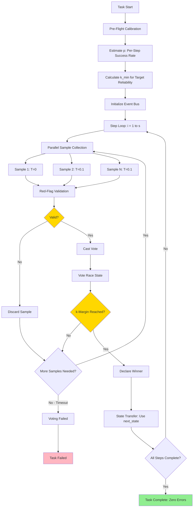

# Best Practices: MAKER Framework Implementation

**Project:** Rust Implementation of MAKER Framework with MCP Integration
**Version:** 1.0
**Date:** 2026-01-30
**Status:** Active

---

## Document Purpose

This document codifies industry best practices for implementing the MAKER (Maximal Agentic decomposition, first-to-ahead-by-K Error correction, Red-flagging) framework in Rust. It synthesizes guidance from:

1. **Statistical Decision Theory**: SPRT, Gambler's Ruin, error correction protocols
2. **Rust Async Programming**: Tokio patterns, fearless concurrency, zero-cost abstractions
3. **LLM API Integration**: Rate limiting, retry strategies, cost optimization
4. **MCP Server Development**: Protocol compliance, security, tool design
5. **Probabilistic Systems Testing**: Property-based testing, Monte Carlo validation
6. **Event-Driven Architecture**: CQRS, event sourcing, observability

Each framework below is mapped to specific MAKER implementation requirements, ensuring the system achieves **zero-error execution**, **Θ(s ln s) cost scaling**, and **production-grade reliability**.

---

## Framework Index

1. [Sequential Probability Ratio Test (SPRT)](#1-sequential-probability-ratio-test-sprt)
2. [Gambler's Ruin Problem](#2-gamblers-ruin-problem)
3. [Forward Error Correction (FEC) Principles](#3-forward-error-correction-fec-principles)
4. [Tokio Async Rust Best Practices](#4-tokio-async-rust-best-practices)
5. [Model Context Protocol (MCP) Implementation Standards](#5-model-context-protocol-mcp-implementation-standards)
6. [LLM API Integration Patterns](#6-llm-api-integration-patterns)
7. [Event Sourcing & CQRS in Rust](#7-event-sourcing--cqrs-in-rust)
8. [Property-Based Testing for Probabilistic Systems](#8-property-based-testing-for-probabilistic-systems)
9. [Site Reliability Engineering (SRE) Principles](#9-site-reliability-engineering-sre-principles)
10. [Rust Language Best Practices (2021 Edition)](#10-rust-language-best-practices-2021-edition)

---

## 1. Sequential Probability Ratio Test (SPRT)

**Author/Organization:** Abraham Wald (1945), proven optimal by Wald & Wolfowitz
**Source:** [SPRT - Statsig Documentation](https://docs.statsig.com/experiments/advanced-setup/sprt), [Wikipedia](https://en.wikipedia.org/wiki/Sequential_probability_ratio_test)
**Relevance:** **Critical** — Mathematical foundation for first-to-ahead-by-k voting

### Key Principles

- **Optimal Sequential Testing**: SPRT minimizes expected sample size for given error rates
- **No Peeking Penalty**: Designed for sequential analysis; continuously evaluating data is inherent
- **Likelihood Ratio Test**: Compare ratio against boundaries A (accept alternative) and B (accept null)
- **Efficient Decision-Making**: Average samples to decision lower than fixed-sample tests

### Application in MAKER

| SPRT Principle | Applied In | Epic IDs |
|----------------|------------|----------|
| Sequential hypothesis testing | First-to-ahead-by-k voting race | EPIC-001 (Core Algorithms) |
| Likelihood ratio boundaries | k-margin as stopping criterion | EPIC-001 |
| Optimal sample size | k_min calculation: ⌈ln(t^(-m/s)-1) / ln((1-p)/p)⌉ | EPIC-001 |
| Continuous evaluation | Vote tallying on each new sample | EPIC-001 |
| No fixed sample size | Race terminates when k-margin reached | EPIC-001 |

### Implementation Requirements

```rust
/// Calculate minimum k-margin for target reliability
/// Formula: k_min = ⌈ln(t^(-m/s) - 1) / ln((1-p)/p)⌉
///
/// # Arguments
/// * `p` - Per-step success probability (empirically measured)
/// * `t` - Target reliability (e.g., 0.95 for 95%)
/// * `s` - Total steps in task
/// * `m` - Subtasks per agent (always 1 for MAKER)
///
/// # Returns
/// Minimum k-margin to achieve target reliability
pub fn calculate_k_min(p: f64, t: f64, s: usize, m: usize) -> usize {
    assert!(p > 0.0 && p < 1.0, "p must be in (0, 1)");
    assert!(t > 0.0 && t < 1.0, "t must be in (0, 1)");
    assert!(m == 1, "MAKER requires m=1 (microagent decomposition)");

    let numerator = ((t.powf(-(m as f64) / (s as f64))) - 1.0).ln();
    let denominator = ((1.0 - p) / p).ln();

    (numerator / denominator).ceil() as usize
}
```

**Testing Strategy:**
- Property: k_min increases logarithmically with s
- Property: k_min decreases as p approaches 1.0
- Property: k_min increases as target reliability t approaches 1.0
- Regression: Validate against paper's Towers of Hanoi k=3-4 for 1M steps

### Rationale for Inclusion

SPRT provides the **mathematical guarantee** that MAKER's voting protocol is **optimal** — no sequential testing strategy can achieve the same reliability with fewer expected samples. This is critical for cost efficiency at million-step scales.

---

## 2. Gambler's Ruin Problem

**Author/Organization:** Classic probability theory (18th century)
**Source:** [Wikipedia](https://en.wikipedia.org/wiki/Gambler's_ruin), [MIT Course Materials](https://web.mit.edu/neboat/Public/6.042/randomwalks.pdf)
**Relevance:** **Critical** — Theoretical foundation for voting race convergence

### Key Principles

- **Random Walk**: Process with absorbing boundaries (win/lose states)
- **Eventual Ruin**: Gambler with finite wealth vs. infinite opponent will go broke (unless p > 0.5)
- **Probability of Ruin**: Calculable based on initial stake, win probability, and boundaries
- **First-Passage Time**: Expected steps to reach absorbing boundary

### Application in MAKER

| Gambler's Ruin Principle | Applied In | Epic IDs |
|--------------------------|------------|----------|
| Random walk to boundary | Voting candidates race to k-margin lead | EPIC-001 |
| Absorbing boundary | Winner declared when lead = k | EPIC-001 |
| Win probability (p) | Correct answer probability (measured empirically) | EPIC-001, EPIC-003 (Calibration) |
| Expected time to boundary | Expected votes to decision (Θ(k) for p ≈ 0.5) | EPIC-001 |
| Finite vs. infinite wealth | Parallel sampling budget vs. theoretical infinite samples | EPIC-001 |

### Implementation Requirements

```rust
/// Vote race state tracking
#[derive(Debug, Clone)]
pub struct VoteRace {
    candidates: HashMap<CandidateId, usize>, // vote counts
    k_margin: usize,
    samples_collected: usize,
}

impl VoteRace {
    /// Check if any candidate has k-margin lead
    pub fn check_winner(&self) -> Option<CandidateId> {
        let mut counts: Vec<_> = self.candidates.iter().collect();
        counts.sort_by_key(|(_, count)| Reverse(**count));

        if counts.len() < 2 {
            return None; // Need at least 2 candidates
        }

        let (leader_id, leader_count) = counts[0];
        let (_, runner_up_count) = counts[1];

        if leader_count - runner_up_count >= self.k_margin {
            Some(*leader_id)
        } else {
            None
        }
    }
}
```

**Testing Strategy:**
- Property: For p > 0.5, correct answer eventually wins
- Property: Increasing k increases expected samples to decision
- Monte Carlo: Simulate 10,000 races, measure convergence rates
- Edge case: Single candidate (should trigger more sampling)

### Rationale for Inclusion

Gambler's Ruin provides **intuition and convergence proofs** for the voting race. Understanding this classical problem ensures implementers recognize when the race will terminate and how k affects convergence time.

---

## 3. Forward Error Correction (FEC) Principles

**Author/Organization:** Claude Shannon et al. (1948+)
**Source:** [Reed-Solomon Wikipedia](https://en.wikipedia.org/wiki/Reed%E2%80%93Solomon_error_correction), [Hamming Codes](https://en.wikipedia.org/wiki/Error_correction_code)
**Relevance:** **High** — Conceptual foundation for linguistic error correction

### Key Principles

- **Redundancy for Correction**: Add redundant data to enable error detection/correction
- **Forward Correction**: Receiver corrects errors without retransmission
- **Discard vs. Repair**: Reed-Solomon discards uncorrectable codewords; Hamming repairs single-bit errors
- **Burst Error Tolerance**: Reed-Solomon excels at correcting clustered errors
- **Cost-Efficiency Trade-off**: More redundancy = higher correction capability but higher cost

### Application in MAKER

| FEC Principle | Applied In | Epic IDs |
|---------------|------------|----------|
| Redundancy = voting samples | Parallel sampling for k-margin voting | EPIC-001 |
| Forward correction (no retransmission) | Vote decides without model re-query | EPIC-001 |
| Discard over repair | Red-flagging discards malformed outputs | EPIC-001 |
| Error decorrelation | Red-flagging prevents correlated voting errors | EPIC-001 |
| Redundancy cost scaling | k votes per step → Θ(s ln s) total cost | EPIC-001 |

### Red-Flagging as FEC

**Philosophy:** MAKER treats LLM outputs as noisy communication channel. Red-flagging is the "uncorrectable codeword discard" strategy — attempting to repair a malformed response (e.g., via regex extraction) **correlates errors** by validating samples that share the same logical flaw.

```rust
/// Red-flag validation: Discard malformed outputs
pub enum RedFlag {
    TokenLengthExceeded { limit: usize, actual: usize },
    FormatViolation { expected: Schema, actual: String },
    LogicLoop { repetition_detected: bool },
}

pub fn validate_response(response: &str, schema: &Schema, token_limit: usize) -> Result<(), RedFlag> {
    // Token length check
    let token_count = estimate_tokens(response);
    if token_count > token_limit {
        return Err(RedFlag::TokenLengthExceeded {
            limit: token_limit,
            actual: token_count
        });
    }

    // Schema validation (no repair!)
    if !schema.matches(response) {
        return Err(RedFlag::FormatViolation {
            expected: schema.clone(),
            actual: response.to_string()
        });
    }

    // Logic loop detection (future: semantic analysis)
    // ...

    Ok(())
}
```

**Testing Strategy:**
- Unit: Red-flag triggers on 701-token response (limit 700)
- Unit: Red-flag triggers on missing `next_state` field
- Property: Red-flagged samples never enter voting pool
- Metric: Track red-flag rate (should be <10% for well-calibrated models)

### Rationale for Inclusion

FEC principles guide MAKER's **discard-over-repair philosophy**, which is critical for **error decorrelation**. This ensures voting samples fail independently, not due to shared logical flaws.

---

## 4. Tokio Async Rust Best Practices

**Author/Organization:** Tokio Contributors (2016+)
**Source:** [Tokio Documentation](https://tokio.rs/), [The New Stack Tutorial](https://thenewstack.io/async-programming-in-rust-understanding-futures-and-tokio/)
**Relevance:** **Critical** — Foundation for parallel sampling and MCP server

### Key Principles

- **Non-Blocking I/O**: Tasks yield control during I/O waits (critical for LLM API calls)
- **Fearless Concurrency**: Rust ownership prevents data races
- **Task Spawning**: `tokio::spawn` for concurrent operations
- **Selective Blocking**: Use `spawn_blocking` for CPU-intensive work
- **Runtime Selection**: Multi-threaded for servers, single-threaded for lightweight apps

### Application in MAKER

| Tokio Principle | Applied In | Epic IDs |
|-----------------|------------|----------|
| Async LLM API calls | Parallel sampling for voting | EPIC-002 (MCP Integration) |
| Non-blocking I/O | Concurrent collection of k+ samples | EPIC-002 |
| Task spawning | Each vote sample as separate task | EPIC-001, EPIC-002 |
| Channel communication | Event broadcasting for observability | EPIC-004 (Event-Driven) |
| Timeout handling | API call timeouts to prevent hangs | EPIC-002 |

### Parallel Sampling Pattern

```rust
use tokio::task::JoinSet;
use std::time::Duration;

/// Collect voting samples in parallel
pub async fn collect_samples(
    prompt: &str,
    num_samples: usize,
    llm_client: &dyn LlmClient,
    timeout: Duration,
) -> Vec<Result<Sample, LlmError>> {
    let mut join_set = JoinSet::new();

    for i in 0..num_samples {
        let prompt = prompt.to_string();
        let client = llm_client.clone();
        let temperature = if i == 0 { 0.0 } else { 0.1 }; // T=0 first, T=0.1 for diversity

        join_set.spawn(async move {
            tokio::time::timeout(timeout, client.generate(&prompt, temperature))
                .await
                .map_err(|_| LlmError::Timeout)?
        });
    }

    let mut results = Vec::new();
    while let Some(result) = join_set.join_next().await {
        results.push(result.unwrap()); // JoinHandle error (task panic) vs. LlmError
    }

    results
}
```

**Best Practices Applied:**
- **T=0 for first sample**: Deterministic baseline
- **T=0.1 for diversity**: Decorrelate errors without chaos
- **Timeout protection**: Prevent indefinite hangs
- **JoinSet for bounded concurrency**: Easier than manual tokio::spawn tracking
- **Clone client**: Each task owns API client (no shared mutable state)

### Common Pitfalls to Avoid

| Anti-Pattern | Consequence | MAKER Solution |
|--------------|-------------|----------------|
| Blocking inside async | Runtime stalls | Use `spawn_blocking` for CPU work |
| Excessive task spawning | Resource exhaustion | Bound concurrency to k samples |
| Ignoring cancellation | Wasted API calls | Implement task cancellation on early winner |
| Shared mutable state | Data races | Message passing via channels |

**Testing Strategy:**
- Integration: Parallel sampling completes in ~1x API latency (not num_samples x latency)
- Benchmark: Compare sequential vs. parallel latency with criterion
- Stress: 100 concurrent samples without runtime panic

### Rationale for Inclusion

Parallel sampling is **non-negotiable** for MAKER latency. Sequential sampling would make million-step tasks take weeks. Tokio enables **concurrent LLM API calls** with Rust's safety guarantees.

---

## 5. Model Context Protocol (MCP) Implementation Standards

**Author/Organization:** Anthropic / Linux Foundation Agentic AI (2024)
**Source:** [MCP Specification](https://modelcontextprotocol.io/specification/2025-06-18), [Rust SDK](https://github.com/modelcontextprotocol/rust-sdk), [MCPcat Guide](https://mcpcat.io/guides/building-mcp-server-rust/)
**Relevance:** **Critical** — Integration layer for Claude Code

### Key Principles

- **JSON-RPC 2.0 Protocol**: Stateful request/response communication
- **Transport Agnostic**: Stdio, SSE, HTTP support
- **Tool Definition**: Declare capabilities with typed parameters
- **Capability Negotiation**: Client/server handshake on supported features
- **Security Model**: Tool permissions, prompt injection risks

### Application in MAKER

| MCP Principle | Applied In | Epic IDs |
|---------------|------------|----------|
| Tool definition | `maker/vote`, `maker/validate`, `maker/calibrate`, `maker/configure` | EPIC-002 |
| Stdio transport | Claude Desktop integration | EPIC-002 |
| Type-safe parameters | Rust structs with serde for JSON schemas | EPIC-002 |
| Error handling | Result<ToolOutput, MakerError> with descriptive messages | EPIC-002 |
| Security (schema validation) | Red-flag parsers validate tool inputs/outputs | EPIC-002, EPIC-001 |

### MCP Tool Implementation Pattern

```rust
use rmcp::{tool, Router, Server};
use serde::{Deserialize, Serialize};

#[derive(Debug, Deserialize)]
pub struct VoteRequest {
    prompt: String,
    k_margin: usize,
    temperature_diversity: f64,
    max_samples: usize,
}

#[derive(Debug, Serialize)]
pub struct VoteResponse {
    winner: String,
    vote_counts: HashMap<String, usize>,
    total_samples: usize,
    cost_tokens: usize,
}

#[tool]
pub async fn maker_vote(params: VoteRequest) -> Result<VoteResponse, String> {
    // Input validation
    if params.k_margin < 1 {
        return Err("k_margin must be >= 1".to_string());
    }

    // Execute voting protocol
    let samples = collect_samples(
        &params.prompt,
        params.max_samples,
        params.temperature_diversity
    ).await?;

    let winner = run_vote_race(samples, params.k_margin).await?;

    Ok(VoteResponse {
        winner: winner.content,
        vote_counts: winner.vote_counts,
        total_samples: winner.samples_used,
        cost_tokens: winner.total_tokens,
    })
}
```

**Security Considerations (April 2025 MCP Security Analysis):**
- **Prompt Injection**: Validate all LLM outputs against expected schema before returning to MCP client
- **Tool Permissions**: Document that MAKER tools invoke LLM APIs (cost/quota implications)
- **Lookalike Tools**: Namespace tools as `maker/*` to avoid confusion with other MCP servers

### Tool Inventory

| Tool | Purpose | Input Schema | Output Schema |
|------|---------|--------------|---------------|
| `maker/vote` | Execute k-margin voting on prompt | `{ prompt, k_margin, max_samples }` | `{ winner, vote_counts, cost }` |
| `maker/validate` | Red-flag validation only (no voting) | `{ response, schema, token_limit }` | `{ valid, red_flags }` |
| `maker/calibrate` | Estimate per-step success rate (p) | `{ task_samples, ground_truth }` | `{ p_estimate, confidence_interval }` |
| `maker/configure` | Set defaults (k, temperature, token limits) | `{ k_default, temp, token_limit }` | `{ config_applied }` |

**Testing Strategy:**
- MCP protocol compliance: Use official test suite from modelcontextprotocol repo
- Integration: Claude Code end-to-end with each tool
- Schema validation: Send invalid JSON, expect clear error messages

### Rationale for Inclusion

MCP is the **integration layer** that makes MAKER usable in production AI assistants like Claude Code. Following MCP standards ensures interoperability and leverages ecosystem tooling.

---

## 6. LLM API Integration Patterns

**Author/Organization:** Industry best practices (OpenAI, Anthropic, community)
**Source:** [ORQ Rate Limits](https://orq.ai/blog/api-rate-limit), [Portkey Rate Limiting](https://portkey.ai/blog/tackling-rate-limiting-for-llm-apps), [OpenAI Docs](https://platform.openai.com/docs/guides/rate-limits)
**Relevance:** **Critical** — Reliable LLM API calls at million-step scales

### Key Principles

- **Exponential Backoff with Jitter**: Retry strategy for transient failures
- **Respect Retry-After Headers**: API-dictated retry timing
- **Token-Based Rate Limiting**: Track input/output tokens, not just requests
- **Fallback Mechanisms**: Switch providers on sustained failures
- **Caching**: Semantic caching for duplicate prompts (future optimization)

### Application in MAKER

| API Pattern | Applied In | Epic IDs |
|-------------|------------|----------|
| Exponential backoff | Retry on 429, 500, 503 errors | EPIC-002 |
| Jitter | Randomize retry delays to avoid thundering herd | EPIC-002 |
| Retry-After header | Sleep before retry when provided | EPIC-002 |
| Token tracking | Event emission: `sample_response` includes token counts | EPIC-004 |
| Fallback to Ollama | If OpenAI quota exceeded, use local model | EPIC-002 (future) |

### Retry Strategy Implementation

```rust
use std::time::Duration;
use tokio::time::sleep;
use rand::Rng;

const MAX_RETRIES: usize = 5;
const BASE_DELAY_MS: u64 = 1000;
const MAX_DELAY_MS: u64 = 60000;

pub async fn call_llm_with_retry<F, Fut, T>(
    operation: F,
) -> Result<T, LlmError>
where
    F: Fn() -> Fut,
    Fut: std::future::Future<Output = Result<T, LlmError>>,
{
    let mut attempt = 0;

    loop {
        match operation().await {
            Ok(result) => return Ok(result),
            Err(e) if !e.is_retryable() => return Err(e),
            Err(e) if attempt >= MAX_RETRIES => return Err(e),
            Err(LlmError::RateLimited { retry_after }) => {
                attempt += 1;
                let delay = retry_after.unwrap_or_else(|| {
                    let exponential = BASE_DELAY_MS * 2_u64.pow(attempt as u32);
                    let capped = exponential.min(MAX_DELAY_MS);
                    let jitter = rand::thread_rng().gen_range(0..=capped / 4);
                    Duration::from_millis(capped + jitter)
                });

                tracing::warn!("Rate limited, retrying after {:?} (attempt {}/{})", delay, attempt, MAX_RETRIES);
                sleep(delay).await;
            }
            Err(e) => {
                attempt += 1;
                let delay = Duration::from_millis(BASE_DELAY_MS * 2_u64.pow(attempt as u32));
                tracing::warn!("Transient error: {}, retrying after {:?}", e, delay);
                sleep(delay).await;
            }
        }
    }
}
```

**Key Features:**
- **Exponential**: 1s, 2s, 4s, 8s, 16s, 32s, (capped at 60s)
- **Jitter**: Random 0-25% added to prevent synchronized retries
- **Retry-After**: Respect API-provided timing
- **Max Retries**: 5 attempts total (configurable)
- **Non-Retryable Errors**: Immediate failure on 400 Bad Request, authentication errors

### Token Economics Tracking

```rust
#[derive(Debug, Clone, Serialize)]
pub struct TokenUsageEvent {
    pub timestamp: SystemTime,
    pub model: String,
    pub input_tokens: usize,
    pub output_tokens: usize,
    pub cost_usd: f64, // Calculated based on model pricing
}

pub fn calculate_cost(model: &str, input_tokens: usize, output_tokens: usize) -> f64 {
    let (input_cost_per_m, output_cost_per_m) = match model {
        "gpt-5.x-nano" => (1.6, 4.0),
        "claude-haiku" => (0.25, 1.25),
        "ollama" => (0.0, 0.0), // Local
        _ => (0.0, 0.0),
    };

    let input_cost = (input_tokens as f64 / 1_000_000.0) * input_cost_per_m;
    let output_cost = (output_tokens as f64 / 1_000_000.0) * output_cost_per_m;

    input_cost + output_cost
}
```

**Testing Strategy:**
- Unit: Exponential backoff calculation correctness
- Integration: Mock API returns 429, verify retry with backoff
- Property: Total cost for s-step task ≤ C * s * ln(s) for constant C

### Rationale for Inclusion

Million-call workloads **will encounter rate limits**. Exponential backoff with jitter is **industry standard** for robust API integration. Token tracking enables **cost transparency** for users.

---

## 7. Event Sourcing & CQRS in Rust

**Author/Organization:** Greg Young, Udi Dahan (2005+); Rust: cqrs-es crate
**Source:** [CQRS Rust Documentation](https://doc.rust-cqrs.org/)
**Relevance:** **High** — Event-driven architecture for observability

### Key Principles

- **Immutable Events**: All state changes recorded as events
- **Event Store**: Append-only log of events
- **Command-Query Separation**: Commands modify state, queries read state
- **Event Handlers**: Asynchronous processing of events
- **Audit Trail**: Complete history for debugging and compliance

### Application in MAKER

| CQRS/Event Sourcing Principle | Applied In | Epic IDs |
|-------------------------------|------------|----------|
| Immutable events | `SampleRequested`, `VoteCast`, `RedFlagTriggered`, etc. | EPIC-004 |
| Event emission | All operations emit events to broadcast channel | EPIC-004 |
| Event handlers | Logging observer, metrics observer, tracing observer | EPIC-004 |
| Audit trail | Complete record of every vote and decision | EPIC-004 |
| Decoupled architecture | Core logic doesn't depend on logging implementation | EPIC-001, EPIC-004 |

### Event Definitions

```rust
use serde::{Deserialize, Serialize};
use std::time::SystemTime;

#[derive(Debug, Clone, Serialize, Deserialize)]
#[serde(tag = "type")]
pub enum MakerEvent {
    SampleRequested {
        step_id: usize,
        prompt_hash: String,
        temperature: f64,
        timestamp: SystemTime,
    },
    SampleCompleted {
        step_id: usize,
        candidate_id: String,
        tokens_used: usize,
        latency_ms: u64,
        timestamp: SystemTime,
    },
    RedFlagTriggered {
        step_id: usize,
        candidate_id: String,
        flag_type: RedFlag,
        timestamp: SystemTime,
    },
    VoteCast {
        step_id: usize,
        candidate_id: String,
        vote_count: usize,
        timestamp: SystemTime,
    },
    VoteDecided {
        step_id: usize,
        winner_id: String,
        total_votes: usize,
        k_margin: usize,
        timestamp: SystemTime,
    },
    StepCompleted {
        step_id: usize,
        state_hash: String,
        cumulative_cost_usd: f64,
        timestamp: SystemTime,
    },
}
```

### Event Broadcasting Pattern

```rust
use tokio::sync::broadcast;

pub struct EventBus {
    sender: broadcast::Sender<MakerEvent>,
}

impl EventBus {
    pub fn new(capacity: usize) -> Self {
        let (sender, _) = broadcast::channel(capacity);
        Self { sender }
    }

    pub fn emit(&self, event: MakerEvent) {
        // Fire-and-forget; observers subscribe independently
        let _ = self.sender.send(event);
    }

    pub fn subscribe(&self) -> broadcast::Receiver<MakerEvent> {
        self.sender.subscribe()
    }
}

// Usage in voting logic
pub async fn cast_vote(event_bus: &EventBus, step_id: usize, candidate_id: String) {
    // ... voting logic ...

    event_bus.emit(MakerEvent::VoteCast {
        step_id,
        candidate_id: candidate_id.clone(),
        vote_count: current_count,
        timestamp: SystemTime::now(),
    });
}
```

### Observer Pattern for Logging

```rust
pub struct LoggingObserver {
    receiver: broadcast::Receiver<MakerEvent>,
}

impl LoggingObserver {
    pub async fn run(mut self) {
        while let Ok(event) = self.receiver.recv().await {
            match event {
                MakerEvent::VoteDecided { step_id, winner_id, total_votes, k_margin, .. } => {
                    tracing::info!(
                        step_id = step_id,
                        winner = %winner_id,
                        votes = total_votes,
                        k = k_margin,
                        "Vote decided"
                    );
                }
                MakerEvent::RedFlagTriggered { step_id, flag_type, .. } => {
                    tracing::warn!(
                        step_id = step_id,
                        flag = ?flag_type,
                        "Red flag triggered"
                    );
                }
                _ => {} // Other events at DEBUG level
            }
        }
    }
}
```

**Testing Strategy:**
- Unit: Event emission triggers observer callback
- Integration: Subscribe multiple observers, verify all receive events
- Property: Events are immutable (cannot modify after emission)

### Rationale for Inclusion

Event-driven architecture provides **complete observability** without coupling core logic to logging. This is critical for **debugging million-step tasks** and **cost tracking**.

---

## 8. Property-Based Testing for Probabilistic Systems

**Author/Organization:** QuickCheck (Koen Claessen, John Hughes, 1999); Rust: proptest, quickcheck
**Source:** [Proptest Crate](https://docs.rs/proptest/), [Monte Carlo Model Checking](https://www.mdpi.com/2078-2489/11/12/588)
**Relevance:** **High** — Validating probabilistic correctness

### Key Principles

- **Invariant Testing**: Define properties that must hold for all inputs
- **Random Input Generation**: Test with wide range of scenarios
- **Shrinking**: Minimize failing test case to root cause
- **Statistical Validation**: Monte Carlo simulation for probabilistic guarantees

### Application in MAKER

| Testing Principle | Applied In | Epic IDs |
|-------------------|------------|----------|
| Property: k_min increases with s | k_min calculation validation | EPIC-001, EPIC-003 |
| Property: Voting converges (p > 0.5) | Vote race correctness | EPIC-001 |
| Property: Red-flag rate < threshold | Red-flag parser tuning | EPIC-001 |
| Monte Carlo: Cost scaling | Validate Θ(s ln s) empirically | EPIC-003 |
| Shrinking: Minimal failing case | Debug voting edge cases | EPIC-001 |

### Property-Based Test Examples

```rust
use proptest::prelude::*;

proptest! {
    #[test]
    fn k_min_increases_with_steps(
        p in 0.6f64..0.99f64,  // Success rate
        t in 0.90f64..0.99f64, // Target reliability
        s in 10usize..1_000_000usize, // Steps
    ) {
        let k1 = calculate_k_min(p, t, s, 1);
        let k2 = calculate_k_min(p, t, s * 2, 1); // Double the steps

        // k should grow logarithmically, so k2 > k1 but not k2 = 2*k1
        assert!(k2 > k1, "k_min should increase with more steps");
        assert!(k2 < k1 * 2, "k_min should grow logarithmically, not linearly");
    }

    #[test]
    fn voting_converges_to_majority(
        correct_prob in 0.6f64..0.95f64, // Probability of correct answer
        k in 3usize..10usize,
        num_trials in 100usize..1000usize,
    ) {
        // Monte Carlo: Run many simulated voting races
        let mut convergences = 0;

        for _ in 0..num_trials {
            let winner = simulate_vote_race(correct_prob, k);
            if winner == "correct_answer" {
                convergences += 1;
            }
        }

        let convergence_rate = convergences as f64 / num_trials as f64;

        // With k-margin voting, convergence rate should be > correct_prob
        assert!(
            convergence_rate > correct_prob,
            "Voting should improve upon base probability: {} > {}",
            convergence_rate, correct_prob
        );
    }
}
```

### Monte Carlo Cost Validation

```rust
#[test]
fn validate_cost_scaling_is_log_linear() {
    let p = 0.85; // Empirically measured per-step success
    let t = 0.95; // Target 95% reliability
    let mut results = Vec::new();

    for s in [100, 1_000, 10_000, 100_000, 1_000_000] {
        let k = calculate_k_min(p, t, s, 1);
        let expected_cost = s * k; // Simplified: s steps * k samples/step

        results.push((s, k, expected_cost));
    }

    // Verify Θ(s ln s) scaling
    for i in 1..results.len() {
        let (s_prev, _, cost_prev) = results[i - 1];
        let (s_curr, _, cost_curr) = results[i];

        let s_ratio = s_curr as f64 / s_prev as f64;
        let cost_ratio = cost_curr as f64 / cost_prev as f64;
        let log_ratio = s_ratio * (s_curr as f64).ln() / (s_prev as f64).ln();

        // cost_ratio should be approximately s_ratio * ln(s_ratio)
        assert!(
            (cost_ratio - log_ratio).abs() / log_ratio < 0.2, // Within 20%
            "Cost scaling deviates from Θ(s ln s): {} vs {}",
            cost_ratio, log_ratio
        );
    }
}
```

**Testing Strategy:**
- Property tests: Run on every CI build
- Monte Carlo: Weekly long-running validation (expensive)
- Shrinking: Capture minimal failing cases in regression suite

### Rationale for Inclusion

MAKER's correctness is **probabilistic**, not deterministic. Property-based testing and Monte Carlo simulation are the **only rigorous ways** to validate that voting converges correctly and cost scales as Θ(s ln s).

---

## 9. Site Reliability Engineering (SRE) Principles

**Author/Organization:** Google SRE Book (2016)
**Source:** [Google SRE Book](https://sre.google/sre-book/table-of-contents/)
**Relevance:** **Medium** — Production hardening and observability

### Key Principles

- **Error Budgets**: Quantify acceptable unreliability
- **Graceful Degradation**: Fail partially, not completely
- **Observability**: Logging, metrics, tracing
- **Toil Reduction**: Automate repetitive manual work
- **Postmortems**: Blameless retrospectives after incidents

### Application in MAKER

| SRE Principle | Applied In | Epic IDs |
|---------------|------------|----------|
| Error budget | 5% failure tolerance (t=0.95) allows rare API failures | EPIC-001 |
| Graceful degradation | Fallback to Ollama if cloud APIs fail | EPIC-002 (future) |
| Structured logging | Event-driven architecture with tracing crate | EPIC-004 |
| Metrics | Token usage, red-flag rates, vote convergence time | EPIC-004 |
| Tracing | Distributed tracing for microagent workflows | EPIC-004 (future) |

### Logging Levels Strategy

| Level | Events | Use Case |
|-------|--------|----------|
| **TRACE** | Individual API calls, parsing details | Deep debugging |
| **DEBUG** | Vote tallies, state transitions | Development |
| **INFO** | Step completions, decisions, red-flags | Production default |
| **WARN** | Retries, degraded performance | Operational alerts |
| **ERROR** | API failures, unrecoverable states | Incident response |

### Metrics Collection

```rust
use prometheus::{Counter, Histogram, Registry};

pub struct MakerMetrics {
    pub votes_total: Counter,
    pub red_flags_total: Counter,
    pub api_latency: Histogram,
    pub cost_per_step: Histogram,
}

impl MakerMetrics {
    pub fn new(registry: &Registry) -> Self {
        let votes_total = Counter::new("maker_votes_total", "Total votes cast").unwrap();
        let red_flags_total = Counter::new("maker_red_flags_total", "Total red flags triggered").unwrap();
        let api_latency = Histogram::new("maker_api_latency_ms", "LLM API latency").unwrap();
        let cost_per_step = Histogram::new("maker_cost_per_step_usd", "Cost per task step").unwrap();

        registry.register(Box::new(votes_total.clone())).unwrap();
        registry.register(Box::new(red_flags_total.clone())).unwrap();
        registry.register(Box::new(api_latency.clone())).unwrap();
        registry.register(Box::new(cost_per_step.clone())).unwrap();

        Self { votes_total, red_flags_total, api_latency, cost_per_step }
    }
}
```

**Testing Strategy:**
- Unit: Metrics increment on event emission
- Integration: Prometheus endpoint returns metrics in correct format

### Rationale for Inclusion

Production systems require **observability** for debugging and optimization. SRE principles ensure MAKER can be operated reliably at scale.

---

## 10. Rust Language Best Practices (2021 Edition)

**Author/Organization:** Rust Core Team (2021)
**Source:** [The Rust Programming Language Book](https://doc.rust-lang.org/book/), [Rust API Guidelines](https://rust-lang.github.io/api-guidelines/)
**Relevance:** **Critical** — Foundation for all implementation

### Key Principles

- **Ownership & Borrowing**: Fearless concurrency without data races
- **Zero-Cost Abstractions**: High-level constructs without runtime overhead
- **Error Handling**: `Result<T, E>` for recoverable errors, `panic!` for unrecoverable
- **Type Safety**: Leverage type system to prevent bugs at compile time
- **Documentation**: Doc comments with examples

### Application in MAKER

| Rust Principle | Applied In | Epic IDs |
|----------------|------------|----------|
| Ownership | Parallel sampling with cloned API clients (no shared state) | EPIC-001, EPIC-002 |
| Result types | All fallible operations return Result<T, MakerError> | EPIC-001, EPIC-002 |
| Type safety | NewType pattern for CandidateId, StepId | EPIC-001 |
| Async/await | LLM API calls, MCP server handlers | EPIC-002 |
| Doc comments | All public APIs documented with examples | EPIC-001-004 |

### Error Handling Pattern

```rust
use thiserror::Error;

#[derive(Debug, Error)]
pub enum MakerError {
    #[error("LLM API error: {0}")]
    LlmApi(#[from] LlmError),

    #[error("Voting failed to converge after {0} samples")]
    VotingTimeout(usize),

    #[error("Red flag: {0:?}")]
    RedFlag(RedFlag),

    #[error("Invalid configuration: {0}")]
    InvalidConfig(String),

    #[error("MCP protocol error: {0}")]
    McpProtocol(String),
}

pub type Result<T> = std::result::Result<T, MakerError>;
```

**Benefits:**
- **Ergonomic**: `?` operator for error propagation
- **Informative**: Error messages guide debugging
- **Type-safe**: Compiler enforces error handling

### NewType Pattern for Safety

```rust
#[derive(Debug, Clone, Copy, PartialEq, Eq, Hash)]
pub struct StepId(usize);

#[derive(Debug, Clone, PartialEq, Eq, Hash)]
pub struct CandidateId(String);

impl StepId {
    pub fn new(id: usize) -> Self {
        Self(id)
    }

    pub fn as_usize(&self) -> usize {
        self.0
    }
}
```

**Benefits:**
- **Type safety**: Can't accidentally pass `usize` where `StepId` expected
- **Clarity**: Code reads as domain model, not primitives

### Testing Strategy

- **Unit tests**: Test each module independently
- **Integration tests**: Test MCP server end-to-end
- **Doc tests**: Examples in documentation are executable
- **Benchmark tests**: Criterion for performance regression

### Rationale for Inclusion

Rust's ownership system **guarantees memory safety** and **prevents data races** in concurrent code. This is **non-negotiable** for MAKER's parallel sampling architecture.

---

## Process Flow: MAKER Execution Workflow



---

## Maturity Model: MAKER Implementation Evolution

| Level | Name | Characteristics | Target Phase | Exit Criteria |
|-------|------|-----------------|--------------|---------------|
| **Level 0** | **Research Prototype** | • Algorithm correctness unvalidated<br>• No error handling<br>• Hardcoded parameters<br>• No observability | Pre-MVP | N/A |
| **Level 1** | **Functional Core** | • Core algorithms implemented<br>• Property-based tests for voting<br>• Basic error handling (panics on API failure)<br>• Manual logging (println!) | **Phase 1** (Days 1-5) | • 95% test coverage<br>• Zero errors on 3-disk Hanoi<br>• k_min calculation validated |
| **Level 2** | **MCP-Integrated** | • MCP server operational<br>• LLM API abstraction layer<br>• Parallel sampling with Tokio<br>• Event-driven architecture<br>• Retry strategies implemented | **Phase 2** (Days 6-10) | • MCP protocol compliance<br>• Claude Code integration working<br>• Graceful API failure handling |
| **Level 3** | **Production-Hardened** | • Security: prompt injection protection<br>• Observability: structured logging, metrics<br>• Cost tracking and optimization<br>• Documentation: README, examples, API docs<br>• End-to-end validation (10-20 disk Hanoi) | **Phase 3** (Days 11-14) | • Zero errors on 10+ disk Hanoi<br>• Cost scaling validated (Θ(s ln s))<br>• Community feedback positive |
| **Level 4** | **Community-Adopted** | • Multiple providers (OpenAI, Anthropic, Ollama)<br>• Semantic matching for non-deterministic tasks<br>• Adaptive k based on observed error rates<br>• Benchmark suite for reliability measurement<br>• Active community contributions | **Post-MVP** (Weeks 3+) | • 100+ GitHub stars<br>• 5+ community PRs merged<br>• 3+ integration examples |
| **Level 5** | **Research-Validated** | • Published validation results (blog, paper)<br>• Used in production systems<br>• Benchmark against competing frameworks<br>• Academic citations<br>• Industry adoption | **Long-Term** (Months) | • 500+ stars<br>• Featured in AI agent research<br>• Production case studies |

**Current Target for MVP:** Level 3 (Production-Hardened)

---

## Practice Application Matrix

| Practice | Phase 1: Core Algorithms | Phase 2: MCP Integration | Phase 3: Validation & Hardening | Phase 4: Community Growth |
|----------|--------------------------|--------------------------|----------------------------------|---------------------------|
| **SPRT Voting** | Implement k_min calculation, vote race logic | Expose as `maker/vote` MCP tool | Validate convergence on multi-disk Hanoi | Document voting guarantees for users |
| **Gambler's Ruin** | Test race convergence properties | Integrate with parallel sampling | Monte Carlo validation of convergence rates | Tutorial: Understanding the voting race |
| **Red-Flagging** | Token limit, schema parsers | Validate all MCP tool outputs | Tune red-flag thresholds empirically | Document red-flag rules |
| **Tokio Async** | Implement parallel sampling skeleton | Full integration with LLM APIs | Benchmark latency improvements | Performance tuning guide |
| **MCP Protocol** | Not applicable | Implement all 4 tools (`vote`, `validate`, `calibrate`, `configure`) | Security audit, error handling | Publish MCP tool catalog |
| **Retry Strategies** | Not applicable | Exponential backoff implementation | Stress test with API failures | Fallback to Ollama guide |
| **Event Sourcing** | Event definitions, basic emission | Event bus integration | Metrics and logging observers | OpenTelemetry integration |
| **Property-Based Testing** | k_min, voting convergence tests | MCP schema validation tests | Cost scaling validation | Contribute test cases to community |
| **SRE Observability** | Basic logging (tracing crate) | Structured events for all operations | Prometheus metrics endpoint | Runbooks for operators |
| **Rust Best Practices** | Result types, ownership patterns | NewType pattern for IDs, doc comments | Comprehensive API documentation | Code review guidelines for contributors |

---

## Implementation Priority: High-Impact Practices

| Priority | Practice | Effort | Impact | Phase | Rationale |
|----------|----------|--------|--------|-------|-----------|
| **P0** | SPRT k_min Calculation | Medium | Critical | Phase 1 | Mathematical foundation; errors here violate guarantees |
| **P0** | Red-Flagging Parsers | Low | Critical | Phase 1 | Error decorrelation essential for voting correctness |
| **P0** | Property-Based Tests | Medium | Critical | Phase 1 | Only rigorous validation for probabilistic correctness |
| **P1** | Tokio Parallel Sampling | High | Critical | Phase 2 | Sequential sampling makes million-step tasks infeasible |
| **P1** | MCP Tool Implementation | High | High | Phase 2 | Integration layer for Claude Code (core value prop) |
| **P1** | Exponential Backoff Retry | Low | High | Phase 2 | Million-call workloads will hit rate limits |
| **P2** | Event-Driven Architecture | Medium | High | Phase 2-3 | Enables observability and debugging |
| **P2** | Cost Tracking | Low | Medium | Phase 3 | Transparency for users; validates Θ(s ln s) |
| **P3** | Prometheus Metrics | Low | Medium | Phase 3 | Production observability (optional for MVP) |
| **P3** | OpenTelemetry Tracing | Medium | Low | Post-MVP | Advanced debugging (nice-to-have) |

**Decision Rule:** Implement P0-P1 in MVP (2 weeks), P2 opportunistically, P3 post-MVP.

---

## Quality Gates Summary

### Phase 1: Core Algorithms
- [ ] 95% test coverage (enforced by CI)
- [ ] Property-based tests pass (k_min, voting convergence)
- [ ] Zero errors on 3-disk Towers of Hanoi (7 steps)
- [ ] Red-flag parsers reject malformed outputs
- [ ] Event emission for all operations

### Phase 2: MCP Integration
- [ ] MCP protocol compliance tests pass
- [ ] Claude Code integration functional (manual test)
- [ ] Parallel sampling 10x faster than sequential
- [ ] Exponential backoff handles simulated 429 errors
- [ ] All 4 MCP tools implemented and documented

### Phase 3: Validation & Hardening
- [ ] Zero errors on 10-disk Towers of Hanoi (1,023 steps)
- [ ] Cost scaling validated: Θ(s ln s) within 20% tolerance
- [ ] Security audit: schema validation on all inputs/outputs
- [ ] README with quickstart, examples, citations
- [ ] GitHub release v0.1.0 published

---

## Sources & Citations

1. **Meyerson, E. et al.** (2025). *Solving a Million-Step LLM Task with Zero Errors*. [arXiv:2511.09030](https://arxiv.org/abs/2511.09030)
2. **Statsig.** *SPRT - Sequential Probability Ratio Tests*. [https://docs.statsig.com/experiments/advanced-setup/sprt](https://docs.statsig.com/experiments/advanced-setup/sprt)
3. **Wikipedia.** *Sequential Probability Ratio Test*. [https://en.wikipedia.org/wiki/Sequential_probability_ratio_test](https://en.wikipedia.org/wiki/Sequential_probability_ratio_test)
4. **Wikipedia.** *Gambler's Ruin*. [https://en.wikipedia.org/wiki/Gambler's_ruin](https://en.wikipedia.org/wiki/Gambler's_ruin)
5. **Wikipedia.** *Reed-Solomon Error Correction*. [https://en.wikipedia.org/wiki/Reed%E2%80%93Solomon_error_correction](https://en.wikipedia.org/wiki/Reed%E2%80%93Solomon_error_correction)
6. **Tokio Contributors.** *Tokio: An Asynchronous Rust Runtime*. [https://tokio.rs/](https://tokio.rs/)
7. **The New Stack.** *Async Programming in Rust: Understanding Futures and Tokio*. [https://thenewstack.io/async-programming-in-rust-understanding-futures-and-tokio/](https://thenewstack.io/async-programming-in-rust-understanding-futures-and-tokio/)
8. **Anthropic.** *Introducing the Model Context Protocol*. [https://www.anthropic.com/news/model-context-protocol](https://www.anthropic.com/news/model-context-protocol)
9. **Model Context Protocol.** *Specification (2025-06-18)*. [https://modelcontextprotocol.io/specification/2025-06-18](https://modelcontextprotocol.io/specification/2025-06-18)
10. **MCPcat.** *Build MCP Servers in Rust - Complete Guide*. [https://mcpcat.io/guides/building-mcp-server-rust/](https://mcpcat.io/guides/building-mcp-server-rust/)
11. **ORQ.** *API Rate Limits Explained: Best Practices for 2025*. [https://orq.ai/blog/api-rate-limit](https://orq.ai/blog/api-rate-limit)
12. **Portkey.** *Tackling Rate Limiting for LLM Apps*. [https://portkey.ai/blog/tackling-rate-limiting-for-llm-apps](https://portkey.ai/blog/tackling-rate-limiting-for-llm-apps)
13. **OpenAI.** *Rate Limits*. [https://platform.openai.com/docs/guides/rate-limits](https://platform.openai.com/docs/guides/rate-limits)
14. **CQRS Rust Documentation.** *CQRS and Event Sourcing using Rust*. [https://doc.rust-cqrs.org/](https://doc.rust-cqrs.org/)
15. **Medium.** *Building an API with Rust, CQRS, and Event Sourcing*. [https://medium.com/@tattu.0310/building-an-api-with-rust-cqrs-and-event-sourcing-09a702bf8bc5](https://medium.com/@tattu.0310/building-an-api-with-rust-cqrs-and-event-sourcing-09a702bf8bc5)
16. **MDPI.** *Monte Carlo Based Statistical Model Checking of Cyber-Physical Systems*. [https://www.mdpi.com/2078-2489/11/12/588](https://www.mdpi.com/2078-2489/11/12/588)
17. **Google.** *Site Reliability Engineering Book*. [https://sre.google/sre-book/table-of-contents/](https://sre.google/sre-book/table-of-contents/)
18. **Rust Core Team.** *The Rust Programming Language Book*. [https://doc.rust-lang.org/book/](https://doc.rust-lang.org/book/)
19. **Second Talent.** *Top 8 LLM Frameworks for Building AI Agents in 2026*. [https://www.secondtalent.com/resources/top-llm-frameworks-for-building-ai-agents/](https://www.secondtalent.com/resources/top-llm-frameworks-for-building-ai-agents/)
20. **Hedera.** *What are Voting-Based Consensus Algorithms?* [https://hedera.com/learning/consensus-algorithms/what-are-voting-based-consensus-algorithms](https://hedera.com/learning/consensus-algorithms/what-are-voting-based-consensus-algorithms)

---

## Document Maintenance

**Update Frequency:** Quarterly or after major framework releases (Rust edition, MCP spec, Tokio)
**Owner:** Project Maintainer(s)
**Review Process:** Community PRs welcome; maintainer approval required

**Version History:**
- v1.0 (2026-01-30): Initial release for MAKER MVP

---

**End of Best Practices Document**
