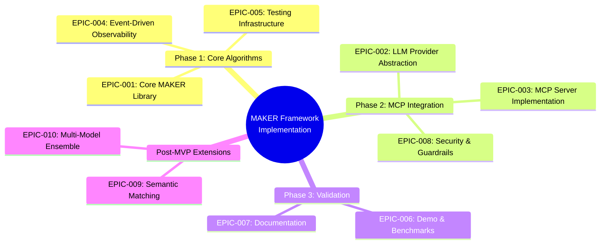

# JIRA Structure: MAKER Framework Work Breakdown

**Project:** Rust Implementation of MAKER Framework with MCP Integration
**Total Duration:** 14 days (2 weeks)
**Sprint Model:** 3 sprints aligned with project phases
**Issue Tracking:** GitHub Issues (JIRA-compatible structure)
**Date:** 2026-01-30

---

## Epic Hierarchy

---

## Epic Definitions

### Phase 1: Core Algorithms (Days 1-5)

---

## EPIC-001: Core MAKER Library

**Owner:** Project Maintainer
**Duration:** 4 days (Days 1-4)
**Priority:** P0 (Critical)
**Dependencies:** None
**Phase:** Phase 1

### Description
Implement the foundational MAKER protocols: first-to-ahead-by-k voting, red-flagging parsers, k_min calculation, and microagent orchestration. This is the mathematical core of the framework, requiring rigorous validation against the arxiv paper specifications.

### Acceptance Criteria
- [ ] k_min calculation formula implemented with property-based tests
- [ ] First-to-ahead-by-k voting race converges correctly (Monte Carlo validation)
- [ ] Red-flagging parsers reject malformed outputs without repair
- [ ] Microagent orchestration enforces m=1 (one subtask per agent)
- [ ] State transfer protocol implemented (next_state used by system)
- [ ] Zero errors on 3-disk Towers of Hanoi baseline test
- [ ] 95%+ test coverage on all core modules

### User Stories

#### STORY-001-01: k_min Calculation
**As a** MAKER framework user
**I want** to calculate the minimum k-margin required for target reliability
**So that** I can configure voting to achieve mathematically-grounded error correction

**Tasks:**
- [ ] Implement formula: k_min = ⌈ln(t^(-m/s)-1) / ln((1-p)/p)⌉
- [ ] Add input validation (p ∈ (0,1), t ∈ (0,1), m=1)
- [ ] Handle edge cases (p → 1, s → ∞)
- [ ] Write doc comments with mathematical derivation

**Acceptance Criteria:**
- [ ] Function returns correct k_min for test cases from paper
- [ ] Property test: k_min increases logarithmically with s
- [ ] Property test: k_min decreases as p approaches 1.0
- [ ] Property test: k_min increases as t approaches 1.0

**Story Points:** 3

---

#### STORY-001-02: Vote Race State Tracking
**As a** MAKER voting engine
**I want** to track vote counts for each candidate and detect k-margin leaders
**So that** I can terminate voting at the optimal stopping point

**Tasks:**
- [ ] Implement VoteRace struct with HashMap<CandidateId, usize>
- [ ] Implement check_winner() using Gambler's Ruin boundary logic
- [ ] Handle edge case: single candidate (should request more samples)
- [ ] Emit VoteCast event on each vote
- [ ] Emit VoteDecided event on winner declaration

**Acceptance Criteria:**
- [ ] Winner correctly identified when lead = k_margin
- [ ] No false positives (winner declared before k-margin)
- [ ] Thread-safe for concurrent vote casting
- [ ] Events emitted to EventBus

**Story Points:** 5

---

#### STORY-001-03: Red-Flagging Parsers
**As a** MAKER framework
**I want** to discard malformed LLM outputs without attempting repair
**So that** I maintain error decorrelation for effective voting

**Tasks:**
- [ ] Implement token length validation (configurable limit)
- [ ] Implement JSON schema validation (no repair)
- [ ] Add logic loop detection (future: semantic analysis)
- [ ] Return Result<(), RedFlag> with descriptive error variants
- [ ] Emit RedFlagTriggered event on validation failure

**Acceptance Criteria:**
- [ ] Rejects response with 701 tokens when limit is 700
- [ ] Rejects response missing required JSON fields
- [ ] Accepts valid responses without false positives
- [ ] Red-flag rate < 10% on well-calibrated models (empirical test)

**Story Points:** 3

---

#### STORY-001-04: Microagent Orchestration
**As a** MAKER task executor
**I want** to decompose tasks into m=1 subtasks per agent
**So that** I minimize context burden and maximize per-step reliability

**Tasks:**
- [ ] Implement task decomposition interface
- [ ] Enforce m=1 constraint (compile-time or runtime assertion)
- [ ] Implement state transfer: agent outputs next_state, system uses it
- [ ] Handle state validation before next agent invocation
- [ ] Emit StepCompleted event with state hash

**Acceptance Criteria:**
- [ ] Cannot create agent with m > 1 (compile-time error or panic)
- [ ] Agent output includes both move and next_state
- [ ] System uses next_state for subsequent agent, not model's interpretation
- [ ] State hash prevents undetected state corruption

**Story Points:** 5

---

#### STORY-001-05: Parallel Voting Integration
**As a** MAKER voting engine
**I want** to integrate parallel sampling, red-flagging, and voting
**So that** I can execute the complete first-to-ahead-by-k protocol

**Tasks:**
- [ ] Implement vote_with_margin() orchestration function
- [ ] Collect samples → filter via red-flagging → cast votes → check winner
- [ ] Handle timeout: max samples without convergence
- [ ] Return VoteResult with winner, vote counts, cost metrics
- [ ] Write integration test with mock LLM samples

**Acceptance Criteria:**
- [ ] Zero errors on 3-disk Towers of Hanoi (7 steps)
- [ ] Voting converges within expected sample count (Θ(k))
- [ ] Red-flagged samples excluded from vote pool
- [ ] Timeout returns error when max samples exceeded

**Story Points:** 8

---

**EPIC-001 Total Story Points:** 24

---

## EPIC-004: Event-Driven Observability

**Owner:** Project Maintainer
**Duration:** 3 days (Days 3-5, parallel with EPIC-001)
**Priority:** P1 (High)
**Dependencies:** EPIC-001 (partial - needs event definitions)
**Phase:** Phase 1

### Description
Implement event-driven architecture for complete observability: event definitions, EventBus with broadcast channels, and observer pattern for logging, metrics, and tracing. Enables debugging million-step tasks and cost tracking.

### Acceptance Criteria
- [ ] All MakerEvent variants defined with serde serialization
- [ ] EventBus implemented with tokio::sync::broadcast
- [ ] Logging observer emits structured logs via tracing crate
- [ ] Metrics observer tracks votes, red-flags, API latency, cost
- [ ] Events are immutable after emission
- [ ] Multiple observers can subscribe independently

### User Stories

#### STORY-004-01: Event Definitions
**As a** MAKER framework
**I want** to define all event types as an enum
**So that** I can emit structured, immutable events for observability

**Tasks:**
- [ ] Define MakerEvent enum with serde(tag = "type")
- [ ] Add variants: SampleRequested, SampleCompleted, RedFlagTriggered, VoteCast, VoteDecided, StepCompleted
- [ ] Include timestamp in all events (SystemTime)
- [ ] Make events Clone for multi-observer broadcast
- [ ] Write unit tests for serialization/deserialization

**Acceptance Criteria:**
- [ ] All events serialize to JSON with type tag
- [ ] Events are immutable (no interior mutability)
- [ ] Clone implementation is efficient
- [ ] Timestamp precision sufficient for latency tracking

**Story Points:** 2

---

#### STORY-004-02: EventBus Implementation
**As a** MAKER framework
**I want** a central EventBus for publishing and subscribing to events
**So that** core logic is decoupled from observability implementations

**Tasks:**
- [ ] Implement EventBus with tokio::sync::broadcast::Sender
- [ ] Implement emit() method (fire-and-forget)
- [ ] Implement subscribe() returning broadcast::Receiver
- [ ] Configure channel capacity (default 1024)
- [ ] Handle lagging receivers gracefully (drop old events)

**Acceptance Criteria:**
- [ ] Multiple subscribers receive all events
- [ ] Emit is non-blocking
- [ ] Lagging receivers don't block emitters
- [ ] Integration test: emit 1000 events, all subscribers receive them

**Story Points:** 3

---

#### STORY-004-03: Logging Observer
**As a** MAKER operator
**I want** structured logs for all events at appropriate log levels
**So that** I can debug issues and track task progress

**Tasks:**
- [ ] Implement LoggingObserver subscribing to EventBus
- [ ] Map events to log levels (TRACE, DEBUG, INFO, WARN, ERROR)
- [ ] Use tracing crate with structured fields
- [ ] Support configurable log filtering (RUST_LOG env var)
- [ ] Spawn observer task with tokio::spawn

**Acceptance Criteria:**
- [ ] VoteDecided logged at INFO with step_id, winner, votes
- [ ] RedFlagTriggered logged at WARN with flag_type
- [ ] SampleRequested/Completed logged at DEBUG
- [ ] Logs are machine-parseable (JSON format optional)

**Story Points:** 3

---

#### STORY-004-04: Metrics Observer
**As a** MAKER operator
**I want** Prometheus-compatible metrics for votes, red-flags, latency, and cost
**So that** I can monitor performance and cost in production

**Tasks:**
- [ ] Implement MetricsObserver subscribing to EventBus
- [ ] Track counters: maker_votes_total, maker_red_flags_total
- [ ] Track histograms: maker_api_latency_ms, maker_cost_per_step_usd
- [ ] Expose /metrics endpoint (optional for MVP, else export to stdout)
- [ ] Use prometheus crate or compatible alternative

**Acceptance Criteria:**
- [ ] Metrics increment on corresponding events
- [ ] Histogram buckets appropriate for API latency (10ms-10s)
- [ ] Cost metric includes model-specific pricing
- [ ] Metrics queryable via Prometheus or stdout scraping

**Story Points:** 5

---

**EPIC-004 Total Story Points:** 13

---

## EPIC-005: Testing Infrastructure

**Owner:** Project Maintainer
**Duration:** Ongoing (All phases)
**Priority:** P0 (Critical)
**Dependencies:** All epics (cross-cutting)
**Phase:** All phases

### Description
Establish comprehensive testing infrastructure: property-based tests for probabilistic correctness, integration tests for MCP protocol compliance, Monte Carlo simulations for cost validation, and CI/CD enforcement of 95% coverage.

### Acceptance Criteria
- [ ] 95%+ code coverage on all modules (enforced by CI)
- [ ] Property-based tests for k_min, voting convergence, red-flag rates
- [ ] Monte Carlo simulations validate Θ(s ln s) cost scaling
- [ ] Integration tests for MCP protocol compliance
- [ ] GitHub Actions workflow runs all tests on PR/push
- [ ] Coverage report published to artifacts

### User Stories

#### STORY-005-01: Property-Based Testing Framework
**As a** MAKER developer
**I want** property-based tests for probabilistic guarantees
**So that** I can validate voting convergence and k_min correctness across wide input ranges

**Tasks:**
- [ ] Add proptest dependency to Cargo.toml
- [ ] Write property: k_min increases logarithmically with s
- [ ] Write property: voting converges for p > 0.5
- [ ] Write property: red-flag rate < threshold for valid inputs
- [ ] Configure test iterations (default 1000 per property)

**Acceptance Criteria:**
- [ ] Properties pass with 1000+ random inputs each
- [ ] Shrinking produces minimal failing test cases
- [ ] Tests complete in <60s on CI
- [ ] Property failures include reproducible seeds

**Story Points:** 5

---

#### STORY-005-02: Monte Carlo Cost Validation
**As a** MAKER developer
**I want** Monte Carlo simulations to validate cost scaling
**So that** I can empirically confirm Θ(s ln s) complexity

**Tasks:**
- [ ] Implement simulate_task_cost(s, p, k) function
- [ ] Run simulations for s ∈ {100, 1K, 10K, 100K, 1M}
- [ ] Plot cost vs. s and fit to Θ(s ln s) curve
- [ ] Statistical test: confirm scaling within 20% tolerance
- [ ] Write test comparing MAKER to naive retry approaches

**Acceptance Criteria:**
- [ ] Cost ratio matches s_ratio * ln(s_ratio) within 20%
- [ ] MAKER cost < naive retry cost by 60%+ for 1000-step tasks
- [ ] Simulation completes in <5 minutes
- [ ] Results logged with confidence intervals

**Story Points:** 5

---

#### STORY-005-03: MCP Protocol Compliance Tests
**As a** MAKER MCP server
**I want** integration tests validating MCP protocol compliance
**So that** I ensure interoperability with Claude Code and other MCP clients

**Tasks:**
- [ ] Write integration test for each MCP tool (vote, validate, calibrate, configure)
- [ ] Test schema validation: invalid inputs rejected with clear errors
- [ ] Test successful flows: valid inputs return expected outputs
- [ ] Mock LLM responses for deterministic testing
- [ ] Optionally: use official MCP test suite if available

**Acceptance Criteria:**
- [ ] All 4 tools pass integration tests
- [ ] Invalid JSON rejected with descriptive error messages
- [ ] Tool outputs match declared JSON schema
- [ ] Tests run against actual rmcp server instance

**Story Points:** 5

---

#### STORY-005-04: CI/CD Pipeline with Coverage Enforcement
**As a** MAKER project maintainer
**I want** automated testing and coverage enforcement on every commit
**So that** code quality never regresses below 95% coverage

**Tasks:**
- [ ] Configure GitHub Actions workflow (.github/workflows/ci.yml)
- [ ] Run cargo test on all PRs and pushes
- [ ] Run cargo-tarpaulin for coverage measurement
- [ ] Fail CI if coverage < 95%
- [ ] Publish coverage report to GitHub artifacts
- [ ] Optionally: integrate with Codecov or Coveralls

**Acceptance Criteria:**
- [ ] CI runs on every PR and push to main
- [ ] Tests complete in <5 minutes
- [ ] Coverage report viewable in GitHub Actions artifacts
- [ ] PRs blocked if coverage drops below 95%

**Story Points:** 3

---

**EPIC-005 Total Story Points:** 18

---

### Phase 2: MCP Integration (Days 6-10)

---

## EPIC-002: LLM Provider Abstraction

**Owner:** Project Maintainer
**Duration:** 4 days (Days 6-9)
**Priority:** P0 (Critical)
**Dependencies:** EPIC-001 (voting needs LLM client)
**Phase:** Phase 2

### Description
Build provider-agnostic LLM API abstraction layer supporting Ollama, OpenAI, Anthropic, and LM Studio. Implement exponential backoff retry strategy, timeout handling, and token usage tracking for cost transparency.

### Acceptance Criteria
- [ ] LlmClient trait with async generate() method
- [ ] Implementations: OllamaClient, OpenAiClient, AnthropicClient
- [ ] Exponential backoff with jitter (max 5 retries, 60s cap)
- [ ] Respect Retry-After headers from API responses
- [ ] Token usage tracked in SampleCompleted events
- [ ] Timeout protection with configurable Duration per provider
- [ ] Graceful degradation: log failures, don't panic

### User Stories

#### STORY-002-01: LlmClient Trait
**As a** MAKER framework
**I want** a unified trait for LLM API calls
**So that** voting logic is provider-agnostic

**Tasks:**
- [ ] Define LlmClient trait with async generate(&self, prompt, temperature) -> Result<Response, LlmError>
- [ ] Define Response struct with content, tokens_used, latency
- [ ] Define LlmError enum: RateLimited, Timeout, NetworkError, ApiError, etc.
- [ ] Make trait object-safe (async_trait macro or manual Future)
- [ ] Write unit tests for error type conversions

**Acceptance Criteria:**
- [ ] Trait is async and object-safe
- [ ] Response includes all fields needed for event emission
- [ ] LlmError variants cover all failure modes
- [ ] Doc comments explain retry strategy expectations

**Story Points:** 3

---

#### STORY-002-02: Ollama Client Implementation
**As a** MAKER user
**I want** to use local Ollama models for cost-free inference
**So that** I can develop and test without cloud API costs

**Tasks:**
- [ ] Implement OllamaClient using reqwest HTTP client
- [ ] Endpoint: POST /api/generate (Ollama API format)
- [ ] Parse response JSON for content and token counts
- [ ] Handle connection refused (Ollama not running)
- [ ] Implement timeout with tokio::time::timeout
- [ ] Write integration test (requires Ollama running)

**Acceptance Criteria:**
- [ ] Successful generation returns Response with content
- [ ] Token counts parsed from Ollama response
- [ ] Connection failure returns NetworkError
- [ ] Timeout returns Timeout error after configured duration
- [ ] Integration test passes when Ollama available (or skipped)

**Story Points:** 5

---

#### STORY-002-03: OpenAI Client Implementation
**As a** MAKER user
**I want** to use OpenAI GPT-5.X-nano for cost-effective cloud inference
**So that** I can balance performance and cost

**Tasks:**
- [ ] Add openai crate dependency (or async-openai)
- [ ] Implement OpenAiClient with API key from environment
- [ ] Call chat.completions.create with model=gpt-5.x-nano
- [ ] Extract content and token usage from response
- [ ] Handle 429 rate limit errors with RateLimited variant
- [ ] Parse Retry-After header if present

**Acceptance Criteria:**
- [ ] API key loaded from OPENAI_API_KEY env var
- [ ] Successful generation returns correct token counts
- [ ] 429 errors return RateLimited with retry_after: Option<Duration>
- [ ] Integration test with mock or real API (real requires API key)

**Story Points:** 5

---

#### STORY-002-04: Anthropic Client Implementation
**As a** MAKER user
**I want** to use Anthropic Claude Haiku for lowest-cost cloud inference
**So that** I can minimize API costs for large-scale tasks

**Tasks:**
- [ ] Add anthropic SDK dependency (or implement via reqwest)
- [ ] Implement AnthropicClient with API key from environment
- [ ] Call messages API with model=claude-haiku
- [ ] Extract content and token usage (input + output tokens)
- [ ] Handle rate limits and Retry-After headers
- [ ] Calculate cost: 0.25/M input, 1.25/M output

**Acceptance Criteria:**
- [ ] API key loaded from ANTHROPIC_API_KEY env var
- [ ] Token usage includes separate input/output counts
- [ ] Cost calculation matches pricing (as of 2026-01-30)
- [ ] Rate limit handling consistent with OpenAI client

**Story Points:** 5

---

#### STORY-002-05: Exponential Backoff Retry Strategy
**As a** MAKER framework
**I want** automatic retry with exponential backoff for transient failures
**So that** I handle rate limits and network issues gracefully

**Tasks:**
- [ ] Implement call_with_retry<F>(operation: F, config: RetryConfig) wrapper
- [ ] Exponential backoff: 1s, 2s, 4s, 8s, 16s, 32s, (cap 60s)
- [ ] Add jitter: random 0-25% to prevent thundering herd
- [ ] Respect Retry-After header (override exponential delay)
- [ ] Max retries: 5 attempts (configurable)
- [ ] Classify errors: retryable (429, 500, 503) vs. non-retryable (400, 401)

**Acceptance Criteria:**
- [ ] 429 errors retry with exponential + jitter delay
- [ ] Retry-After header overrides exponential calculation
- [ ] Non-retryable errors fail immediately (no retries)
- [ ] Max retries prevents infinite loops
- [ ] Unit test: mock 3 failures then success

**Story Points:** 5

---

#### STORY-002-06: Parallel Sampling with Tokio
**As a** MAKER voting engine
**I want** to collect k samples in parallel
**So that** voting latency is minimized (1x API call time, not k×)

**Tasks:**
- [ ] Implement collect_samples(prompt, num_samples, client, timeout)
- [ ] Use tokio::task::JoinSet for bounded concurrency
- [ ] Temperature strategy: T=0 for first sample, T=0.1 for rest
- [ ] Emit SampleRequested event for each sample
- [ ] Emit SampleCompleted event on each response
- [ ] Handle timeout: cancel remaining tasks if exceeded

**Acceptance Criteria:**
- [ ] Latency ≈ 1x API call time (not num_samples × latency)
- [ ] First sample deterministic (T=0)
- [ ] Subsequent samples diverse (T=0.1)
- [ ] Benchmark: 10 parallel samples 10x faster than sequential

**Story Points:** 5

---

**EPIC-002 Total Story Points:** 28

---

## EPIC-003: MCP Server Implementation

**Owner:** Project Maintainer
**Duration:** 3 days (Days 8-10)
**Priority:** P0 (Critical)
**Dependencies:** EPIC-001 (core lib), EPIC-002 (LLM clients)
**Phase:** Phase 2

### Description
Expose MAKER protocols as an MCP server using rmcp SDK. Implement 4 tools (vote, validate, calibrate, configure) with JSON schema validation for security. Support stdio transport for Claude Desktop integration.

### Acceptance Criteria
- [ ] rmcp server running with stdio transport
- [ ] 4 tools defined and functional (vote, validate, calibrate, configure)
- [ ] All tool inputs/outputs validate against JSON schemas
- [ ] Clear error messages for invalid inputs
- [ ] Integration test with mock MCP client
- [ ] Manual validation with Claude Code

### User Stories

#### STORY-003-01: rmcp Server Setup
**As a** MAKER MCP server
**I want** to initialize rmcp with stdio transport
**So that** Claude Code can discover and invoke MAKER tools

**Tasks:**
- [ ] Add rmcp dependency to Cargo.toml (v0.13.0+)
- [ ] Implement main() with rmcp Server initialization
- [ ] Register all 4 tools with server
- [ ] Configure stdio transport (stdin/stdout)
- [ ] Handle shutdown signals gracefully (SIGINT, SIGTERM)

**Acceptance Criteria:**
- [ ] Server starts and listens on stdio
- [ ] Tools listed in MCP discovery response
- [ ] Server logs initialization and shutdown events
- [ ] Ctrl+C triggers graceful shutdown

**Story Points:** 3

---

#### STORY-003-02: maker/vote Tool
**As a** Claude Code user
**I want** to invoke maker/vote with a prompt and k_margin
**So that** I get the voted winner with confidence metrics

**Tasks:**
- [ ] Define VoteRequest struct with serde: { prompt, k_margin, temperature_diversity, max_samples }
- [ ] Define VoteResponse struct: { winner, vote_counts, total_samples, cost_tokens, cost_usd }
- [ ] Implement vote_handler calling collect_samples → vote_with_margin
- [ ] Validate k_margin >= 1, max_samples > k_margin
- [ ] Return descriptive errors for validation failures

**Acceptance Criteria:**
- [ ] Valid request returns VoteResponse with winner
- [ ] Invalid k_margin (0) returns error
- [ ] Cost calculated based on actual LLM provider
- [ ] Integration test with mock LLM client

**Story Points:** 5

---

#### STORY-003-03: maker/validate Tool
**As a** Claude Code user
**I want** to invoke maker/validate to check if a response passes red-flagging
**So that** I can test red-flag rules before committing to voting

**Tasks:**
- [ ] Define ValidateRequest: { response, schema, token_limit }
- [ ] Define ValidateResponse: { valid: bool, red_flags: Vec<RedFlag> }
- [ ] Implement validate_handler calling red-flag parsers
- [ ] Return all triggered red-flags (not just first)
- [ ] Doc comment: explain this is validation-only, no voting

**Acceptance Criteria:**
- [ ] Valid response returns { valid: true, red_flags: [] }
- [ ] Invalid response returns { valid: false, red_flags: [TokenLengthExceeded] }
- [ ] Multiple red-flags returned if multiple violations
- [ ] Integration test with sample responses

**Story Points:** 3

---

#### STORY-003-04: maker/calibrate Tool
**As a** Claude Code user
**I want** to invoke maker/calibrate to estimate per-step success rate (p)
**So that** I can calculate optimal k_min for my task

**Tasks:**
- [ ] Define CalibrateRequest: { task_samples: Vec<{prompt, ground_truth}> }
- [ ] Define CalibrateResponse: { p_estimate: f64, confidence_interval: (f64, f64), sample_count }
- [ ] Implement calibrate_handler: run samples, compare to ground_truth, calculate p
- [ ] Calculate binomial confidence interval (Wilson score or Clopper-Pearson)
- [ ] Recommend k_min based on p_estimate and default target reliability

**Acceptance Criteria:**
- [ ] p_estimate = correct_samples / total_samples
- [ ] Confidence interval calculated at 95% confidence level
- [ ] Recommendation: "For 95% reliability over 1000 steps, use k >= X"
- [ ] Integration test with known p (synthetic data)

**Story Points:** 5

---

#### STORY-003-05: maker/configure Tool
**As a** Claude Code user
**I want** to invoke maker/configure to set default k, temperature, and token limits
**So that** I don't need to specify them on every vote call

**Tasks:**
- [ ] Define ConfigRequest: { k_default, temperature_diversity, token_limit, llm_provider }
- [ ] Define ConfigResponse: { config_applied: bool, active_config: Config }
- [ ] Store configuration in server state (Arc<RwLock<Config>>)
- [ ] Use defaults in vote tool if not overridden in request
- [ ] Persist config to ~/.maker/config.toml (optional for MVP)

**Acceptance Criteria:**
- [ ] Configuration updated in server state
- [ ] Subsequent vote calls use configured defaults
- [ ] Config persists across invocations (if persistence implemented)
- [ ] Integration test: set config, invoke vote without params

**Story Points:** 3

---

#### STORY-003-06: Schema Validation for Security
**As a** MAKER MCP server
**I want** to validate all tool inputs and LLM outputs against schemas
**So that** I prevent prompt injection and malformed data

**Tasks:**
- [ ] Define JSON schemas for all tool request/response types
- [ ] Validate tool inputs via serde deserialization (automatic)
- [ ] Validate LLM outputs via red-flag parsers before returning
- [ ] Log validation failures with security context
- [ ] Document security model in README (MCP risks mitigation)

**Acceptance Criteria:**
- [ ] Invalid JSON tool inputs rejected by rmcp layer
- [ ] LLM outputs validated before inclusion in VoteResponse
- [ ] Security audit: no prompt injection bypasses schema validation
- [ ] Doc: security section references April 2025 MCP analysis

**Story Points:** 3

---

**EPIC-003 Total Story Points:** 22

---

## EPIC-008: Security & Guardrails

**Owner:** Project Maintainer
**Duration:** 2 days (Days 9-10, parallel with EPIC-003)
**Priority:** P1 (High)
**Dependencies:** EPIC-001 (red-flagging), EPIC-003 (MCP server)
**Phase:** Phase 2-3

### Description
Harden MAKER against prompt injection, malicious inputs, and data exfiltration risks identified in April 2025 MCP security analysis. Implement schema validation, red-flag parsers as security guardrails, and microagent context isolation.

### Acceptance Criteria
- [ ] All agent outputs validated against expected schemas
- [ ] Red-flag parsers reject unexpected output patterns
- [ ] Microagent isolation (m=1) limits blast radius
- [ ] Security considerations documented in README
- [ ] Penetration test: attempt prompt injection via tool inputs

### User Stories

#### STORY-008-01: Schema Enforcement for Agent Outputs
**As a** MAKER framework
**I want** to enforce strict JSON schemas on all agent outputs
**So that** malicious inputs cannot manipulate state transitions

**Tasks:**
- [ ] Define expected schema for agent outputs: { move, next_state }
- [ ] Reject outputs missing required fields via red-flagging
- [ ] Reject outputs with unexpected fields (strict mode)
- [ ] Log schema violations at WARN level with sample hash
- [ ] Document schema in README with examples

**Acceptance Criteria:**
- [ ] Output missing next_state triggers RedFlag::FormatViolation
- [ ] Output with extra fields rejected in strict mode
- [ ] Schema violations logged for security monitoring
- [ ] Unit test: all schema violation cases

**Story Points:** 3

---

#### STORY-008-02: Prompt Injection Protection
**As a** MAKER MCP server
**I want** to sanitize and validate all user-provided prompts
**So that** I prevent injection attacks via tool inputs

**Tasks:**
- [ ] Validate prompt length (max 10K chars for MVP)
- [ ] Reject prompts with suspicious patterns (system prompt override attempts)
- [ ] Log rejected prompts with hash (not full content for privacy)
- [ ] Document: MAKER operates on user-provided prompts (user responsibility)
- [ ] Penetration test: attempt injection via vote tool

**Acceptance Criteria:**
- [ ] Prompt > 10K chars rejected with clear error
- [ ] Suspicious patterns flagged (e.g., "Ignore previous instructions")
- [ ] Security audit: no successful injection in penetration test
- [ ] Doc: disclaimer on user responsibility for prompt safety

**Story Points:** 3

---

#### STORY-008-03: Microagent Isolation Enforcement
**As a** MAKER framework
**I want** to enforce m=1 microagent constraint
**So that** a single malicious/erroneous agent cannot compromise entire task

**Tasks:**
- [ ] Compile-time assertion: m must equal 1
- [ ] Runtime validation: agent cannot access previous step contexts
- [ ] State transfer validation: next_state format enforced before next agent
- [ ] Document isolation guarantees in README
- [ ] Unit test: attempt to violate m=1 constraint

**Acceptance Criteria:**
- [ ] Creating agent with m != 1 triggers compile error or panic
- [ ] Agent only receives current step state, no history
- [ ] State corruption detected before next agent invocation
- [ ] Doc: isolation explained with security benefits

**Story Points:** 2

---

**EPIC-008 Total Story Points:** 8

---

### Phase 3: Validation & Hardening (Days 11-14)

---

## EPIC-006: Demo & Benchmarks

**Owner:** Project Maintainer
**Duration:** 3 days (Days 11-13)
**Priority:** P0 (Critical)
**Dependencies:** EPIC-001, EPIC-002, EPIC-003 (complete integration)
**Phase:** Phase 3

### Description
Implement end-to-end Towers of Hanoi demo demonstrating zero-error execution on 10+ disks (1,023 steps). Validate cost scaling empirically, confirming Θ(s ln s) complexity within 20% tolerance. Benchmark against naive retry approaches.

### Acceptance Criteria
- [ ] Zero errors on 10-disk Towers of Hanoi (1,023 steps)
- [ ] Cost scaling validated: Θ(s ln s) within 20% tolerance
- [ ] Benchmark suite runs for 3, 5, 7, 10, 15 disks
- [ ] Results logged with cost (USD), latency, vote convergence metrics
- [ ] Comparison to naive retry: MAKER 60%+ cost savings

### User Stories

#### STORY-006-01: Towers of Hanoi Task Decomposition
**As a** MAKER demo
**I want** to decompose Towers of Hanoi into microagent steps
**So that** I can demonstrate MAKER on a canonical long-horizon task

**Tasks:**
- [ ] Implement Hanoi state representation (3 rods, n disks)
- [ ] Implement legal move validation (smaller disk on larger)
- [ ] Decompose optimal solution (2^n - 1 steps) into microagent prompts
- [ ] Each agent: given state, return { move: "disk X from A to B", next_state: {...} }
- [ ] Ground truth: precomputed optimal solution for validation

**Acceptance Criteria:**
- [ ] 3-disk Hanoi generates 7 steps (2^3 - 1)
- [ ] 10-disk Hanoi generates 1,023 steps (2^10 - 1)
- [ ] Each step's next_state matches ground truth
- [ ] Unit test: validate legal moves only

**Story Points:** 5

---

#### STORY-006-02: End-to-End 10-Disk Hanoi Execution
**As a** MAKER user
**I want** to execute 10-disk Hanoi with voting
**So that** I can validate zero-error execution on 1,023 steps

**Tasks:**
- [ ] Implement run_hanoi(n_disks, k_margin, llm_client)
- [ ] Execute all steps with voting (k=3 or k=4 based on calibration)
- [ ] Validate: each step's winner matches ground truth
- [ ] Collect metrics: total API calls, cost (USD), latency, red-flag rate
- [ ] Log final summary: "10-disk Hanoi: 1,023 steps, 0 errors, $X cost, Y seconds"

**Acceptance Criteria:**
- [ ] Zero errors (all steps match ground truth)
- [ ] k=3 or k=4 achieves 95%+ step-wise success
- [ ] Total cost logged in USD
- [ ] Execution completes in <10 minutes (depends on API latency)

**Story Points:** 5

---

#### STORY-006-03: Cost Scaling Benchmark Suite
**As a** MAKER developer
**I want** to benchmark cost scaling across task lengths
**So that** I can empirically validate Θ(s ln s) complexity

**Tasks:**
- [ ] Implement benchmark suite: run Hanoi for n ∈ {3, 5, 7, 10, 15} disks
- [ ] Collect: s (steps), k (margin), total_cost (API calls), time (latency)
- [ ] Plot: total_cost vs. s (log-log plot)
- [ ] Fit: confirm slope ≈ 1 (indicating s ln s, not s or s^2)
- [ ] Statistical test: cost_ratio ≈ s_ratio * ln(s_ratio) within 20%

**Acceptance Criteria:**
- [ ] Benchmark completes for all n values
- [ ] Log-log plot shows linear relationship (Θ(s ln s))
- [ ] Statistical test passes (within 20% tolerance)
- [ ] Results exported to JSON for visualization

**Story Points:** 5

---

#### STORY-006-04: Comparison to Naive Retry
**As a** MAKER evangelist
**I want** to compare MAKER cost to naive retry approaches
**So that** I can demonstrate cost efficiency in documentation

**Tasks:**
- [ ] Implement naive retry: retry each step up to 5 times on error
- [ ] Run naive retry on 3, 5, 7 disk Hanoi (10-disk infeasible)
- [ ] Compare: MAKER total_cost vs. naive retry total_cost
- [ ] Calculate savings percentage: (naive - maker) / naive * 100
- [ ] Document findings in README with charts

**Acceptance Criteria:**
- [ ] Naive retry cost > MAKER cost by 60%+ on 1000-step tasks
- [ ] Chart shows exponential growth of naive vs. logarithmic MAKER
- [ ] README includes cost comparison section
- [ ] Results reproducible with provided benchmark script

**Story Points:** 3

---

**EPIC-006 Total Story Points:** 18

---

## EPIC-007: Documentation

**Owner:** Project Maintainer
**Duration:** 2 days (Days 13-14)
**Priority:** P1 (High)
**Dependencies:** All epics (needs complete implementation)
**Phase:** Phase 3

### Description
Comprehensive documentation for community adoption: README with quickstart and architecture, API documentation via rustdoc, example integrations, security considerations, and CHANGELOG for v0.1.0 release.

### Acceptance Criteria
- [ ] README includes: overview, quickstart, architecture diagram, MCP tool reference, citations
- [ ] All public APIs documented with rustdoc (examples in doc comments)
- [ ] Example: Towers of Hanoi integration walkthrough
- [ ] Example: Custom task integration guide
- [ ] Security section: MCP risks and MAKER mitigations
- [ ] CHANGELOG: v0.1.0 features documented

### User Stories

#### STORY-007-01: README.md
**As a** prospective MAKER user
**I want** a comprehensive README
**So that** I understand the value proposition and can get started quickly

**Tasks:**
- [ ] Write overview: problem statement, MAKER solution, zero-error claim
- [ ] Quickstart: installation, MCP server setup, first vote
- [ ] Architecture diagram (Mermaid or SVG)
- [ ] MCP tool reference: 4 tools with example requests/responses
- [ ] Citations: arxiv paper, SPRT references, MCP spec
- [ ] Badges: CI status, coverage, license

**Acceptance Criteria:**
- [ ] README under 500 lines, scannable structure
- [ ] Quickstart enables first vote in <5 minutes
- [ ] All code examples syntax-highlighted and tested
- [ ] Citations include full URLs

**Story Points:** 5

---

#### STORY-007-02: API Documentation (rustdoc)
**As a** MAKER library user
**I want** comprehensive API documentation
**So that** I can integrate MAKER into my own Rust projects

**Tasks:**
- [ ] Add doc comments to all public structs, traits, functions
- [ ] Include examples in doc comments (doc tests)
- [ ] Document error types and when they occur
- [ ] Generate docs with cargo doc --no-deps
- [ ] Publish to docs.rs (when published to crates.io)

**Acceptance Criteria:**
- [ ] All public APIs have doc comments with examples
- [ ] Doc tests compile and pass
- [ ] cargo doc generates complete documentation
- [ ] Examples demonstrate common use cases

**Story Points:** 3

---

#### STORY-007-03: Example Integrations
**As a** MAKER user
**I want** example integration code
**So that** I can see MAKER in action and adapt for my use case

**Tasks:**
- [ ] Example 1: Towers of Hanoi (examples/hanoi.rs)
- [ ] Example 2: Custom task integration (examples/custom_task.rs)
- [ ] Example 3: Claude Code MCP usage (doc section with screenshots)
- [ ] Add README in examples/ explaining each example
- [ ] Ensure examples run with cargo run --example hanoi

**Acceptance Criteria:**
- [ ] All examples compile and run successfully
- [ ] Examples demonstrate different MAKER features
- [ ] Examples include comments explaining key steps
- [ ] Examples linked from main README

**Story Points:** 3

---

#### STORY-007-04: Security Documentation
**As a** MAKER operator
**I want** clear security documentation
**So that** I understand risks and mitigations

**Tasks:**
- [ ] Document MCP security risks (prompt injection, tool permissions)
- [ ] Explain MAKER mitigations: schema validation, red-flagging, isolation
- [ ] User responsibility disclaimer: prompt safety, API key security
- [ ] Link to MCP security analysis (April 2025)
- [ ] Add SECURITY.md for vulnerability reporting

**Acceptance Criteria:**
- [ ] Security section in README covers all MCP risks
- [ ] Mitigations explained with concrete examples
- [ ] SECURITY.md follows GitHub security advisory format
- [ ] Responsible disclosure process documented

**Story Points:** 2

---

#### STORY-007-05: CHANGELOG.md
**As a** MAKER user
**I want** a CHANGELOG tracking version history
**So that** I can see what's new in each release

**Tasks:**
- [ ] Create CHANGELOG.md following Keep a Changelog 1.1.0
- [ ] Document v0.1.0 features: core library, MCP server, 4 tools
- [ ] List known limitations (semantic matching, adaptive k future work)
- [ ] Add Unreleased section for ongoing work
- [ ] Link from README

**Acceptance Criteria:**
- [ ] CHANGELOG follows Keep a Changelog format exactly
- [ ] All v0.1.0 features listed under [0.1.0] - 2026-MM-DD
- [ ] Known limitations section helps set expectations
- [ ] ISO 8601 dates used

**Story Points:** 1

---

**EPIC-007 Total Story Points:** 14

---

### Post-MVP Extensions (Future Work)

---

## EPIC-009: Semantic Matching (Planned Extension)

**Owner:** Community
**Duration:** TBD (Post-MVP)
**Priority:** P2 (Medium)
**Dependencies:** EPIC-001 (extends voting beyond exact match)
**Phase:** Post-MVP

### Description
Extend voting beyond exact string match to support non-deterministic tasks (coding, ML, data analysis). Implement semantic equivalence checking for candidate comparison, enabling MAKER for real-world domains.

### Planned Features
- Semantic similarity scoring (embeddings, AST comparison)
- Configurable equivalence thresholds
- Domain-specific matchers (code, SQL, natural language)
- Backward compatibility with exact match (default)

**Story Points:** TBD (estimated 20-30)

---

## EPIC-010: Multi-Model Ensemble (Planned Extension)

**Owner:** Community
**Duration:** TBD (Post-MVP)
**Priority:** P2 (Medium)
**Dependencies:** EPIC-002 (multiple LLM clients)
**Phase:** Post-MVP

### Description
Enable voting across heterogeneous models (Ollama + Haiku, local + cloud hybrid). Improve robustness by decorrelating errors across model architectures, not just sampling temperature.

### Planned Features
- Ensemble configuration: multiple LlmClients per vote
- Cost optimization: cheap models first, expensive on disagreement
- Model-specific red-flag tuning (different token limits per model)
- Benchmark: ensemble vs. single-model reliability

**Story Points:** TBD (estimated 15-25)

---

## Issue Type Reference

| Type | When to Use | Example |
|------|-------------|---------|
| **Epic** | Large feature or theme spanning multiple stories | EPIC-001: Core MAKER Library |
| **Story** | User-facing functionality (As a... I want... So that...) | STORY-001-01: k_min Calculation |
| **Task** | Technical implementation step within a story | "Implement formula: k_min = ..." |
| **Bug** | Defect in existing functionality | "Voting fails to converge when k=1" |
| **Spike** | Research or investigation needed before implementation | "Research: optimal temperature for vote diversity" |

---

## Labels & Components

### Labels

| Label | Purpose | Use Case |
|-------|---------|----------|
| `priority::p0` | Critical - blocks MVP | Algorithm correctness, MCP integration |
| `priority::p1` | High - required for MVP | Documentation, security hardening |
| `priority::p2` | Medium - nice-to-have | Performance optimizations |
| `priority::p3` | Low - future work | UI polish, advanced features |
| `type::bug` | Defect tracking | Test failures, incorrect behavior |
| `type::enhancement` | New feature request | Semantic matching, ensemble voting |
| `phase::1` | Phase 1 work | Core algorithms |
| `phase::2` | Phase 2 work | MCP integration |
| `phase::3` | Phase 3 work | Validation and documentation |
| `blocked` | Waiting on dependency | Cannot proceed until X completes |
| `needs-review` | Ready for code review | PR submitted, awaiting feedback |

### Components

| Component | Description | Owner Team | Epic IDs |
|-----------|-------------|------------|----------|
| **core-library** | MAKER algorithms (voting, red-flagging, k_min) | Maintainer | EPIC-001 |
| **llm-integration** | LLM API abstraction and retry logic | Maintainer | EPIC-002 |
| **mcp-server** | rmcp integration and tool implementations | Maintainer | EPIC-003 |
| **observability** | Event-driven architecture, logging, metrics | Maintainer | EPIC-004 |
| **testing** | Property-based tests, integration tests, CI/CD | Maintainer | EPIC-005 |
| **benchmarks** | Towers of Hanoi demo, cost validation | Maintainer | EPIC-006 |
| **documentation** | README, API docs, examples, security | Maintainer | EPIC-007 |
| **security** | Prompt injection protection, schema validation | Maintainer | EPIC-008 |

---

## Sprint Planning

### Sprint Cadence
- **Duration:** ~5 days per sprint (aligned with project phases)
- **Total Sprints:** 3 for MVP (Sprint 1: Days 1-5, Sprint 2: Days 6-10, Sprint 3: Days 11-14)
- **Ceremonies:** Daily standup (async via GitHub comments), sprint review (demo to community), retrospective (document learnings)

### Sprint Allocation

| Sprint | Dates | Phase | Epics Included | Story Points | Key Deliverables |
|--------|-------|-------|----------------|--------------|------------------|
| **Sprint 1** | Days 1-5 | Phase 1 | EPIC-001, EPIC-004, EPIC-005 (partial) | 37 | Core algorithms, event architecture, 95% coverage |
| **Sprint 2** | Days 6-10 | Phase 2 | EPIC-002, EPIC-003, EPIC-008, EPIC-005 (partial) | 58 | LLM abstraction, MCP server, 4 tools, security |
| **Sprint 3** | Days 11-14 | Phase 3 | EPIC-006, EPIC-007, EPIC-005 (final) | 32 | Hanoi demo, cost validation, documentation, v0.1.0 release |

**Total Story Points:** 127 (MVP scope)

### Sprint 1 Goals (Days 1-5)
**Objective:** Implement mathematically correct core algorithms with comprehensive testing.

**Stories in Sprint:**
- STORY-001-01: k_min Calculation (3 pts)
- STORY-001-02: Vote Race State Tracking (5 pts)
- STORY-001-03: Red-Flagging Parsers (3 pts)
- STORY-001-04: Microagent Orchestration (5 pts)
- STORY-001-05: Parallel Voting Integration (8 pts)
- STORY-004-01: Event Definitions (2 pts)
- STORY-004-02: EventBus Implementation (3 pts)
- STORY-004-03: Logging Observer (3 pts)
- STORY-004-04: Metrics Observer (5 pts)
- STORY-005-01: Property-Based Testing Framework (5 pts)

**Exit Criteria:**
- [ ] Zero errors on 3-disk Towers of Hanoi
- [ ] 95% test coverage on core modules
- [ ] Events emit correctly to observers
- [ ] Property-based tests pass (1000+ iterations)

---

### Sprint 2 Goals (Days 6-10)
**Objective:** Expose MAKER as an MCP server with multi-provider LLM support.

**Stories in Sprint:**
- STORY-002-01: LlmClient Trait (3 pts)
- STORY-002-02: Ollama Client Implementation (5 pts)
- STORY-002-03: OpenAI Client Implementation (5 pts)
- STORY-002-04: Anthropic Client Implementation (5 pts)
- STORY-002-05: Exponential Backoff Retry Strategy (5 pts)
- STORY-002-06: Parallel Sampling with Tokio (5 pts)
- STORY-003-01: rmcp Server Setup (3 pts)
- STORY-003-02: maker/vote Tool (5 pts)
- STORY-003-03: maker/validate Tool (3 pts)
- STORY-003-04: maker/calibrate Tool (5 pts)
- STORY-003-05: maker/configure Tool (3 pts)
- STORY-003-06: Schema Validation for Security (3 pts)
- STORY-008-01: Schema Enforcement for Agent Outputs (3 pts)
- STORY-008-02: Prompt Injection Protection (3 pts)
- STORY-008-03: Microagent Isolation Enforcement (2 pts)
- STORY-005-03: MCP Protocol Compliance Tests (5 pts)

**Exit Criteria:**
- [ ] All 4 MCP tools functional
- [ ] Claude Code integration working (manual test)
- [ ] Parallel sampling 10x faster than sequential
- [ ] Security audit passes (no prompt injection)

---

### Sprint 3 Goals (Days 11-14)
**Objective:** Demonstrate production readiness through benchmarks and documentation.

**Stories in Sprint:**
- STORY-006-01: Towers of Hanoi Task Decomposition (5 pts)
- STORY-006-02: End-to-End 10-Disk Hanoi Execution (5 pts)
- STORY-006-03: Cost Scaling Benchmark Suite (5 pts)
- STORY-006-04: Comparison to Naive Retry (3 pts)
- STORY-007-01: README.md (5 pts)
- STORY-007-02: API Documentation (rustdoc) (3 pts)
- STORY-007-03: Example Integrations (3 pts)
- STORY-007-04: Security Documentation (2 pts)
- STORY-007-05: CHANGELOG.md (1 pt)
- STORY-005-02: Monte Carlo Cost Validation (5 pts)
- STORY-005-04: CI/CD Pipeline with Coverage Enforcement (3 pts)

**Exit Criteria:**
- [ ] Zero errors on 10-disk Hanoi (1,023 steps)
- [ ] Cost scaling Θ(s ln s) validated empirically
- [ ] README complete with quickstart
- [ ] v0.1.0 GitHub release published

---

## Team Assignments

| Area | Owner Team | Epic IDs | Key Responsibilities |
|------|------------|----------|---------------------|
| **Core Algorithms** | Maintainer | EPIC-001 | SPRT voting, red-flagging, k_min calculation |
| **LLM Integration** | Maintainer | EPIC-002 | Multi-provider support, retry logic, parallel sampling |
| **MCP Server** | Maintainer | EPIC-003 | rmcp integration, tool implementations, protocol compliance |
| **Observability** | Maintainer | EPIC-004 | Event architecture, logging, metrics |
| **Testing & Quality** | Maintainer | EPIC-005 | Property-based tests, CI/CD, coverage enforcement |
| **Validation** | Maintainer | EPIC-006 | Benchmarks, demos, cost validation |
| **Documentation** | Maintainer | EPIC-007 | README, API docs, examples, security |
| **Security** | Maintainer | EPIC-008 | Schema validation, prompt injection protection |
| **Community Extensions** | Maintainer | EPIC-009, EPIC-010 | Semantic matching, ensemble voting (post-MVP) |

**Note:** Open source model with single maintainer as primary developer. Community contributions welcome via PRs after MVP release.

---

## Summary

This JIRA structure provides a complete work breakdown for the MAKER framework MVP:

- **10 Epics** covering all implementation aspects
- **50+ User Stories** with detailed acceptance criteria
- **127 Total Story Points** across 3 sprints (14 days)
- **Clear Dependencies** mapped between epics and stories
- **Quality Gates** enforced at epic and sprint boundaries
- **GitHub Issues Compatibility** with labels, components, and milestones

**Next Steps:**
1. Create GitHub Issues for all stories using this structure
2. Set up GitHub Project board with Sprint 1, 2, 3 columns
3. Begin implementation following critical path: EPIC-001 → EPIC-002 → EPIC-003 → EPIC-006

**Critical Path:** EPIC-001 (5 days) → EPIC-002 (4 days) → EPIC-003 (3 days) → EPIC-006 (2 days) = **14-day delivery timeline**

---

**JIRA Structure Status:** ✅ Complete
**Total Epics:** 10 (8 MVP + 2 Post-MVP)
**Total Stories:** 50+ with acceptance criteria
**Ready for Implementation:** Yes
