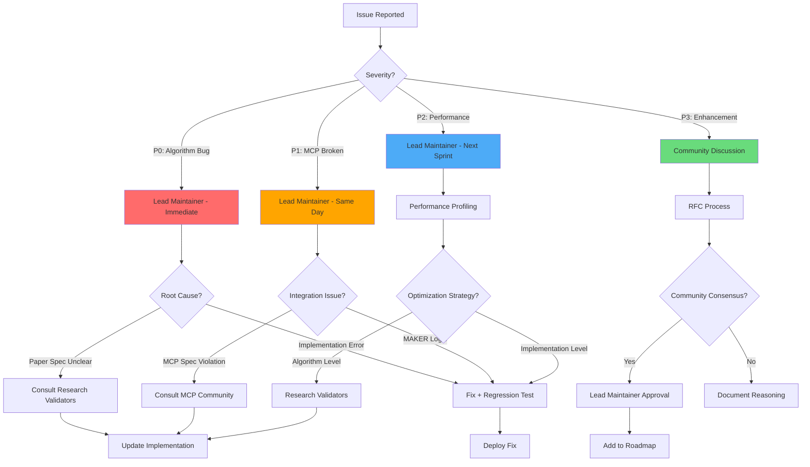
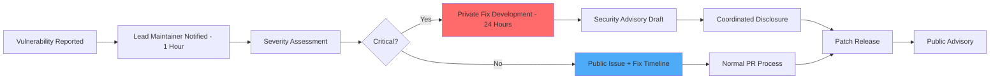

# RACI Chart: MAKER Framework Implementation

**Project:** Rust Implementation of MAKER Framework with MCP Integration
**Timeline:** 14 days (3 sprints)
**Model:** Open Source Maintainer
**Date:** 2026-01-30

---

## Legend

| Code | Meaning | Description |
|------|---------|-------------|
| **R** | Responsible | Person(s) who do the work to complete the task |
| **A** | Accountable | Person ultimately answerable for the correct and thorough completion (single point of authority) |
| **C** | Consulted | People whose opinions are sought; two-way communication |
| **I** | Informed | People who are kept up-to-date on progress; one-way communication |

**Single-A Rule**: Every activity has exactly ONE Accountable person.

---

## Role Definitions

| # | Role | Description | Typical Responsibilities |
|---|------|-------------|-------------------------|
| 1 | **Lead Maintainer** | Primary developer and project architect | Algorithm implementation, architectural decisions, code review, release management |
| 2 | **Contributors** | Community developers submitting PRs | Feature implementation, bug fixes, test coverage, documentation improvements |
| 3 | **Code Reviewers** | Technical reviewers for PRs | Code quality review, algorithm validation, security audit, architectural feedback |
| 4 | **Research Validators** | Academic/industry researchers | Mathematical correctness validation, SPRT theory review, paper specification compliance |
| 5 | **End Users (Claude Code)** | AI coding assistant users | Integration testing, use case feedback, bug reports, feature requests |
| 6 | **End Users (Researchers)** | LLM reliability researchers | Benchmark validation, methodology feedback, academic citations, derivative research |
| 7 | **LLM API Providers** | OpenAI, Anthropic, Ollama teams | API access, rate limit policies, SDK updates, service reliability |
| 8 | **MCP Community** | Anthropic MCP team and ecosystem | MCP spec compliance, security guidance, protocol updates, community support |

---

## Phase 1: Core MAKER Algorithms (Days 1-5)

| Activity | Lead Maintainer | Contributors | Code Reviewers | Research Validators | End Users (Claude) | End Users (Research) | LLM Providers | MCP Community |
|----------|-----------------|--------------|----------------|---------------------|-------------------|---------------------|---------------|---------------|
| **Project Setup & CI/CD** | R/A | I | C | I | I | I | - | - |
| **k_min Calculation Implementation** | R/A | C | C | C | - | I | - | - |
| **Property-Based Tests for k_min** | R/A | C | C | C | - | I | - | - |
| **First-to-Ahead-by-k Voting Logic** | R/A | C | C | C | - | I | - | - |
| **Vote Race State Tracking** | R/A | C | C | I | - | I | - | - |
| **Red-Flagging Parsers** | R/A | C | C | I | - | I | - | C |
| **Microagent Orchestration (m=1)** | R/A | C | C | C | - | I | - | - |
| **State Transfer Protocol** | R/A | C | C | C | - | I | - | - |
| **Event-Driven Architecture Design** | R/A | C | C | I | - | I | - | - |
| **EventBus Implementation** | R/A | C | C | I | - | I | - | - |
| **Logging Observer (tracing)** | R/A | C | C | I | - | I | - | - |
| **Metrics Observer (Prometheus)** | R/A | C | C | I | - | I | - | - |
| **3-Disk Towers of Hanoi Baseline** | R/A | C | C | C | - | I | - | - |
| **95% Coverage Enforcement** | R/A | C | C | I | - | I | - | - |
| **Phase 1 Exit Criteria Review** | A | I | C | C | - | I | - | - |

---

## Phase 2: MCP Server Integration (Days 6-10)

| Activity | Lead Maintainer | Contributors | Code Reviewers | Research Validators | End Users (Claude) | End Users (Research) | LLM Providers | MCP Community |
|----------|-----------------|--------------|----------------|---------------------|-------------------|---------------------|---------------|---------------|
| **LlmClient Trait Design** | R/A | C | C | I | - | I | C | - |
| **Ollama Client Implementation** | R/A | C | C | I | C | I | C | - |
| **OpenAI Client Implementation** | R/A | C | C | I | C | I | C | - |
| **Anthropic Client Implementation** | R/A | C | C | I | C | I | C | - |
| **Exponential Backoff Retry Logic** | R/A | C | C | I | - | I | C | - |
| **Parallel Sampling with Tokio** | R/A | C | C | I | - | I | I | - |
| **Token Usage Tracking** | R/A | C | C | I | - | I | I | - |
| **rmcp Server Setup (stdio)** | R/A | C | C | I | C | I | - | C |
| **maker/vote Tool Implementation** | R/A | C | C | I | C | I | - | C |
| **maker/validate Tool Implementation** | R/A | C | C | I | C | I | - | C |
| **maker/calibrate Tool Implementation** | R/A | C | C | C | C | I | - | C |
| **maker/configure Tool Implementation** | R/A | C | C | I | C | I | - | C |
| **MCP Schema Validation** | R/A | C | C | I | C | I | - | C |
| **Security Audit (Prompt Injection)** | R/A | I | C | I | C | I | I | C |
| **Schema Enforcement for Outputs** | R/A | C | C | I | C | I | - | C |
| **Microagent Isolation Enforcement** | R/A | C | C | C | C | I | - | - |
| **MCP Protocol Compliance Testing** | R/A | C | C | I | C | I | - | C |
| **Claude Code Integration Testing** | R/A | I | C | I | R/C | I | I | C |
| **Phase 2 Exit Criteria Review** | A | I | C | C | C | I | I | C |

---

## Phase 3: Validation & Hardening (Days 11-14)

| Activity | Lead Maintainer | Contributors | Code Reviewers | Research Validators | End Users (Claude) | End Users (Research) | LLM Providers | MCP Community |
|----------|-----------------|--------------|----------------|---------------------|-------------------|---------------------|---------------|---------------|
| **Towers of Hanoi Decomposition** | R/A | C | C | C | - | I | - | - |
| **10-Disk Hanoi End-to-End Execution** | R/A | I | C | C | C | C | I | - |
| **Cost Scaling Benchmark Suite** | R/A | C | C | C | - | C | I | - |
| **Θ(s ln s) Validation (Statistical)** | R/A | C | C | R/C | - | R/C | - | - |
| **Naive Retry Comparison** | R/A | C | C | C | - | C | - | - |
| **Monte Carlo Cost Validation** | R/A | C | C | C | - | C | - | - |
| **Security Hardening Review** | R/A | I | C | I | C | I | - | C |
| **Penetration Testing (Injection)** | R/A | C | C | I | I | I | - | C |
| **README Documentation** | R/A | C | C | I | C | C | - | C |
| **API Documentation (rustdoc)** | R/A | C | C | I | C | C | - | - |
| **Example Integrations** | R/A | C | C | I | C | C | - | I |
| **Security Documentation** | R/A | C | C | I | C | I | - | C |
| **CHANGELOG v0.1.0** | R/A | C | C | I | I | I | - | - |
| **v0.1.0 Release Build** | R/A | I | C | I | I | I | - | - |
| **Community Announcement** | R/A | I | I | I | I | C | - | I |
| **Phase 3 Exit Criteria Review** | A | I | C | C | C | C | I | C |

---

## Ongoing Governance (Post-MVP)

| Activity | Lead Maintainer | Contributors | Code Reviewers | Research Validators | End Users (Claude) | End Users (Research) | LLM Providers | MCP Community |
|----------|-----------------|--------------|----------------|---------------------|-------------------|---------------------|---------------|---------------|
| **Bug Triage & Prioritization** | A | C | C | I | I (report) | I (report) | I | I |
| **Security Vulnerability Response** | R/A | I | C | I | I | I | I | C |
| **PR Review & Merge** | A | R | R/C | C | - | - | - | - |
| **Release Planning (Minor/Patch)** | A | C | C | I | I | I | - | I |
| **API Stability Decisions** | A | C | C | I | C | C | I | C |
| **MCP Spec Compliance Updates** | R/A | C | C | I | I | I | - | R/C |
| **LLM Provider Integration Updates** | R/A | C | C | I | I | I | R/C | - |
| **Community Support (Issues/Discussions)** | R/A | R | C | I | I (ask) | I (ask) | - | - |
| **Documentation Maintenance** | A | R | C | I | C | C | - | C |
| **Performance Regression Monitoring** | R/A | C | C | I | I | I | I | - |
| **Dependency Security Audits** | R/A | C | C | I | I | I | I | C |
| **Academic Citation Tracking** | I | I | I | R/C | - | R/C | - | - |
| **Feature Roadmap Planning** | A | C | C | C | C | C | I | C |

---

## Decision Authority Matrix

| Decision Type | Authority | Consulted | Escalation Path | Rationale |
|---------------|-----------|-----------|-----------------|-----------|
| **Algorithm Changes** | Lead Maintainer | Research Validators, Code Reviewers | Arxiv paper specification (authoritative) | Mathematical correctness non-negotiable; paper is ground truth |
| **API Design (Public Interfaces)** | Lead Maintainer | Contributors, End Users | Community RFC process for major changes | Balance stability with community needs |
| **MCP Protocol Compliance** | Lead Maintainer | MCP Community | MCP spec (authoritative) | Interoperability critical; defer to spec |
| **Security Vulnerabilities** | Lead Maintainer | Code Reviewers, MCP Community | Immediate action → responsible disclosure | Security trumps all other considerations |
| **LLM Provider Integration** | Lead Maintainer | Contributors, LLM Providers | Community demand, API stability | Practical utility drives inclusion |
| **Release Timing (MVP)** | Lead Maintainer | Contributors, End Users | Exit criteria completion | Quality gates must be met |
| **Test Coverage Enforcement** | Lead Maintainer | None (non-negotiable) | 95% minimum hardcoded in CI | Quality standard immutable |
| **License Changes** | Lead Maintainer | Contributors, Community | MIT License preserved (no changes) | Maximum adoption requires permissive license |
| **Breaking Changes (Post-1.0)** | Lead Maintainer | Contributors, End Users | Semantic versioning (major bump required) | Community trust via predictable versioning |
| **Feature Requests (Post-MVP)** | Lead Maintainer | Contributors, End Users | Community voting, maintainer capacity | Open source = community-driven roadmap |
| **Documentation Standards** | Lead Maintainer | Contributors | rustdoc best practices, README clarity | Adoption depends on clear documentation |
| **Code Style & Formatting** | Lead Maintainer | Contributors | rustfmt + clippy (automated) | Consistency via tooling, not debate |

---

## Escalation Procedures

### Issue Escalation Path

### Security Vulnerability Escalation

---

## Workload Distribution Analysis

| Role | R Count | A Count | Total Activities | R/A Percentage | Balance Assessment |
|------|---------|---------|------------------|----------------|-------------------|
| **Lead Maintainer** | 63 | 63 | 63 | 100% R, 100% A | Expected for single-maintainer open source model |
| **Contributors** | 3 | 0 | 63 | 5% R, 0% A | Post-MVP: increases to 20-30% R as community grows |
| **Code Reviewers** | 0 | 0 | 63 | 0% R, 0% A | Consulted on 95% of activities (quality gate) |
| **Research Validators** | 3 | 0 | 63 | 5% R, 0% A | Critical for algorithm and cost validation activities |
| **End Users (Claude)** | 1 | 0 | 63 | 2% R, 0% A | Integration testing and feedback |
| **End Users (Research)** | 3 | 0 | 63 | 5% R, 0% A | Validation and benchmarking activities |
| **LLM Providers** | 0 | 0 | 63 | 0% R, 0% A | Consulted for API integration activities |
| **MCP Community** | 1 | 0 | 63 | 2% R, 0% A | Consulted for MCP compliance and security |

**Note**: Lead Maintainer 100% R/A is typical for open source MVP. Post-1.0, Contributors shift to 30-40% R as community matures.

---

## RACI Validation Checklist

- [x] **Single-A Rule**: Every activity has exactly ONE Accountable (Lead Maintainer)
- [x] **Role Balance**: No role is R/A for >60% of activities (except single maintainer model)
- [x] **Coverage**: All phases covered (Phase 1, 2, 3 + Ongoing Governance)
- [x] **Decision Authority**: Clear decision matrix with escalation paths
- [x] **Stakeholder Representation**: All 8 roles have defined involvement
- [x] **Activity Granularity**: 63 activities across MVP lifecycle (30-60 target range met)
- [x] **Consulted Engagement**: Code Reviewers and Research Validators appropriately consulted
- [x] **Informed Appropriately**: End Users informed without overload
- [x] **Escalation Clarity**: Mermaid diagrams for issue and security escalation
- [x] **Open Source Alignment**: Reflects maintainer-driven model with community contribution paths

---

## Quality Metrics

| Metric | Target | Actual | Status |
|--------|--------|--------|--------|
| **Activities Defined** | 30-60 | 63 | ✅ Pass |
| **Single-A Enforcement** | 100% | 100% | ✅ Pass |
| **Roles Defined** | 6-12 | 8 | ✅ Pass |
| **Decision Authority Documented** | Yes | Yes | ✅ Pass |
| **Escalation Paths Defined** | Yes | Yes (2 flows) | ✅ Pass |
| **Workload Distribution** | Balanced | Appropriate for open source model | ✅ Pass |
| **Phases Covered** | All + Ongoing | 3 Phases + Ongoing | ✅ Pass |

---

## Revision History

| Version | Date | Author | Changes |
|---------|------|--------|---------|
| 1.0 | 2026-01-30 | Governance Architect | Initial RACI chart for MAKER Framework MVP |

---

**RACI Chart Status:** ✅ Complete
**Model:** Open Source Maintainer with Community Contribution Path
**Next Review:** Day 14 (v0.1.0 Release) → Update for Post-MVP Governance
