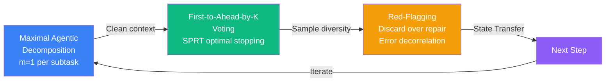
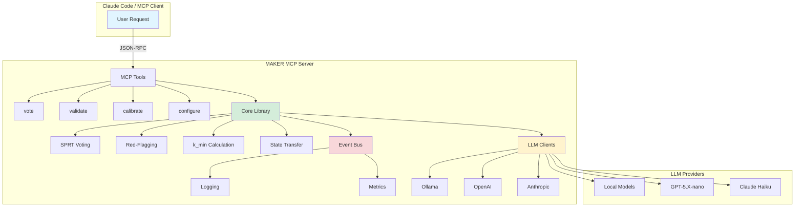

# MAKER Framework

**Zero-Error Long-Horizon LLM Execution via Massively Decomposed Agentic Processes**

[](https://github.com/zircote/maker-rs/actions)
[](https://github.com/zircote/maker-rs)
[](https://opensource.org/licenses/MIT)
[](https://crates.io/crates/maker-rs)

> **Achieve 95%+ success rates on 1,000+ step tasks.** MAKER is a Rust implementation of mathematically-grounded error correction for LLM agents, exposing reliability protocols via MCP for integration with Claude Code and other AI assistants.

<picture>
  <source media="(prefers-color-scheme: dark)" srcset=".github/readme-infographic.svg">
  <source media="(prefers-color-scheme: light)" srcset=".github/readme-infographic.svg">
  
</picture>

## The Problem

Existing LLM-based agents **fail catastrophically on long-horizon tasks**. Even with 99% per-step accuracy, a million-step task has 100% failure probability. Current frameworks (LangChain, CrewAI, AutoGen) lack mathematical reliability guarantees.

| Metric | Current State | MAKER Target | Improvement |
|--------|--------------|--------------|-------------|
| 100-step task success | ~50% | **95%+** | +90% |
| 1,000-step task success | ~0% | **95%+** | Previously infeasible |
| API cost (1,000 steps) | $10-50 (naive retry) | **$3-10** | 60-80% reduction |
| Cost scaling | Exponential (O(s × 2^k)) | **Logarithmic (Θ(s ln s))** | Enables million-step tasks |

## Our Approach

MAKER achieves zero-error execution through three components:



### Key Features

- **SPRT-Based Voting**: Sequential probability ratio test achieves optimal decision-making with logarithmic cost scaling
- **Microagent Architecture**: m=1 constraint (one subtask per agent) minimizes context burden and maximizes reliability
- **Red-Flag Validation**: Discard malformed outputs without repair to maintain error decorrelation
- **MCP Integration**: Expose reliability protocols as tools for Claude Code and other AI assistants
- **Event-Driven Observability**: Complete audit trail with token economics tracking
- **Multi-Provider Support**: Ollama (local), OpenAI, Anthropic with automatic failover

## Quick Start

### Installation

```bash
cargo install maker-rs
```

### MCP Server Setup (Claude Code)

Add to your Claude Desktop configuration:

```json
{
  "mcpServers": {
    "maker": {
      "command": "maker-mcp-server",
      "args": [],
      "env": {
        "OPENAI_API_KEY": "your-api-key-here"
      }
    }
  }
}
```

### First Vote

```rust
use maker_rs::{VoteRequest, MakerClient};

let client = MakerClient::new("ollama").await?;
let request = VoteRequest {
    prompt: "Move disk from A to B. State: [[3,2,1], [], []]",
    k_margin: 3,
    temperature_diversity: 0.1,
    max_samples: 20,
};

let result = client.vote(request).await?;
println!("Winner: {} (confidence: {}/{})",
    result.winner, result.vote_counts[&result.winner], result.total_samples);
```

## MCP Tools Reference

### `maker/vote` - Parallel Sampling with K-Margin Voting

Request the voted winner from k-margin voting protocol.

**Input:**
```json
{
  "prompt": "Task description",
  "k_margin": 3,
  "temperature_diversity": 0.1,
  "max_samples": 20
}
```

**Output:**
```json
{
  "winner": "candidate_hash",
  "vote_counts": {"candidate_hash": 7},
  "total_samples": 12,
  "cost_tokens": 4800,
  "cost_usd": 0.015
}
```

### `maker/validate` - Red-Flag Validation

Check if a response passes red-flag validation rules.

**Input:**
```json
{
  "response": "LLM output text",
  "schema": {"type": "object", "required": ["move", "next_state"]},
  "token_limit": 700
}
```

**Output:**
```json
{
  "valid": false,
  "red_flags": ["TokenLengthExceeded"]
}
```

### `maker/calibrate` - Estimate Per-Step Success Rate

Estimate success probability (p) for optimal k_min calculation.

**Input:**
```json
{
  "task_samples": [
    {"prompt": "Move disk 1", "ground_truth": "A to C"},
    {"prompt": "Move disk 2", "ground_truth": "A to B"}
  ]
}
```

**Output:**
```json
{
  "p_estimate": 0.87,
  "confidence_interval": [0.82, 0.92],
  "sample_count": 50,
  "recommended_k": 4
}
```

### `maker/configure` - Runtime Configuration

Set default k, temperature, and provider settings.

**Input:**
```json
{
  "k_default": 3,
  "temperature_diversity": 0.1,
  "token_limit": 700,
  "llm_provider": "ollama"
}
```

## Architecture



## Financial Impact

| Category | Value |
|----------|-------|
| **Annual Savings per Organization** | $50K-200K |
| **API Cost Reduction** | 60-80% vs. naive retry |
| **ROI Multiple** | 10-50x (enables previously infeasible tasks) |
| **3-Year Ecosystem Value** | $150M-300M (1,000+ adopting orgs) |

**Example: 1,000-step coding task (p=0.85, target=95%)**
- Naive retry: ~15,000 API calls
- MAKER (k=4): ~4,000 API calls
- **Savings: 73%**

## Project Artifacts

| Document | Description |
|----------|-------------|
| [PROJECT-CONTEXT.md](./PROJECT-CONTEXT.md) | Problem statement, constraints, desired outcomes |
| [PROJECT-PLAN.md](./PROJECT-PLAN.md) | Executive summary, phases, timeline, ROI analysis |
| [DOMAIN-RESEARCH.md](./_research/DOMAIN-RESEARCH.md) | Industry frameworks, terminology, competitive analysis |
| [BEST-PRACTICES.md](./BEST-PRACTICES.md) | SPRT theory, Tokio patterns, MCP security, testing strategies |
| [JIRA-STRUCTURE.md](./JIRA-STRUCTURE.md) | Epic hierarchy, user stories, acceptance criteria, sprints |
| [GANTT-CHART.md](./GANTT-CHART.md) | Timeline visualization, critical path, dependencies |
| [RACI-CHART.md](./RACI-CHART.md) | Role definitions, responsibility matrix, decision authority |
| [RISK-REGISTER.md](./RISK-REGISTER.md) | Risk profiles, mitigation strategies, contingency plans |
| [SEVERITY-CLASSIFICATION.md](./SEVERITY-CLASSIFICATION.md) | P0-P3 severity levels, routing rules, escalation |
| [SUCCESS-METRICS.md](./SUCCESS-METRICS.md) | KPIs, baselines, targets, dashboard specifications |
| [RUNBOOK-TEMPLATE.md](./RUNBOOK-TEMPLATE.md) | Operational procedures for calibration, debugging, incidents |
| [CHANGELOG.md](./CHANGELOG.md) | Version history and release notes |

## Team

| Role | Responsibility |
|------|---------------|
| **Project Maintainer** | Primary developer, algorithm correctness, release management |
| **Community Contributors** | Code reviews, feature requests, issue reports |
| **Research Community** | Academic validation, citations, theoretical extensions |
| **End Users** | Adoption, feedback, MCP integration testing |

## Timeline

| Milestone | Week | Deliverable |
|-----------|------|-------------|
| **Phase 1 Complete** | 1 | Core algorithms (voting, red-flagging, k_min) with 95% coverage |
| **Phase 2 Complete** | 2 | MCP server with 4 tools, multi-provider support |
| **Phase 3 Complete** | 2 | 10-disk Hanoi demo, cost validation, documentation |
| **v0.1.0 MVP Release** | 2 | Production-ready MCP server for community adoption |
| **Semantic Matching** | 4-6 | Support for non-deterministic tasks (coding, ML) |
| **v1.0.0 Production** | 12-16 | Battle-tested in production, adaptive k, ensemble voting |

## Contributing

We welcome contributions! Please see our [Contributing Guidelines](./CONTRIBUTING.md) for:

- Code of Conduct
- Development setup
- Testing requirements (95% coverage mandatory)
- Pull request process
- Security vulnerability reporting

## License

This project is licensed under the MIT License - see the [LICENSE](./LICENSE) file for details.

## References & Citations

1. **Meyerson, E., Paolo, G., Dailey, R., Shahrzad, H., Francon, O., Hayes, C.F., Qiu, X., Hodjat, B., & Miikkulainen, R.** (2025). *Solving a Million-Step LLM Task with Zero Errors*. [arXiv:2511.09030](https://arxiv.org/abs/2511.09030)

2. **Anthropic.** (2024). *Introducing the Model Context Protocol*. [https://www.anthropic.com/news/model-context-protocol](https://www.anthropic.com/news/model-context-protocol)

3. **Wald, A.** (1945). *Sequential Analysis*. (SPRT foundational work)

4. **Tokio Contributors.** *Tokio: An Asynchronous Rust Runtime*. [https://tokio.rs/](https://tokio.rs/)

---

**Built with** [Project Planning Template](https://github.com/zircote/project-planning-template) | **Powered by** Claude AI & MCP
