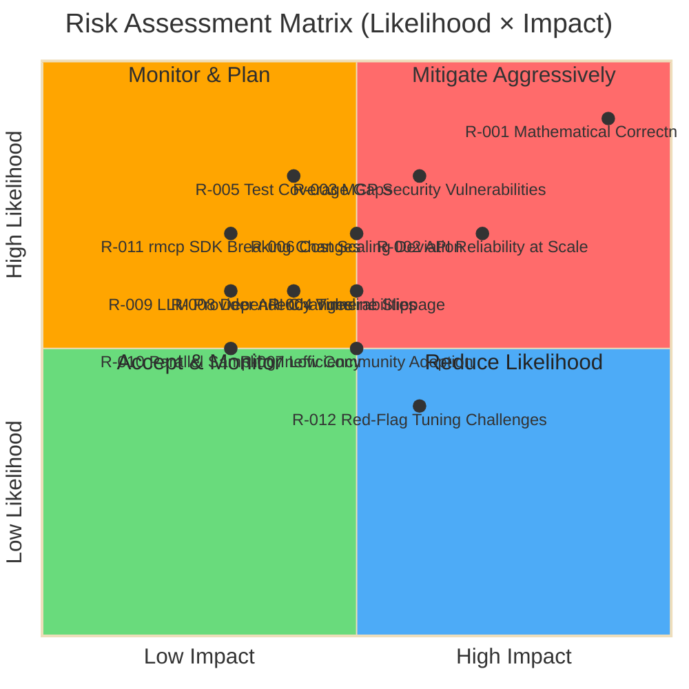

# Risk Register: MAKER Framework Implementation

**Project:** Rust Implementation of MAKER Framework with MCP Integration
**Timeline:** 14 days (3 sprints)
**Date:** 2026-01-30
**Last Updated:** 2026-01-30
**Review Cadence:** Weekly during MVP, Monthly post-release

---

## Risk Assessment Overview

---

## Risk Scoring Methodology

### Likelihood Scale (1-4)

| Score | Level | Description | Probability Range |
|-------|-------|-------------|-------------------|
| **1** | Rare | Unlikely to occur during project lifecycle | < 10% |
| **2** | Unlikely | Could occur but not expected | 10-40% |
| **3** | Possible | Moderate chance of occurrence | 40-70% |
| **4** | Likely | Expected to occur unless mitigated | > 70% |

### Impact Scale (1-4)

| Score | Level | Description | Consequences |
|-------|-------|-------------|--------------|
| **1** | Minimal | Minor inconvenience, easily resolved | < 1 day delay, no quality impact |
| **2** | Moderate | Noticeable impact, requires effort | 1-3 day delay, limited quality impact |
| **3** | Significant | Major disruption, substantial rework | 3-7 day delay, quality compromise possible |
| **4** | Critical | Project failure or core guarantees violated | > 7 day delay, mathematical guarantees broken |

### Risk Score Calculation

**Risk Score = Likelihood × Impact** (Range: 1-16)

| Score Range | Priority | Action Required |
|-------------|----------|-----------------|
| **12-16** | Critical | Immediate mitigation, daily monitoring |
| **8-11** | High | Active mitigation, weekly monitoring |
| **4-7** | Medium | Planned mitigation, monthly monitoring |
| **1-3** | Low | Accept and monitor, quarterly review |

---

## Risk Summary

| ID | Risk | Category | L | I | Score | Owner | Status |
|----|------|----------|---|---|-------|-------|--------|
| **R-001** | Mathematical correctness errors in SPRT/k_min | Technical | 4 | 4 | **16** | Lead Maintainer | Open - Active Mitigation |
| **R-002** | API reliability at million-call scales | Operational | 3 | 3 | **9** | Lead Maintainer | Open - Active Mitigation |
| **R-003** | MCP security vulnerabilities (prompt injection) | Technical | 3 | 3 | **9** | Lead Maintainer | Open - Active Mitigation |
| **R-004** | Timeline slippage (1-2 week MVP) | Organizational | 2 | 3 | **6** | Lead Maintainer | Open - Monitored |
| **R-005** | Test coverage gaps below 95% | Technical | 2 | 4 | **8** | Lead Maintainer | Open - Active Mitigation |
| **R-006** | Cost scaling deviates from Θ(s ln s) | Technical | 2 | 3 | **6** | Lead Maintainer | Open - Monitored |
| **R-007** | Low community adoption post-release | Organizational | 2 | 2 | **4** | Lead Maintainer | Open - Monitored |
| **R-008** | Dependency vulnerabilities (supply chain) | Operational | 2 | 3 | **6** | Lead Maintainer | Open - Monitored |
| **R-009** | LLM provider API breaking changes | External | 1 | 3 | **3** | Lead Maintainer | Open - Monitored |
| **R-010** | Parallel sampling inefficiency (latency) | Technical | 1 | 2 | **2** | Lead Maintainer | Open - Accepted |
| **R-011** | rmcp SDK breaking changes during MVP | External | 1 | 3 | **3** | Lead Maintainer | Open - Monitored |
| **R-012** | Red-flag tuning (false positives/negatives) | Technical | 3 | 2 | **6** | Lead Maintainer | Open - Monitored |

---

## Detailed Risk Profiles

---

### R-001: Mathematical Correctness Errors in SPRT/k_min

**Category:** Technical
**Owner:** Lead Maintainer
**Status:** Open - Active Mitigation
**Detection Method:** Property-based testing, Monte Carlo simulation, regression tests against paper results

#### Attributes

| Attribute | Value | Rationale |
|-----------|-------|-----------|
| **Likelihood** | 4 (Likely) | SPRT implementation is subtle; k_min formula has multiple edge cases; first implementation without reference code |
| **Impact** | 4 (Critical) | Violates core MAKER reliability guarantees; could lead to systematic under/over-voting; breaks mathematical foundation |
| **Risk Score** | **16 (Critical)** | Highest priority risk; algorithm correctness is non-negotiable |

#### Mitigation Strategies

1. **Property-Based Testing with Proptest**
   - Validate voting convergence for p > 0.5 across 1000+ random scenarios
   - Test k_min growth is logarithmic with s (task length)
   - Verify k_min increases as p decreases and t (target reliability) increases
   - Shrinking produces minimal failing test cases for debugging

2. **Regression Testing Against Paper Results**
   - Implement Towers of Hanoi examples from arxiv paper (3, 5, 7, 10 disks)
   - Compare k_min calculations to paper's empirical k values
   - Validate zero-error claims on 10-disk (1,023 steps) baseline

3. **Independent Code Review**
   - Submit SPRT logic to research validators (academic community)
   - Request review from probabilistic systems experts
   - Document mathematical derivation in rustdoc with citations

4. **Monte Carlo Simulation Validation**
   - Run 10,000 simulated voting races with known p values
   - Measure empirical success rates vs. theoretical guarantees
   - Statistical hypothesis testing (chi-squared test) for distribution match

5. **Reference Implementation Comparison**
   - If other MAKER implementations emerge, cross-validate results
   - Compare k_min calculations for identical input parameters
   - Benchmark cost scaling against independent implementations

#### Contingency Plan

**If risk materializes (algorithm bug detected):**

1. **Immediate Response** (Hour 0-24):
   - Halt all development; priority-0 incident
   - Isolate buggy code module; revert to last known-good state
   - Document failure mode with minimal reproducible example

2. **Root Cause Analysis** (Hour 24-48):
   - Trace bug to specific formula or logic error
   - Consult arxiv paper section for authoritative specification
   - Engage research validators for clarification if spec ambiguous

3. **Fix Development** (Hour 48-96):
   - Implement fix with comprehensive test coverage
   - Add regression test preventing recurrence
   - Update property-based tests to catch similar bugs

4. **Validation** (Hour 96-120):
   - Re-run full test suite (unit, property-based, integration)
   - Execute Monte Carlo validation with 100K+ samples
   - Obtain research validator sign-off on fix correctness

5. **Post-Mortem** (Day 7):
   - Document incident in CHANGELOG with technical explanation
   - Update CI/CD to add checks preventing similar bugs
   - Publish learning to community (transparency builds trust)

#### Triggers / Early Warning Signs

- Property-based test failures (voting doesn't converge)
- k_min values differ from paper's empirical results by >20%
- Zero-error Hanoi demo produces errors
- Monte Carlo simulations show success rates below target reliability
- Community reports of systematic voting failures

---

### R-002: API Reliability at Million-Call Scales

**Category:** Operational
**Owner:** Lead Maintainer
**Status:** Open - Active Mitigation
**Detection Method:** Token usage monitoring, error rate tracking, latency profiling

#### Attributes

| Attribute | Value | Rationale |
|-----------|-------|-----------|
| **Likelihood** | 3 (Possible) | Million-call workloads stress API infrastructure; rate limits and transient failures inevitable at scale |
| **Impact** | 3 (Significant) | Blocks task execution; increases cost via excessive retries; user experience degraded but doesn't compromise correctness |
| **Risk Score** | **9 (High)** | High priority; mitigate proactively to ensure production viability |

#### Mitigation Strategies

1. **Exponential Backoff with Jitter**
   - Base delay: 1s, doubling each retry (1s, 2s, 4s, 8s, 16s, 32s)
   - Cap at 60s maximum delay
   - Add 0-25% random jitter to prevent thundering herd
   - Max 5 retry attempts before failure

2. **Respect Retry-After Headers**
   - Parse HTTP 429 responses for Retry-After header
   - Override exponential backoff if Retry-After provided
   - Log rate limit encounters for pattern analysis

3. **Fallback to Alternative Providers**
   - Primary: OpenAI or Anthropic (cloud)
   - Fallback: Ollama (local inference, no rate limits)
   - Automatic failover on sustained 429 errors (>3 in 60s)
   - User notification of provider switch

4. **Token Budget Tracking and Alerts**
   - Track cumulative token usage in real-time
   - Alert when approaching budget limits (80%, 90%, 95%)
   - Circuit breaker pattern: halt execution if budget exceeded
   - Cost estimation before task execution (pre-flight check)

5. **Batch API Usage for Calibration**
   - Use batch APIs for pre-flight calibration (OpenAI batch endpoint)
   - Reduces rate pressure during calibration phase
   - Amortizes cost over many samples

6. **Rate Limit Monitoring and Forecasting**
   - Track rate limit headroom (requests remaining)
   - Adaptive throttling when nearing limits
   - Log rate limit resets for usage pattern analysis

#### Contingency Plan

**If risk materializes (sustained API failures):**

1. **Detection** (Automatic):
   - EventBus emits `ApiFailure` events
   - Metrics observer increments `maker_api_errors_total`
   - Alert triggers when error rate > 10% over 5-minute window

2. **Immediate Mitigation** (Automated):
   - Circuit breaker opens: pause new API calls for 60s
   - Switch to fallback provider (Ollama if available)
   - Log incident with provider, error type, backoff state

3. **Manual Intervention** (If automated mitigation insufficient):
   - Reduce parallel sampling concurrency (10 → 5 → 3)
   - Increase k_margin to reduce total samples needed
   - Split long tasks into smaller batches with inter-batch delays

4. **Communication**:
   - Update users via GitHub Discussions/Issues
   - Document temporary degradation and ETA for resolution
   - Publish incident post-mortem with cost impact analysis

5. **Long-Term Fix**:
   - Negotiate higher rate limits with providers (for production use)
   - Implement request queuing with adaptive rate control
   - Add provider diversity (support more local models)

#### Triggers / Early Warning Signs

- HTTP 429 (Too Many Requests) errors increasing
- Average API latency exceeding 2x baseline
- Retry exhaustion (max retries hit) rate > 1%
- Provider status page incidents
- Token budget depletion faster than projected

---

### R-003: MCP Security Vulnerabilities (Prompt Injection)

**Category:** Technical
**Owner:** Lead Maintainer
**Status:** Open - Active Mitigation
**Detection Method:** Penetration testing, schema validation logs, security audit

#### Attributes

| Attribute | Value | Rationale |
|-----------|-------|-----------|
| **Likelihood** | 3 (Possible) | April 2025 MCP analysis identified prompt injection, tool permission escalation, lookalike tool risks |
| **Impact** | 3 (Significant) | Compromises system integrity; potential data exfiltration; user trust violation; but m=1 isolation limits blast radius |
| **Risk Score** | **9 (High)** | High priority; security is foundational for community adoption |

#### Mitigation Strategies

1. **Strict Schema Validation for Agent Outputs**
   - Enforce JSON schema: `{ move: string, next_state: object }` required fields
   - Reject outputs with missing fields via red-flagging
   - Reject outputs with unexpected extra fields (strict mode)
   - Log schema violations at WARN level with sample hash (not full content)

2. **Red-Flag Parsers as Security Guardrails**
   - Token length limits prevent exfiltration via bloated outputs
   - Format validation ensures outputs conform to expected patterns
   - Discard-over-repair philosophy prevents correlated errors from manipulated outputs
   - Configurable red-flag rules per task domain

3. **Microagent Context Isolation (m=1)**
   - Each agent receives only current step state, no historical context
   - Agent cannot access previous step outputs directly
   - State corruption detected before next agent invocation
   - Blast radius of malicious agent limited to single step

4. **Input Sanitization for Tool Calls**
   - Validate prompt length (max 10K chars for MVP)
   - Detect suspicious patterns (e.g., "Ignore previous instructions")
   - Log rejected prompts with hash (privacy-preserving)
   - User education: MAKER operates on user-provided prompts (user responsibility)

5. **Security Audit with Penetration Testing**
   - Attempt prompt injection via `maker/vote` tool inputs
   - Test schema bypass attempts (malformed JSON, nested injection)
   - Validate red-flag parsers reject malicious outputs
   - Document security model in README with threat model

6. **MCP Community Engagement**
   - Monitor MCP security advisories
   - Contribute findings to MCP security working group
   - Implement MCP security best practices as they emerge

#### Contingency Plan

**If risk materializes (security vulnerability discovered):**

1. **Immediate Response** (Hour 0-1):
   - Halt all releases; priority-1 security incident
   - Create private fork for fix development
   - Notify MCP community (confidential disclosure)

2. **Severity Assessment** (Hour 1-4):
   - Classify vulnerability (CVSS score)
   - Determine exploitability (proof-of-concept required?)
   - Assess impact (data exfiltration, privilege escalation, DoS?)

3. **Fix Development** (Hour 4-24):
   - Implement fix in private fork
   - Add regression test to prevent recurrence
   - Request security researcher review of fix

4. **Coordinated Disclosure** (Hour 24-72):
   - Draft security advisory (GitHub Security Advisory)
   - Prepare patch release (v0.1.1 with CVE fix)
   - Coordinate disclosure timeline with MCP community

5. **Public Release** (Hour 72):
   - Publish security advisory with technical details
   - Release patch version to crates.io and GitHub
   - Notify users via GitHub Discussions and community channels
   - Update documentation with mitigation guidance

6. **Post-Incident Review** (Day 7):
   - Root cause analysis: how did vulnerability slip through?
   - Update security checklist for future PRs
   - Enhance penetration testing coverage
   - Publish incident post-mortem (transparency builds trust)

#### Triggers / Early Warning Signs

- Schema validation rejections spike (>5% of samples)
- Red-flag rates increase unexpectedly
- Community reports of unexpected agent behavior
- MCP security advisories relevant to MAKER's usage
- Penetration test identifies bypass

---

### R-004: Timeline Slippage (1-2 Week MVP)

**Category:** Organizational
**Owner:** Lead Maintainer
**Status:** Open - Monitored
**Detection Method:** Daily standup tracking, sprint velocity monitoring, exit criteria checkpoints

#### Attributes

| Attribute | Value | Rationale |
|-----------|-------|-----------|
| **Likelihood** | 2 (Unlikely) | Well-scoped MVP with clear exit criteria; single maintainer controls velocity; but algorithm complexity could surprise |
| **Impact** | 3 (Significant) | Delays community feedback loop; momentum loss; but doesn't compromise quality if extended timeline preserves exit criteria |
| **Risk Score** | **6 (Medium)** | Monitor closely; prioritize ruthlessly to stay on track |

#### Mitigation Strategies

1. **Daily Progress Tracking**
   - Track story completion against sprint plan
   - Identify blockers immediately (same-day resolution or escalation)
   - Adjust scope dynamically if velocity lags (defer P2/P3 stories)

2. **Ruthless Prioritization**
   - Phase 1 exit criteria are immutable (95% coverage, zero errors on 3-disk Hanoi)
   - Phase 2/3 features can be deferred to v0.2.0 if timeline pressured
   - Documentation can be minimal for MVP (comprehensive docs in v0.1.1)

3. **Time-Boxing Activities**
   - Each story has max time allocation (e.g., 4 hours for STORY-001-01)
   - If time-box exceeded, reassess approach or defer feature
   - Prevent perfectionism from derailing timeline

4. **Parallel Work Streams Where Possible**
   - Event architecture can proceed parallel to voting logic (Phase 1)
   - Documentation can start during Phase 3 (don't wait for all code)
   - Testing can be incremental (not all at end)

5. **Reduced Scope Fallback**
   - Minimum viable MVP: Core library + single LLM provider (Ollama) + basic MCP tools
   - Defer multi-provider support to v0.1.1 if timeline critical
   - Defer security hardening to v0.1.1 if Phase 3 compressed

#### Contingency Plan

**If risk materializes (timeline slipping beyond Day 14):**

1. **Assessment** (Day 10 checkpoint):
   - Calculate velocity: story points completed / days elapsed
   - Project remaining work: (total points - completed) / velocity
   - Determine slippage: projected completion - Day 14

2. **Scope Reduction** (if slippage > 2 days):
   - Defer EPIC-007 comprehensive docs (ship with minimal README)
   - Defer EPIC-008 security hardening (document risks, harden in v0.1.1)
   - Reduce benchmark suite (10-disk Hanoi only, not 3/5/7/15)
   - Defer multi-provider support (Ollama only for MVP)

3. **Communication**:
   - Update PROJECT-PLAN.md with revised timeline
   - Communicate to community: quality over arbitrary deadlines
   - Set v0.1.1 release date (1 week post-MVP) for deferred features

4. **Quality Preservation**:
   - Never compromise on 95% test coverage
   - Never ship without zero-error Hanoi demo
   - Never skip algorithm validation (property-based tests)

#### Triggers / Early Warning Signs

- Day 5: Phase 1 exit criteria not met
- Day 10: Phase 2 exit criteria not met
- Story taking 2x estimated time
- Blockers unresolved for >1 day
- Velocity <80% of planned story points per day

---

### R-005: Test Coverage Gaps Below 95%

**Category:** Technical
**Owner:** Lead Maintainer
**Status:** Open - Active Mitigation
**Detection Method:** cargo-tarpaulin in CI/CD, PR coverage delta checks

#### Attributes

| Attribute | Value | Rationale |
|-----------|-------|-----------|
| **Likelihood** | 2 (Unlikely) | Enforced by CI/CD (PR blocks); but complex async code and error paths can be tricky to cover |
| **Impact** | 4 (Critical) | Quality standard non-negotiable; untested code in probabilistic system is unacceptable risk |
| **Risk Score** | **8 (High)** | High priority; proactive mitigation essential |

#### Mitigation Strategies

1. **CI/CD Coverage Enforcement**
   - Run cargo-tarpaulin on every PR
   - Fail CI if coverage < 95% or coverage delta < 0%
   - Publish coverage report to GitHub Actions artifacts
   - Optional: Integrate with Codecov for visualization

2. **Property-Based Testing for Edge Cases**
   - Proptest automatically explores input space
   - Covers edge cases human-written tests might miss
   - Shrinking produces minimal failing examples

3. **Error Path Testing**
   - Explicitly test all error variants (LlmError, RedFlag, etc.)
   - Mock API failures (429, 500, timeout)
   - Test retry exhaustion scenarios

4. **Async Code Coverage**
   - Ensure tokio::test coverage with JoinSet and timeout
   - Test concurrent race conditions (parallel sampling edge cases)
   - Mock async dependencies for deterministic testing

5. **Integration Test Coverage**
   - MCP protocol compliance tests cover end-to-end flows
   - Mock LLM responses for deterministic integration tests
   - Test schema validation paths (valid and invalid inputs)

#### Contingency Plan

**If risk materializes (coverage drops below 95%):**

1. **Detection** (Automatic):
   - CI fails with coverage report
   - PR blocked from merge

2. **Root Cause Analysis**:
   - Identify uncovered lines (cargo-tarpaulin HTML report)
   - Classify: unreachable code, error paths, async edge cases, or test gap?

3. **Remediation**:
   - Add unit tests for uncovered functions
   - Add property-based tests for complex logic
   - Add integration tests for system-level paths
   - Refactor if code is untestable (design smell)

4. **Exemptions** (Rare):
   - Unreachable code due to type system guarantees: document with comment
   - Main function / CLI parsing: exempt from coverage (not library code)
   - Debug-only code paths: consider removing or making testable

#### Triggers / Early Warning Signs

- PR coverage delta shows drop
- New modules added without tests
- Complex error handling added without error path tests
- Async code added without tokio::test coverage

---

### R-006: Cost Scaling Deviates from Θ(s ln s)

**Category:** Technical
**Owner:** Lead Maintainer
**Status:** Open - Monitored
**Detection Method:** Benchmark suite, statistical cost scaling tests

#### Attributes

| Attribute | Value | Rationale |
|-----------|-------|-----------|
| **Likelihood** | 2 (Unlikely) | SPRT theory is sound; but implementation bugs or red-flag inefficiencies could increase cost |
| **Impact** | 3 (Significant) | Undermines value proposition; but doesn't break correctness; users still get reliability (at higher cost) |
| **Risk Score** | **6 (Medium)** | Monitor with empirical validation; mitigate if detected |

#### Mitigation Strategies

1. **Empirical Benchmark Suite**
   - Run Hanoi for n ∈ {3, 5, 7, 10, 15} disks
   - Measure: total API calls, k values, red-flag rates
   - Plot: log(cost) vs. log(s) → slope should be ~1

2. **Statistical Cost Scaling Test**
   - Hypothesis: cost_ratio ≈ s_ratio × ln(s_ratio)
   - Test on pairs: (3-disk, 10-disk), (10-disk, 15-disk)
   - Accept if within 20% tolerance

3. **Red-Flag Rate Monitoring**
   - Track red-flag rate per model/task
   - High red-flag rates (>20%) inflate cost
   - Tune red-flag thresholds to balance false positives/negatives

4. **k_min Calibration Accuracy**
   - Validate p estimation during pre-flight calibration
   - Over-estimated p leads to under-k (more votes needed)
   - Under-estimated p leads to over-k (wasted samples)

5. **Temperature Diversity Tuning**
   - T=0.1 diversity balance: enough to decorrelate, not so much to reduce p
   - Empirically test T ∈ {0.05, 0.1, 0.15} for vote efficiency

#### Contingency Plan

**If risk materializes (cost scaling worse than Θ(s ln s)):**

1. **Detection**:
   - Statistical test fails (cost ratio > 1.2 × theoretical)
   - Benchmark shows quadratic or exponential trend

2. **Root Cause Analysis**:
   - Isolate: is it voting inefficiency or red-flag inefficiency?
   - Profile: which component (sampling, parsing, voting) dominates cost?
   - Compare: does cost match paper's empirical results?

3. **Mitigation by Root Cause**:
   - **Voting inefficiency**: Review SPRT logic, validate k_min calculation
   - **Red-flag inefficiency**: Tune thresholds, reduce false positives
   - **Calibration error**: Improve p estimation with more calibration samples
   - **Temperature suboptimal**: Empirically search for best T value

4. **Communication**:
   - Document actual cost scaling in README with charts
   - Explain deviation with root cause and mitigation roadmap
   - Set expectations: "current v0.1.0 cost is X, targeting Y in v0.2.0"

5. **Long-Term Fix** (v0.2.0+):
   - Adaptive k: dynamically adjust based on observed convergence
   - Semantic matching: reduce red-flag false positives for non-deterministic tasks
   - Multi-model ensemble: cheaper models first, expensive on disagreement

#### Triggers / Early Warning Signs

- 10-disk Hanoi costs >6K API calls (theoretical: ~4K)
- Red-flag rate >20% on calibrated models
- Cost ratio deviates >20% from s_ratio × ln(s_ratio)
- k values significantly higher than paper's empirical results

---

### R-007: Low Community Adoption Post-Release

**Category:** Organizational
**Owner:** Lead Maintainer
**Status:** Open - Monitored
**Detection Method:** GitHub stars/forks, crates.io downloads, community engagement

#### Attributes

| Attribute | Value | Rationale |
|-----------|-------|-----------|
| **Likelihood** | 2 (Unlikely) | Novel approach, academic credibility, Claude Code integration, but niche problem domain |
| **Impact** | 2 (Moderate) | Limits impact and feedback loop; but doesn't affect technical correctness |
| **Risk Score** | **4 (Medium)** | Accept and monitor; focus on quality and let adoption follow |

#### Mitigation Strategies

1. **Clear Value Proposition in README**
   - Lead with zero-error claim and million-step demo
   - Quantify cost savings (60-80% vs. naive retry)
   - Visual architecture diagram (Mermaid)
   - Academic citations for credibility

2. **Compelling Demos**
   - 10-disk Towers of Hanoi with full event log
   - Cost comparison chart (MAKER vs. naive retry)
   - Video walkthrough of Claude Code integration

3. **Academic Credibility**
   - Cite arxiv paper prominently
   - Link to SPRT and forward error correction literature
   - Position as research implementation (not just another agent framework)

4. **Community Engagement**
   - Announce on r/rust, r/MachineLearning, Hacker News
   - Share on Twitter/Mastodon with #RustLang #LLMAgents tags
   - Engage with MCP community (Anthropic Discord, GitHub Discussions)

5. **Documentation Quality**
   - Comprehensive rustdoc for library users
   - Examples for common use cases
   - Quickstart guide (<5 minutes to first vote)

6. **Responsive Maintenance**
   - Respond to issues within 24-48 hours
   - Accept community PRs with constructive feedback
   - Publish roadmap for transparency

#### Contingency Plan

**If risk materializes (low adoption after 1 month):**

1. **Metrics Review** (Day 30):
   - GitHub stars < 50: low interest
   - crates.io downloads < 100: minimal usage
   - No community PRs or issues: lack of engagement

2. **Feedback Collection**:
   - Survey early adopters: what's blocking adoption?
   - Review feedback: documentation gaps? integration friction? unclear value prop?

3. **Targeted Improvements**:
   - **If docs unclear**: Rewrite README, add video tutorial
   - **If integration hard**: Simplify MCP setup, add Claude Desktop config template
   - **If value prop unclear**: Publish blog post with real-world use case
   - **If niche too small**: Pivot to broader use cases (not just coding tasks)

4. **Marketing Boost**:
   - Submit to Rust weekly newsletter
   - Present at Rust meetup or conference (virtual/in-person)
   - Write technical blog post explaining SPRT application to LLMs
   - Collaborate with MCP influencers (e.g., Simon Willison, Anthropic DevRel)

5. **Patience and Iteration**:
   - Open source adoption takes time (6-12 months for traction)
   - Focus on technical excellence; adoption follows quality
   - Continue developing features based on feedback

#### Triggers / Early Warning Signs

- GitHub stars < 50 after 1 month
- crates.io downloads < 100 after 1 month
- No community issues or PRs after 2 weeks
- No social media engagement on announcement

---

### R-008: Dependency Vulnerabilities (Supply Chain)

**Category:** Operational
**Owner:** Lead Maintainer
**Status:** Open - Monitored
**Detection Method:** cargo-audit, Dependabot alerts, GitHub Security Advisories

#### Attributes

| Attribute | Value | Rationale |
|-----------|-------|-----------|
| **Likelihood** | 2 (Unlikely) | Rust ecosystem is generally secure; using official SDKs (rmcp, OpenAI, Anthropic); but supply chain attacks possible |
| **Impact** | 3 (Significant) | Security compromise; user trust violation; requires emergency patch |
| **Risk Score** | **6 (Medium)** | Monitor proactively; respond immediately to alerts |

#### Mitigation Strategies

1. **Dependency Audit with cargo-audit**
   - Run cargo audit on every PR (CI/CD)
   - Fail CI on known vulnerabilities
   - Review advisories from RustSec Advisory Database

2. **Dependabot Automated Updates**
   - Enable Dependabot on GitHub repository
   - Auto-create PRs for dependency updates
   - Review and merge security patches within 24 hours

3. **Minimal Dependency Footprint**
   - Use official SDKs (rmcp, openai, anthropic) over community crates
   - Prefer std lib over third-party for simple tasks
   - Review transitive dependencies with cargo tree

4. **Pin Versions in Cargo.lock**
   - Commit Cargo.lock to repository
   - Reproducible builds prevent supply chain injection
   - Control dependency updates explicitly

5. **Review Dependency Changes in PRs**
   - Every Cargo.toml change reviewed for necessity
   - New dependencies: check GitHub stars, maintenance status, audit history
   - Prefer dependencies with security audits or mozilla/cncf backing

#### Contingency Plan

**If risk materializes (vulnerability in dependency):**

1. **Detection** (Automated):
   - Dependabot alert or cargo-audit failure
   - GitHub Security Advisory notification

2. **Severity Assessment**:
   - CVSS score and exploitability
   - Is MAKER affected? (transitive dep might not be used)
   - Is patch available from upstream?

3. **Immediate Mitigation**:
   - If patch available: update dependency, test, release patch version
   - If no patch: investigate alternative dependencies or workarounds
   - If critical and no fix: consider temporary feature removal

4. **Communication**:
   - Publish security advisory (if MAKER users affected)
   - Release patch version to crates.io
   - Notify users via GitHub Discussions

5. **Long-Term Prevention**:
   - If dependency unmaintained: migrate to alternative
   - If vulnerability pattern (e.g., parsing): add fuzzing tests

#### Triggers / Early Warning Signs

- cargo-audit reports new advisory
- Dependabot alert email
- GitHub Security Advisory notification
- Dependency maintainer announces end-of-life

---

### R-009: LLM Provider API Breaking Changes

**Category:** External
**Owner:** Lead Maintainer
**Status:** Open - Monitored
**Detection Method:** Provider changelog monitoring, integration test failures, user reports

#### Attributes

| Attribute | Value | Rationale |
|-----------|-------|-----------|
| **Likelihood** | 1 (Rare) | Providers maintain API stability; breaking changes announced with deprecation period |
| **Impact** | 3 (Significant) | Breaks LLM integration; requires code changes and testing; but isolated to provider abstraction layer |
| **Risk Score** | **3 (Low)** | Monitor provider changelogs; low urgency |

#### Mitigation Strategies

1. **Provider Abstraction Layer**
   - LlmClient trait isolates provider-specific logic
   - Breaking changes contained to individual client implementations
   - Easy to add new providers or replace deprecated endpoints

2. **Multiple Provider Support**
   - Supports 4 providers (Ollama, OpenAI, Anthropic, LM Studio)
   - If one breaks, users can switch providers
   - Fallback mechanism already implemented

3. **Provider Changelog Monitoring**
   - Subscribe to provider API changelog RSS/email
   - Track deprecation notices and migration timelines
   - Proactively update before breaking changes take effect

4. **Integration Test Coverage**
   - Tests catch API contract changes
   - Mock tests validate request/response structure
   - Real API tests (optional, requires keys) catch live changes

5. **Version Pinning in SDK Dependencies**
   - Pin openai, anthropic crate versions
   - Test new versions in separate branch before updating
   - Control upgrade timing

#### Contingency Plan

**If risk materializes (provider API breaks):**

1. **Detection**:
   - Integration tests fail
   - User reports of API errors
   - Provider migration guide published

2. **Impact Assessment**:
   - Which provider(s) affected?
   - Is it deprecation (grace period) or immediate breakage?
   - Can users switch to alternative provider?

3. **Mitigation**:
   - Update affected client implementation
   - Test against new API
   - Release patch version

4. **Communication**:
   - If breaking immediately: emergency patch + announcement
   - If deprecation period: schedule update, communicate timeline
   - Document migration in CHANGELOG

5. **Long-Term Resilience**:
   - Add provider API versioning support if needed
   - Consider contributing to provider SDK maintenance

#### Triggers / Early Warning Signs

- Provider deprecation notice email
- Integration test failures after provider SDK update
- User reports of authentication or API errors
- Provider status page announces API changes

---

### R-010: Parallel Sampling Inefficiency (Latency)

**Category:** Technical
**Owner:** Lead Maintainer
**Status:** Open - Accepted
**Detection Method:** Latency benchmarks, criterion performance regression tests

#### Attributes

| Attribute | Value | Rationale |
|-----------|-------|-----------|
| **Likelihood** | 1 (Rare) | Tokio is mature; parallel sampling is straightforward with JoinSet; but async edge cases possible |
| **Impact** | 2 (Moderate) | Degrades user experience (longer wait times); but doesn't affect correctness or cost economics |
| **Risk Score** | **2 (Low)** | Accept risk; optimize only if detected |

#### Mitigation Strategies

1. **Tokio JoinSet for Bounded Concurrency**
   - Spawn k concurrent tasks for k samples
   - Non-blocking await on all tasks
   - Timeout protection prevents hung tasks

2. **Latency Benchmarking with Criterion**
   - Benchmark: 10 parallel samples vs. 10 sequential
   - Target: parallel ≈ 1x API call time (not 10x)
   - Regression test: alert if latency increases >20%

3. **Profiling with tokio-console**
   - Visualize async task execution
   - Identify bottlenecks (contention, blocking calls)
   - Optimize hot paths

4. **Temperature Strategy**
   - T=0 for first sample (deterministic, fastest)
   - T=0.1 for subsequent samples (diversity, minimal latency impact)

5. **Timeout Configuration**
   - Set conservative timeouts (30-60s per sample)
   - Cancel slow samples to prevent latency tail

#### Contingency Plan

**If risk materializes (parallel sampling slower than expected):**

1. **Detection**:
   - Benchmark shows parallel time > 1.5x single API call
   - User reports of long wait times

2. **Root Cause Analysis**:
   - Profile with tokio-console or flamegraph
   - Identify: network contention, CPU bottleneck, or async overhead?

3. **Optimization**:
   - If network: reduce concurrency (10 → 5 samples at once)
   - If CPU: move red-flag parsing to rayon (data parallelism)
   - If async: refactor to reduce task overhead

4. **Fallback**:
   - If parallel < 2x speedup over sequential: document limitation
   - Consider batching samples (provider-dependent)

#### Triggers / Early Warning Signs

- Criterion benchmarks show regression >20%
- User reports of latency issues
- Profiling shows task contention

---

### R-011: rmcp SDK Breaking Changes During MVP

**Category:** External
**Owner:** Lead Maintainer
**Status:** Open - Monitored
**Detection Method:** rmcp GitHub releases, Dependabot version updates, CI test failures

#### Attributes

| Attribute | Value | Rationale |
|-----------|-------|-----------|
| **Likelihood** | 1 (Rare) | rmcp is official SDK (Anthropic backing); active development but maintains stability; breaking changes announced |
| **Impact** | 3 (Significant) | Breaks MCP server; requires code refactoring and retesting; blocks integration with Claude Code |
| **Risk Score** | **3 (Low)** | Monitor rmcp releases; low urgency but high impact if occurs |

#### Mitigation Strategies

1. **Pin rmcp Version**
   - Cargo.toml: `rmcp = "0.13.0"` (exact version)
   - Control upgrade timing
   - Test new versions before updating

2. **Monitor rmcp GitHub Releases**
   - Subscribe to release notifications
   - Review changelogs for breaking changes
   - Track MCP spec updates (rmcp follows spec)

3. **MCP Protocol Compliance Tests**
   - Integration tests validate MCP protocol compliance
   - Tests catch breaking changes in rmcp behavior
   - Mock MCP client for deterministic testing

4. **Community Engagement**
   - Engage with rmcp maintainers (GitHub Discussions)
   - Report issues early during development
   - Contribute PRs for bugs or missing features

5. **Fallback Plan**
   - If rmcp breaks: temporarily pin old version
   - If unfixable: consider alternative MCP SDK or manual protocol implementation

#### Contingency Plan

**If risk materializes (rmcp breaking change):**

1. **Detection**:
   - Dependabot PR proposes rmcp version update
   - CI fails with breaking change error
   - rmcp release notes document breaking changes

2. **Impact Assessment**:
   - Read migration guide in rmcp changelog
   - Estimate effort: simple API rename or major refactor?
   - Check if MCP spec changed (rmcp following spec update)

3. **Migration**:
   - Update code to new rmcp API
   - Update MCP compliance tests
   - Test against Claude Code integration

4. **Communication**:
   - Document migration in CHANGELOG
   - If breaking for users: release major version (v0.2.0 or v1.0.0)
   - Update examples and documentation

5. **Long-Term Relationship**:
   - Contribute feedback to rmcp maintainers
   - Participate in MCP community to influence spec evolution

#### Triggers / Early Warning Signs

- rmcp GitHub release with BREAKING CHANGE label
- Dependabot proposes major version update
- MCP spec update (modelcontextprotocol.io)
- CI test failures after rmcp update

---

### R-012: Red-Flag Tuning Challenges (False Positives/Negatives)

**Category:** Technical
**Owner:** Lead Maintainer
**Status:** Open - Monitored
**Detection Method:** Red-flag rate monitoring, user feedback, calibration metrics

#### Attributes

| Attribute | Value | Rationale |
|-----------|-------|-----------|
| **Likelihood** | 3 (Possible) | Red-flag thresholds depend on task domain and model characteristics; tuning requires empirical iteration |
| **Impact** | 2 (Moderate) | False positives waste samples (inflate cost); false negatives allow correlated errors (reduce reliability) |
| **Risk Score** | **6 (Medium)** | Monitor red-flag rates; tune iteratively based on empirics |

#### Mitigation Strategies

1. **Configurable Red-Flag Thresholds**
   - Token length limit: default 700, user-configurable
   - Schema validation: strict mode optional
   - Domain-specific rules: pluggable red-flag parsers

2. **Red-Flag Rate Monitoring**
   - Track red-flag rate per model, task, and rule
   - Target: <10% red-flag rate for well-calibrated models
   - Alert if rate spikes (>20% sudden increase)

3. **Pre-Flight Calibration**
   - Measure red-flag rate during calibration phase
   - Adjust thresholds before production voting
   - Document recommended thresholds per model

4. **User Education**
   - Document red-flag philosophy: discard over repair
   - Explain false positive/negative trade-offs
   - Provide tuning guide with examples

5. **Empirical Validation**
   - Compare: red-flagging vs. no red-flagging on Hanoi
   - Measure: reliability improvement vs. cost increase
   - Statistical test: does red-flagging decorrelate errors?

#### Contingency Plan

**If risk materializes (suboptimal red-flag tuning):**

1. **Detection**:
   - Red-flag rate >20% on well-calibrated model
   - User reports excessive cost (false positives)
   - User reports errors despite voting (false negatives)

2. **Diagnosis**:
   - Analyze red-flagged samples: what triggered rejection?
   - Classify: token length, schema violation, or logic loop?
   - Determine: is rule too strict or too lenient?

3. **Tuning**:
   - If false positives: relax threshold (e.g., 700 → 1000 tokens)
   - If false negatives: tighten threshold or add rule
   - Re-calibrate on sample tasks

4. **Validation**:
   - Measure red-flag rate after tuning
   - Validate: reliability maintained or improved?
   - Cost: reduced (fewer false positives) or acceptable?

5. **Documentation**:
   - Update recommended thresholds in docs
   - Publish tuning case study (e.g., "Tuning Red-Flags for Code Generation")

#### Triggers / Early Warning Signs

- Red-flag rate >20% on calibrated model
- Red-flag rate <1% (suspiciously low, possible false negatives)
- User reports of excessive cost
- Voting failures despite k-margin (correlated errors)

---

## Risk Categories Summary

| Category | Count | Highest Score | Average Score |
|----------|-------|---------------|---------------|
| **Technical** | 7 | 16 (R-001) | 8.7 |
| **Operational** | 2 | 9 (R-002) | 7.5 |
| **Organizational** | 2 | 6 (R-004, R-007) | 5.0 |
| **External** | 2 | 3 (R-009, R-011) | 3.0 |

**Insight:** Technical risks dominate (algorithm correctness, test coverage, security). External risks are low but monitored (provider/SDK changes).

---

## Risk Monitoring Schedule

| Cadence | Activity | Participants | Output |
|---------|----------|--------------|--------|
| **Daily** (Days 1-14) | Blockers review, new risks identification | Lead Maintainer | Standup notes, risk register updates |
| **Weekly** (MVP Development) | Risk review: status, triggers, mitigation effectiveness | Lead Maintainer, Code Reviewers | Risk status report |
| **Sprint End** (Days 5, 10, 14) | Risk retrospective: what materialized? what mitigated? | Lead Maintainer, Research Validators | Lessons learned, updated mitigation strategies |
| **Monthly** (Post-MVP) | Risk register review: retire closed risks, add new risks | Lead Maintainer, Community | Updated risk register, community communication |
| **Quarterly** (Post-1.0) | Strategic risk review: adoption, competition, technical debt | Lead Maintainer, Contributors | Roadmap adjustments, investment priorities |

---

## Revision History

| Version | Date | Author | Changes |
|---------|------|--------|---------|
| 1.0 | 2026-01-30 | Governance Architect | Initial risk register for MAKER Framework MVP |

---

**Risk Register Status:** ✅ Complete
**Total Risks:** 12 (3 Critical/High, 5 Medium, 4 Low)
**Next Review:** Day 5 (Sprint 1 End)
**Monitoring:** Active during MVP development
