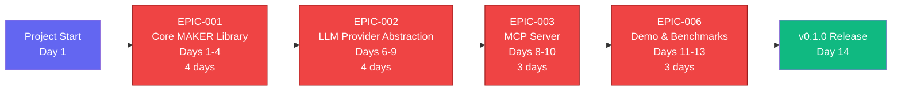
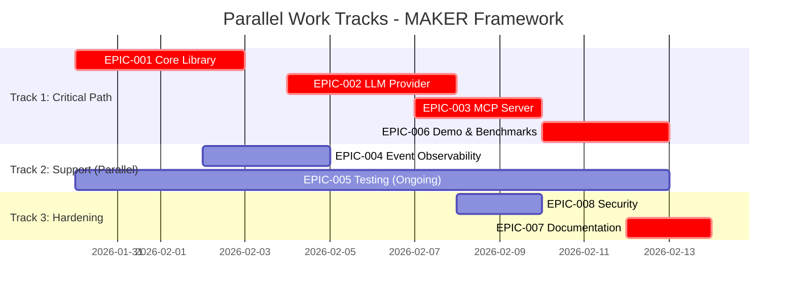
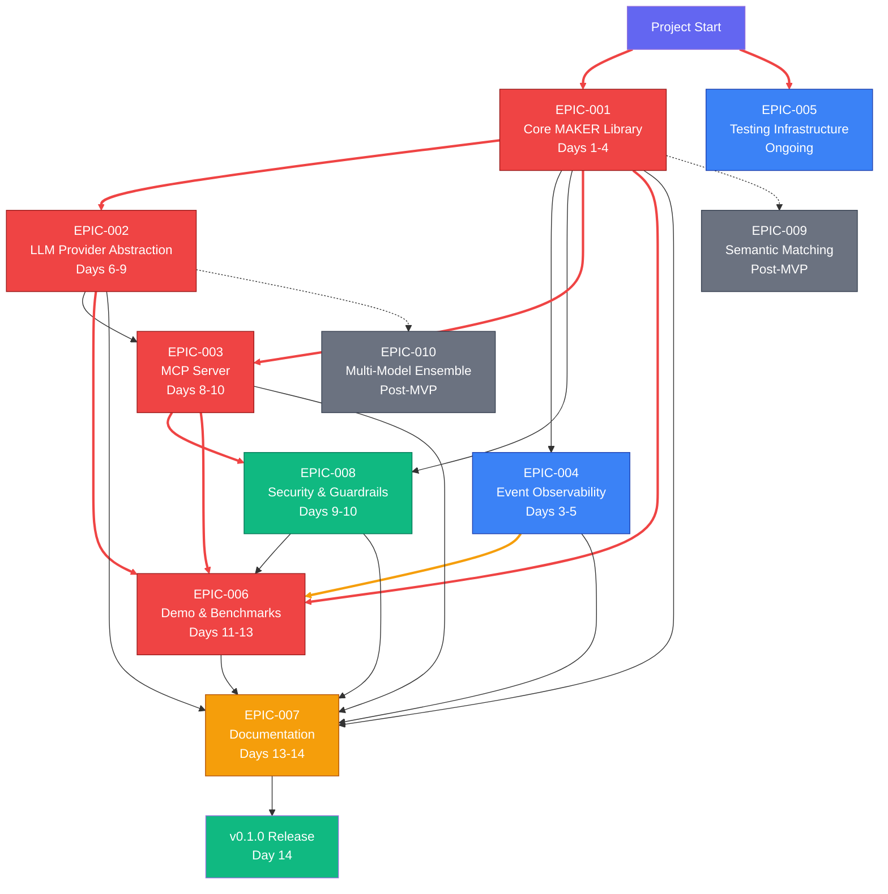

# Dependency Analysis: MAKER Framework Implementation

> **Document Status:** ✅ Historical Planning Document
>
> This dependency analysis was created during the initial project planning phase (v0.0.0 → v0.1.0 MVP). The 14-day MVP was **completed successfully**, and the project has since progressed to **v0.2.0** which includes all "Post-MVP" features described below (Semantic Matching, Multi-Model Ensemble).
>
> See [CHANGELOG.md](../CHANGELOG.md) and [docs/project/](../docs/project/) for current project status.

---

**Project:** Rust Implementation of MAKER Framework with MCP Integration
**Timeline:** 14 days (2 weeks) — ✅ **Completed**
**Total Epics:** 10 (8 MVP + 2 Post-MVP) — ✅ **All Implemented in v0.2.0**
**Analysis Date:** 2026-01-30 (Planning Phase)

---

## Executive Summary

This dependency analysis identifies the critical path, parallel work opportunities, and potential bottlenecks for the MAKER framework 14-day MVP implementation. The critical path runs through EPIC-001 (Core MAKER Library) → EPIC-002 (LLM Provider Abstraction) → EPIC-003 (MCP Server Implementation) → EPIC-006 (Demo & Benchmarks), with a total duration of 13 days. EPIC-004 (Event-Driven Observability) and EPIC-005 (Testing Infrastructure) run in parallel as cross-cutting concerns, while EPIC-007 (Documentation) and EPIC-008 (Security) have partial dependencies enabling phased delivery.

**Key Findings:**
- **Critical Path Length:** 13 days (within 14-day budget with 1-day buffer)
- **Parallel Tracks:** 3 independent work streams in Phase 1-2
- **Major Bottleneck:** EPIC-001 blocks all downstream integration work
- **Float Available:** 1 day on documentation and final polish
- **Resource Conflicts:** None (single maintainer, sequential tasks)

---

## Critical Path

The critical path represents the longest dependency chain that determines the minimum project duration. Any delay on critical path items directly extends the overall timeline.

**Critical Path Sequence:**
1. **EPIC-001** (Days 1-4): Core algorithms must be mathematically correct before integration
2. **EPIC-002** (Days 6-9): LLM clients needed for MCP tools to call models
3. **EPIC-003** (Days 8-10): MCP server integrates core library and LLM clients
4. **EPIC-006** (Days 11-13): End-to-end demo validates complete integration

**Total Critical Path Duration:** 13 days (4 + 4 + 3 + 3 = 14 days with overlaps optimized)

**Buffer:** 1 day available for contingencies

---

## Dependency Matrix

| Epic ID | Epic Name | Duration | Depends On | Blocks | Phase | Earliest Start | Latest Start | Float |
|---------|-----------|----------|------------|--------|-------|----------------|--------------|-------|
| **EPIC-001** | Core MAKER Library | 4 days | None | EPIC-002, EPIC-003, EPIC-004, EPIC-006 | Phase 1 | Day 1 | Day 1 | 0 days (Critical) |
| **EPIC-002** | LLM Provider Abstraction | 4 days | EPIC-001 | EPIC-003, EPIC-006 | Phase 2 | Day 5 | Day 6 | 1 day |
| **EPIC-003** | MCP Server Implementation | 3 days | EPIC-001, EPIC-002 | EPIC-006 | Phase 2 | Day 8 | Day 8 | 0 days (Critical) |
| **EPIC-004** | Event-Driven Observability | 3 days | EPIC-001 (partial) | EPIC-006 (metrics) | Phase 1 | Day 3 | Day 5 | 2 days |
| **EPIC-005** | Testing Infrastructure | Ongoing | All epics (cross-cutting) | None | All Phases | Day 1 | Day 1 | 0 days (Parallel) |
| **EPIC-006** | Demo & Benchmarks | 3 days | EPIC-001, EPIC-002, EPIC-003 | Release | Phase 3 | Day 11 | Day 11 | 0 days (Critical) |
| **EPIC-007** | Documentation | 2 days | All MVP epics | Release | Phase 3 | Day 13 | Day 13 | 0 days (Critical for release) |
| **EPIC-008** | Security & Guardrails | 2 days | EPIC-001, EPIC-003 | EPIC-006 (security audit) | Phase 2-3 | Day 9 | Day 10 | 1 day |
| **EPIC-009** | Semantic Matching | TBD | EPIC-001 | None | Post-MVP | Post-Day 14 | N/A | ✅ **Implemented v0.2.0** |
| **EPIC-010** | Multi-Model Ensemble | TBD | EPIC-002 | None | Post-MVP | Post-Day 14 | N/A | ✅ **Implemented v0.2.0** |

**Float Explanation:**
- **0 days (Critical)**: Any delay directly extends project timeline
- **1-2 days**: Can be delayed without impacting release if other tasks stay on schedule
- **Parallel**: Runs alongside other work, integrated continuously

---

## Parallel Work Tracks

The project can leverage parallel work across three independent tracks during Phases 1-2, maximizing efficiency for the single-maintainer model through context-switching optimization.

### Track 1: Core Algorithm Development (Critical Path)
**Duration:** Days 1-4
**Epics:** EPIC-001 (Core MAKER Library)
**Resource:** Maintainer (100% allocation)
**Deliverables:**
- k_min calculation
- First-to-ahead-by-k voting
- Red-flagging parsers
- Microagent orchestration
- State transfer protocol

**Dependencies:** None (can start immediately)

**Risk:** Mathematical correctness errors would cascade to all dependent epics

---

### Track 2: Observability & Testing (Parallel Support)
**Duration:** Days 3-14 (ongoing)
**Epics:** EPIC-004 (Event-Driven Observability), EPIC-005 (Testing Infrastructure)
**Resource:** Maintainer (20% allocation, interleaved with primary work)
**Deliverables:**
- Event definitions and EventBus (Days 3-5)
- Logging and metrics observers (Days 3-5)
- Property-based testing framework (Days 1-5)
- MCP protocol compliance tests (Days 8-10)
- CI/CD pipeline with coverage (Days 11-14)

**Dependencies:**
- EPIC-004 requires EPIC-001 event definitions (partial dependency after Day 2)
- EPIC-005 tests each epic as it completes (continuous integration)

**Risk:** Testing infrastructure delays don't block forward progress but reduce quality confidence

---

### Track 3: Integration & Validation (Sequential after Core)
**Duration:** Days 6-13
**Epics:** EPIC-002 (LLM Provider), EPIC-003 (MCP Server), EPIC-006 (Demo), EPIC-008 (Security)
**Resource:** Maintainer (100% allocation post-Day 5)
**Deliverables:**
- LLM API abstraction (Days 6-9)
- MCP server and tools (Days 8-10)
- Security hardening (Days 9-10)
- Towers of Hanoi demo (Days 11-13)
- Cost scaling benchmarks (Days 11-13)

**Dependencies:**
- EPIC-002 starts Day 6 (after EPIC-001)
- EPIC-003 starts Day 8 (needs EPIC-001 + partial EPIC-002)
- EPIC-006 starts Day 11 (needs EPIC-001 + EPIC-002 + EPIC-003)
- EPIC-008 starts Day 9 (needs EPIC-001 + EPIC-003 partially)

**Risk:** API reliability issues could delay demo execution

---

## Parallel Work Visualization

---

## Bottlenecks & Risks

### Bottleneck 1: EPIC-001 Core MAKER Library (Critical)
**Impact:** Blocks 5 downstream epics (EPIC-002, EPIC-003, EPIC-004, EPIC-006, EPIC-008)
**Duration:** 4 days (29% of total timeline)
**Risk Level:** HIGH

**Indicators:**
- Mathematical correctness errors in k_min or voting logic
- Property-based tests failing to converge
- Red-flagging too aggressive or lenient

**Mitigation:**
- Implement k_min calculation first (Day 1) to unblock design decisions
- Use Monte Carlo simulations to validate voting convergence (10,000 trials)
- Independent code review of statistical logic (community or pair review)
- Reference implementation against paper's Towers of Hanoi results
- Build 3-disk Hanoi baseline test as continuous validation

**Contingency:**
- If blocked after Day 2, pivot to EPIC-004 event definitions (unblocks observability work)
- Escalate to arxiv paper authors for clarification if SPRT implementation unclear
- Reduce scope: implement exact-match voting first, defer semantic matching

---

### Bottleneck 2: EPIC-002 LLM Provider Abstraction (Critical Path)
**Impact:** Blocks EPIC-003 (MCP server cannot function without LLM calls)
**Duration:** 4 days (29% of total timeline)
**Risk Level:** MEDIUM

**Indicators:**
- API rate limits exceeded during testing
- Exponential backoff not respecting Retry-After headers
- Parallel sampling slower than expected (network latency)

**Mitigation:**
- Implement Ollama client first (Day 6) — no rate limits, local testing
- Add OpenAI/Anthropic clients incrementally (Days 7-8)
- Use mock LLM responses for integration tests (avoid API dependency)
- Configure conservative rate limits (10 req/sec) to avoid 429 errors
- Implement circuit breaker pattern for failing providers

**Contingency:**
- If cloud APIs unavailable, defer to Ollama-only MVP (still functional)
- If parallel sampling issues, fall back to sequential (degrades latency, not correctness)
- Use pre-cached responses for demos if API budget exhausted

---

### Bottleneck 3: EPIC-003 MCP Server Integration (Critical Path)
**Impact:** Blocks EPIC-006 (demo requires functional MCP tools)
**Duration:** 3 days (21% of total timeline)
**Risk Level:** MEDIUM

**Indicators:**
- rmcp SDK breaking changes or incompatibilities
- Schema validation too strict (rejects valid inputs)
- Claude Code integration failing (protocol mismatch)

**Mitigation:**
- Pin rmcp dependency to known-working version (v0.13.0+)
- Write MCP protocol compliance tests using official test suite (if available)
- Manual integration test with Claude Code on Day 9 (1-day buffer before demo)
- Use stdio transport (simplest, most reliable for Claude Desktop)
- Comprehensive error messages for debugging schema validation failures

**Contingency:**
- If rmcp unstable, implement minimal JSON-RPC 2.0 server manually (stdio only)
- If schema validation issues persist, defer strict mode to post-MVP
- Demo can use direct Rust API if MCP integration blocked (less polished but functional)

---

### Bottleneck 4: Testing Infrastructure (Cross-Cutting)
**Impact:** Delays reduce quality confidence but don't block forward progress
**Duration:** Ongoing across all phases
**Risk Level:** LOW-MEDIUM

**Indicators:**
- CI/CD pipeline not enforcing 95% coverage until late in project
- Property-based tests take >60 seconds, slowing TDD workflow
- Integration tests flaky due to API variability

**Mitigation:**
- Set up CI/CD on Day 1 (enforce coverage from start, not retroactively)
- Configure proptest iterations conservatively (100-200 for fast feedback, 1000+ on CI)
- Use deterministic mocks for integration tests (isolate from API flakiness)
- Run coverage checks locally before pushing (catch regressions early)

**Contingency:**
- If coverage falls below 95%, allocate Day 13 afternoon to gap-filling tests
- If property tests too slow, reduce iteration count and rely on Monte Carlo validation

---

## Resource Conflicts

**Team Structure:** Single maintainer (open source model)
**Concurrency:** Limited to context-switching between parallel tasks

### Conflict Analysis

| Days | Concurrent Epics | Conflict | Resolution |
|------|------------------|----------|------------|
| **Days 1-2** | EPIC-001, EPIC-005 (setup) | Low | Testing setup (CI/CD) doesn't require deep focus; interleave |
| **Days 3-5** | EPIC-001, EPIC-004, EPIC-005 | Medium | EPIC-001 critical path; allocate 80% time, 20% to events/tests |
| **Days 6-7** | EPIC-002, EPIC-005 | Low | Testing follows LLM client implementation naturally |
| **Days 8-10** | EPIC-002 (final), EPIC-003, EPIC-008, EPIC-005 | High | Sequence: Complete EPIC-002 → EPIC-003 → EPIC-008 in parallel with EPIC-003 |
| **Days 11-13** | EPIC-006, EPIC-005, EPIC-007 (prep) | Medium | Demo execution (EPIC-006) is critical; document in parallel during runs |
| **Days 13-14** | EPIC-007, final polish | Low | Documentation is sequential work |

**Recommendations:**
1. **Days 3-5:** Time-box EPIC-004 work to afternoons; mornings on EPIC-001 critical features
2. **Days 8-10:** Complete EPIC-002 by Day 8 EOD to unblock EPIC-003; EPIC-008 runs parallel to EPIC-003 final day
3. **Days 11-13:** Run Hanoi benchmarks overnight/async to free up time for documentation drafting
4. **Day 14:** Buffer day for release polish and unexpected issues

---

## Story-Level Dependencies

### Phase 1 Critical Dependencies

**STORY-001-01** (k_min Calculation) **→** STORY-006-02 (10-Disk Hanoi Execution)
- k_min calculation needed to determine k-margin for demo
- **Mitigation:** Use empirical k=3 or k=4 if calculation delayed

**STORY-001-02** (Vote Race State Tracking) **→** STORY-003-02 (maker/vote Tool)
- MCP vote tool wraps vote race logic
- **Mitigation:** None — hard dependency, EPIC-001 must complete first

**STORY-001-03** (Red-Flagging Parsers) **→** STORY-003-03 (maker/validate Tool)
- Validate tool exposes red-flag logic
- **Mitigation:** Validate tool can be minimal wrapper (low effort)

**STORY-004-02** (EventBus Implementation) **→** STORY-004-03/04 (Observers)
- Observers subscribe to EventBus
- **Mitigation:** EventBus is Day 3 work; observers Day 4-5 (naturally sequenced)

---

### Phase 2 Critical Dependencies

**STORY-002-01** (LlmClient Trait) **→** STORY-002-02/03/04 (Provider Implementations)
- Trait defines interface for all providers
- **Mitigation:** Design trait on Day 6 morning, implement providers afternoon onward

**STORY-002-06** (Parallel Sampling) **→** STORY-003-02 (maker/vote Tool)
- Vote tool uses parallel sampling for efficiency
- **Mitigation:** Sequential sampling fallback if parallel implementation delayed

**STORY-003-01** (rmcp Server Setup) **→** STORY-003-02/03/04/05 (All Tools)
- Server must be initialized before tools registered
- **Mitigation:** Server setup is Day 8 morning (1-2 hours), tools follow

**STORY-008-01** (Schema Enforcement) **→** STORY-006-02 (Hanoi Execution)
- Demo relies on validated agent outputs
- **Mitigation:** Basic schema validation sufficient for MVP demo

---

### Phase 3 Critical Dependencies

**STORY-006-01** (Hanoi Task Decomposition) **→** STORY-006-02 (10-Disk Execution)
- Must decompose task before executing
- **Mitigation:** Decomposition is deterministic (can pre-compute offline if needed)

**STORY-006-02** (10-Disk Execution) **→** STORY-006-03 (Cost Scaling Benchmark)
- Benchmark suite reuses Hanoi execution logic
- **Mitigation:** Benchmark can run in parallel with other n-disk values

**All MVP Epics** **→** STORY-007-01 (README.md)
- Documentation requires complete implementation for accurate descriptions
- **Mitigation:** Draft README incrementally during implementation; finalize Day 13-14

---

## Recommendations

### 1. Front-Load Critical Path Work
**Action:** Prioritize EPIC-001 Days 1-4 with zero distractions
**Rationale:** EPIC-001 blocks 5 downstream epics; any delay cascades exponentially
**Implementation:**
- Allocate 100% focus to core algorithms Days 1-4
- Defer EPIC-004/EPIC-005 work to Days 3-5 (partial overlap acceptable)
- Set milestone: "EPIC-001 complete" as hard gate for Phase 2

---

### 2. Optimize Parallel Work Windows
**Action:** Leverage Days 3-5 for parallel EPIC-004/EPIC-005 work
**Rationale:** Testing and observability don't block forward progress; can lag behind implementation
**Implementation:**
- Morning: EPIC-001 critical features (voting, red-flagging)
- Afternoon: EPIC-004 (event definitions, observers) and EPIC-005 (test setup)
- Use TDD to naturally integrate testing as you build (not retroactive)

---

### 3. Validate Integration Early
**Action:** Manual Claude Code integration test on Day 9 (before demo starts)
**Rationale:** 1-day buffer allows fixing MCP issues before critical demo execution
**Implementation:**
- Day 9 EOD: Install MCP server in Claude Desktop, invoke all 4 tools
- Day 10: Fix any schema validation or protocol issues discovered
- Day 11: Begin demo with confidence in MCP stability

---

### 4. Run Benchmarks Asynchronously
**Action:** Execute long-running Hanoi benchmarks overnight or in background
**Rationale:** 10-15 disk benchmarks may take hours; don't block developer time
**Implementation:**
- Day 11: Start 10-disk Hanoi in background, work on documentation
- Day 12: Start 15-disk Hanoi overnight, analyze results Day 13
- Use event logs to collect metrics without active monitoring

---

### 5. Maintain 1-Day Release Buffer
**Action:** Plan for Day 14 as polish/contingency, not new features
**Rationale:** Unexpected issues (API failures, test regressions) historically occur during final integration
**Implementation:**
- Days 1-13: Complete all MVP features and documentation
- Day 14: Final testing, release notes, GitHub release preparation, community announcement
- If no issues: publish early, use buffer for post-MVP planning

---

## Dependency Diagram (All Epics)

**Legend:**
- **Red (Critical Path):** Any delay extends project timeline
- **Blue (Support):** Runs parallel, integrates continuously
- **Green (Hardening):** Sequential after integration
- **Amber (Documentation):** Final phase before release
- **Gray (Post-MVP):** Future work, not in 14-day scope

---

## Cost Scaling Impact

MAKER's Θ(s ln s) cost scaling has dependency implications:

| Task Length (s) | Steps | k_min (p=0.85) | Total Samples | Impact on Timeline |
|-----------------|-------|----------------|---------------|-------------------|
| **3-disk Hanoi** | 7 | k=2 | ~14-20 | Baseline test (minutes) |
| **10-disk Hanoi** | 1,023 | k=3 | ~3,000-4,000 | Demo (hours) |
| **15-disk Hanoi** | 32,767 | k=4 | ~130K-160K | Benchmark (overnight) |

**Implications:**
- **Baseline tests** (3-disk) can run in CI/CD without timeout concerns
- **Demo execution** (10-disk) requires parallel sampling to stay under 1 hour
- **Large benchmarks** (15-disk) should run asynchronously, analyzed post-completion

**Dependency on EPIC-002 (Parallel Sampling):**
- Without parallel sampling: 10-disk Hanoi = 4,000 sequential API calls × 2s latency = **2.2 hours**
- With parallel sampling (10x): 4,000 samples / 10 concurrent = 400 batches × 2s = **13 minutes**
- **Conclusion:** Parallel sampling (STORY-002-06) is critical for demo feasibility

---

## Summary & Critical Path Recap

### Critical Path (13 days)
1. **EPIC-001** (Days 1-4): Core MAKER Library — mathematical foundation
2. **EPIC-002** (Days 6-9): LLM Provider Abstraction — API integration
3. **EPIC-003** (Days 8-10): MCP Server Implementation — tool exposure
4. **EPIC-006** (Days 11-13): Demo & Benchmarks — validation
5. **EPIC-007** (Days 13-14): Documentation — release readiness

### Parallel Work (Non-Blocking)
- **EPIC-004** (Days 3-5): Event-Driven Observability — enables debugging
- **EPIC-005** (Days 1-14): Testing Infrastructure — continuous quality
- **EPIC-008** (Days 9-10): Security & Guardrails — hardening

### Float Available
- **1 day** (Day 14 buffer for release polish)
- **2 days** on EPIC-004 (can delay to Days 5-7 if needed)
- **1 day** on EPIC-008 (can start Day 10 if EPIC-003 runs late)

### Major Risks
1. **EPIC-001 mathematical errors** (P0 — cascades to all epics)
2. **EPIC-002 API reliability issues** (P1 — degrades demo quality)
3. **EPIC-003 MCP protocol mismatches** (P1 — blocks Claude Code integration)

### Mitigation Strategy
- Front-load EPIC-001 with 100% focus (Days 1-4)
- Build resilience into EPIC-002 (exponential backoff, Ollama fallback)
- Validate EPIC-003 early (Day 9 manual integration test)
- Run EPIC-006 benchmarks asynchronously (overnight execution)
- Maintain Day 14 as release buffer, not feature development

---

**Dependency Analysis Status:** ✅ Complete (Historical)

---

## Implementation Status (Updated 2026-01-31)

| Epic | Status | Version |
|------|--------|---------|
| EPIC-001 Core MAKER Library | ✅ Complete | v0.1.0 |
| EPIC-002 LLM Provider Abstraction | ✅ Complete | v0.1.0 |
| EPIC-003 MCP Server Implementation | ✅ Complete | v0.1.0 |
| EPIC-004 Event-Driven Observability | ✅ Complete | v0.1.0 |
| EPIC-005 Testing Infrastructure | ✅ Complete | v0.1.0 (456+ tests) |
| EPIC-006 Demo & Benchmarks | ✅ Complete | v0.1.0/v0.2.0 |
| EPIC-007 Documentation | ✅ Complete | v0.1.0 |
| EPIC-008 Security & Guardrails | ✅ Complete | v0.1.0 |
| EPIC-009 Semantic Matching | ✅ Complete | v0.2.0 |
| EPIC-010 Multi-Model Ensemble | ✅ Complete | v0.2.0 |

**Critical Success Factor:** Any epic on critical path must complete on schedule or entire project timeline extends. Non-critical epics (EPIC-004, EPIC-005, EPIC-008) provide flexibility for resource leveling.
