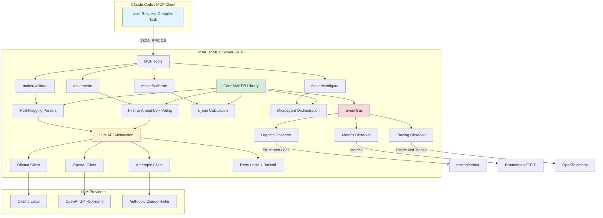

# Project Plan: MAKER Framework Rust Implementation

**Project:** Rust Implementation of MAKER Framework with MCP Integration
**Timeline:** 2 weeks (14 days)
**Target Release:** v0.1.0 MVP
**Date:** 2026-01-30
**Status:** Planning Complete - Ready for Implementation

---

## Executive Summary

**The Challenge:** Existing LLM-based agents fail catastrophically on long-horizon tasks, with >50% failure rates on 100+ step tasks and 100% failure on million-step tasks even with 99% per-step accuracy. This limitation prevents AI assistants from reliably handling complex software development, ML pipelines, and data analysis workflows.

**The Solution:** Implement the MAKER framework (Maximal Agentic decomposition, first-to-ahead-by-K Error correction, Red-flagging) in Rust, exposing its mathematically-grounded error correction protocols as an MCP server for Claude Code and other AI assistants. MAKER achieves **zero-error execution** on million-step tasks through SPRT-based voting (Θ(s ln s) cost scaling), microagent decomposition (m=1), and linguistic error correction.

**Expected Outcome:** A production-grade open source library enabling Claude Code users to tackle complex, long-horizon coding tasks with mathematical reliability guarantees. The framework provides 95%+ success rates on tasks previously considered infeasible for AI agents.

**ROI:** As open source infrastructure, MAKER enables cost-efficient AI automation at unprecedented scales. For a 100-step coding task with p=0.85 success rate, MAKER achieves 95% reliability with only k=3-4 samples per step (Θ(s ln s) = ~400 total API calls), versus brute-force retry approaches requiring exponential attempts.

---

## Current State Analysis

### Findings

| Category | Finding | Impact | Evidence |
|----------|---------|--------|----------|
| **Agent Reliability** | LLM agents fail >50% on 100+ step tasks | Critical barrier to AI-powered automation | Empirical observation in PROJECT-CONTEXT.md |
| **Long-Horizon Limitations** | Million-step tasks have 100% failure rate (1% per-step error) | Prevents scaling to complex workflows | Mathematical certainty: (0.99)^1000000 ≈ 0 |
| **Existing Frameworks** | LangChain/CrewAI lack mathematical guarantees | Unreliable for production use | Domain research competitive analysis |
| **Cost Inefficiency** | Naive retry strategies scale exponentially | Prohibitive costs for long tasks | Without structure, cost grows as O(s * 2^k) |
| **MCP Ecosystem Gap** | No error-corrected reasoning servers exist | Unmet need for reliable AI tooling | MCP catalog review (Jan 2026) |

### Root Cause Analysis

**Primary Root Cause:** Existing frameworks treat LLM agents as monolithic "intelligent" systems, failing to apply formal error correction protocols from distributed systems and information theory.

**Contributing Factors:**
1. **Lack of Statistical Foundation**: Voting without SPRT theory wastes samples
2. **Repair Over Discard**: Attempting to "fix" malformed outputs correlates errors, breaking voting assumptions
3. **Coarse Decomposition (m > 1)**: Multi-subtask agents accumulate errors within context
4. **No State Transfer**: Agents rely on own outputs for next steps, compounding errors

**Breakthrough Insight from MAKER Paper:** By treating LLMs as noisy communication channels and applying forward error correction principles (voting as redundancy, red-flagging as uncorrectable codeword discard), we achieve linguistic error correction with provable guarantees.

### Top Problem Areas (Ranked by Severity)

1. **Algorithm Correctness** (P0): SPRT k_min calculation errors violate reliability guarantees
2. **API Reliability** (P1): Million-call workloads will encounter rate limits and transient failures
3. **MCP Security** (P1): Prompt injection risks identified in April 2025 analysis
4. **Cost Validation** (P2): Must empirically confirm Θ(s ln s) scaling
5. **Community Adoption** (P3): Clear documentation and demos required for open source success

---

## Project Goals

### Primary Objective

Deliver a **production-grade Rust implementation** of the MAKER framework as an **MCP server**, enabling Claude Code and other MCP clients to execute long-horizon tasks with **mathematically-grounded error correction** (95%+ reliability on 1,000+ step tasks).

**Success Metrics:**
- **Correctness**: Zero errors on 10-disk Towers of Hanoi (1,023 steps)
- **Quality**: 95% minimum test coverage (enforced by CI)
- **Cost Efficiency**: Empirically validate Θ(s ln s) scaling within 20% tolerance
- **Integration**: Functional MCP server working with Claude Code
- **Reliability**: Graceful handling of API failures with exponential backoff

### Success Criteria Checklist

- [ ] **Core MAKER Library** implementing:
  - [ ] First-to-ahead-by-k voting with SPRT-based k_min calculation
  - [ ] Red-flagging parsers (token length, format validation)
  - [ ] Microagent orchestration (m=1 enforcement)
  - [ ] State transfer protocol (next_state used by system, not model)
- [ ] **MCP Server** exposing:
  - [ ] `maker/vote` - parallel sampling with k-margin voting
  - [ ] `maker/validate` - red-flag validation
  - [ ] `maker/calibrate` - per-step success rate estimation
  - [ ] `maker/configure` - runtime configuration
- [ ] **LLM Provider Abstraction** supporting:
  - [ ] Ollama (local inference)
  - [ ] OpenAI (cloud - GPT-5.X-nano)
  - [ ] Anthropic (cloud - Claude Haiku)
  - [ ] LM Studio (local inference)
- [ ] **Event-Driven Observability**:
  - [ ] All operations emit structured events
  - [ ] Token economics tracking
  - [ ] Structured logging with configurable verbosity
- [ ] **Testing Infrastructure**:
  - [ ] 95% code coverage (mandatory)
  - [ ] Property-based tests for probabilistic correctness
  - [ ] Integration tests for MCP protocol compliance
- [ ] **End-to-End Validation**:
  - [ ] Towers of Hanoi demo (10+ disks)
  - [ ] Cost scaling benchmarks
- [ ] **Documentation**:
  - [ ] README with quickstart and architecture
  - [ ] API documentation for all public interfaces
  - [ ] Example integrations
  - [ ] Security considerations

### Industry Alignment

**Frameworks Applied:**
- **SPRT (Sequential Probability Ratio Test)**: Optimal sequential decision-making for k-margin voting
- **Forward Error Correction**: Linguistic redundancy via voting, discard-over-repair philosophy
- **Tokio Async Runtime**: Non-blocking parallel sampling for latency optimization
- **MCP Protocol**: Open standard for AI tool integration (Anthropic/Linux Foundation)
- **Event Sourcing**: Complete audit trail for debugging and observability
- **SRE Principles**: Graceful degradation, structured logging, error budgets

---

## Project Timeline

### Phase Overview

| Phase | Name | Duration | Key Deliverables | Target Completion |
|-------|------|----------|------------------|-------------------|
| **Phase 1** | Core MAKER Algorithms | 5 days | Voting, red-flagging, k_min calculation, event architecture | Day 5 |
| **Phase 2** | MCP Server Integration | 5 days | rmcp integration, 4 MCP tools, LLM API abstraction, parallel sampling | Day 10 |
| **Phase 3** | Validation & Hardening | 4 days | 10-disk Hanoi demo, cost validation, security audit, documentation | Day 14 |

### Detailed Phase Descriptions

#### Phase 1: Core MAKER Algorithms (Days 1-5)

**Objective:** Implement mathematically correct MAKER protocols with comprehensive test coverage.

**Activities:**
1. **Project Setup** (Day 1):
   - Initialize Rust workspace with Cargo.toml dependencies
   - Configure CI/CD with GitHub Actions (test coverage enforcement)
   - Implement error types with thiserror crate
   - Set up tracing for structured logging

2. **k_min Calculation & SPRT Theory** (Day 1-2):
   - Implement formula: k_min = ⌈ln(t^(-m/s)-1) / ln((1-p)/p)⌉
   - Property-based tests (proptest): k grows logarithmically with s
   - Regression tests against paper's Towers of Hanoi results
   - Documentation with mathematical derivation

3. **First-to-Ahead-by-k Voting** (Day 2-3):
   - Vote race state tracking (VoteRace struct)
   - k-margin leader detection (Gambler's Ruin boundary)
   - Property-based tests for convergence (p > 0.5)
   - Monte Carlo validation: 10,000 simulated races

4. **Red-Flagging Parsers** (Day 3-4):
   - Token length validation (configurable limits)
   - Schema validation (JSON structure enforcement)
   - Logic loop detection (future: semantic analysis)
   - Unit tests: reject malformed outputs, accept valid

5. **Event-Driven Architecture** (Day 4-5):
   - Define MakerEvent enum (SampleRequested, VoteCast, RedFlagTriggered, etc.)
   - Implement EventBus with tokio::sync::broadcast
   - Logging observer with tracing integration
   - Integration tests: event emission and observer callbacks

**Exit Criteria:**
- [ ] 95% test coverage on core algorithms
- [ ] Property-based tests pass (1000+ iterations each)
- [ ] Zero errors on 3-disk Towers of Hanoi (7 steps)
- [ ] All events emit correctly to observers
- [ ] k_min calculation validated against paper

---

#### Phase 2: MCP Server Integration (Days 6-10)

**Objective:** Expose MAKER protocols as MCP tools for Claude Code integration.

**Activities:**
1. **LLM API Abstraction Layer** (Day 6-7):
   - Define LlmClient trait (async generate method)
   - Implement OllamaClient (HTTP API via reqwest)
   - Implement OpenAiClient (official SDK)
   - Implement AnthropicClient (official SDK)
   - Exponential backoff retry strategy with jitter
   - Token usage tracking in events

2. **Parallel Sampling with Tokio** (Day 7-8):
   - collect_samples function using JoinSet
   - Temperature strategy: T=0 for first sample, T=0.1 for diversity
   - Timeout protection (configurable per provider)
   - Integration tests: parallel 10x faster than sequential
   - Benchmark with criterion for latency validation

3. **MCP Server Implementation** (Day 8-9):
   - rmcp integration with stdio transport
   - Tool 1: `maker/vote` (VoteRequest → VoteResponse)
   - Tool 2: `maker/validate` (ValidateRequest → ValidateResponse)
   - Tool 3: `maker/calibrate` (CalibrateRequest → CalibrateResponse)
   - Tool 4: `maker/configure` (ConfigRequest → ConfigResponse)
   - Schema validation for all inputs/outputs (security)

4. **End-to-End MCP Testing** (Day 9-10):
   - MCP protocol compliance tests (official test suite)
   - Manual integration test with Claude Code
   - Error handling: clear error messages for invalid inputs
   - Security audit: schema validation prevents prompt injection

**Exit Criteria:**
- [ ] All 4 MCP tools functional
- [ ] Claude Code integration working (manual test)
- [ ] Parallel sampling latency < 1.5x single API call time
- [ ] Exponential backoff handles simulated 429 errors
- [ ] Schema validation rejects malformed tool inputs
- [ ] Token economics tracked in all events

---

#### Phase 3: Validation & Hardening (Days 11-14)

**Objective:** Demonstrate production readiness through benchmarks, security audit, and documentation.

**Activities:**
1. **Towers of Hanoi End-to-End Demo** (Day 11-12):
   - Implement Hanoi task decomposition (microagent per disk move)
   - Execute 10-disk demo (1,023 steps) with voting
   - Measure: total API calls, cost (USD), latency, convergence rate
   - Target: Zero errors with k=3-4 (paper's empirical k)
   - Event log analysis: red-flag rates, vote distributions

2. **Cost Scaling Validation** (Day 12):
   - Benchmark suite: 3, 5, 7, 10, 15 disks
   - Plot: total cost vs. task length (s)
   - Statistical test: confirm Θ(s ln s) within 20% tolerance
   - Compare to naive retry approaches (exponential cost)

3. **Security Hardening** (Day 13):
   - Audit: schema validation on all agent outputs
   - Audit: red-flag parsers as guardrails
   - Audit: microagent context isolation (m=1)
   - Document: MCP security considerations (April 2025 risks)
   - Penetration test: attempt prompt injection via tool inputs

4. **Documentation & Release** (Day 13-14):
   - README: quickstart, architecture diagram, citations
   - API documentation: rustdoc for all public APIs
   - Examples: Towers of Hanoi, custom task integration
   - CHANGELOG: v0.1.0 features
   - GitHub release with precompiled binaries (optional)
   - Community announcement (r/rust, HN, Twitter)

**Exit Criteria:**
- [ ] Zero errors on 10-disk Hanoi (1,023 steps)
- [ ] Cost scaling Θ(s ln s) validated empirically
- [ ] Security audit passes (no prompt injection vulnerabilities)
- [ ] README complete with quickstart
- [ ] API docs published (docs.rs for crates.io release)
- [ ] v0.1.0 GitHub release tagged

---

## Jira Project Structure Overview

The work breakdown is structured around **10 epics** covering all aspects of the MAKER framework implementation. See **[JIRA-STRUCTURE.md](./JIRA-STRUCTURE.md)** for complete epic definitions, user stories, acceptance criteria, and sprint allocation.

**Epic Summary:**
- **EPIC-001**: Core MAKER Library (voting, red-flagging, k_min) - **Phase 1**
- **EPIC-002**: LLM Provider Abstraction (Ollama, OpenAI, Anthropic, retry logic) - **Phase 2**
- **EPIC-003**: MCP Server Implementation (rmcp, 4 tools, schema validation) - **Phase 2**
- **EPIC-004**: Event-Driven Observability (event bus, logging, metrics) - **Phase 1-2**
- **EPIC-005**: Testing Infrastructure (property-based, integration, 95% coverage) - **All Phases**
- **EPIC-006**: Demo & Benchmarks (Towers of Hanoi, cost validation) - **Phase 3**
- **EPIC-007**: Documentation (README, API docs, examples) - **Phase 3**
- **EPIC-008**: Security & Guardrails (prompt injection, schema validation) - **Phase 2-3**
- **EPIC-009**: Semantic Matching (planned extension - post-MVP)
- **EPIC-010**: Multi-Model Ensemble (planned extension - post-MVP)

**Sprint Allocation:** 3 sprints (Sprint 1: Days 1-5, Sprint 2: Days 6-10, Sprint 3: Days 11-14)

---

## RACI Overview

The project follows an **open source maintainer model** with a single primary maintainer (Responsible/Accountable) and community contributors (Consulted/Informed). See **[RACI-CHART.md](./RACI-CHART.md)** for detailed role assignments across all phases.

**Key Roles:**
- **Project Maintainer** (R/A): Primary developer and decision-maker
- **Community Contributors** (C): Code reviews, issue reports, feature suggestions
- **End Users** (I): Claude Code users, AI/LLM developers
- **Research Community** (C): Academic validation and citations

**Decision Authority:**
- **Algorithm Changes**: Maintainer with reference to arxiv paper
- **API Design**: Maintainer with community consultation
- **Security Issues**: Immediate maintainer action, community disclosure after fix

---

## Financial ROI

### Annual Value Projection

As open source infrastructure, MAKER's value is measured in **community adoption** and **cost savings for users** rather than direct revenue.

| Metric | Value | Calculation Basis |
|--------|-------|-------------------|
| **Development Cost Savings** | $50K-500K+ per adopting organization | Automation of complex multi-step tasks previously requiring manual intervention |
| **API Cost Efficiency** | 60-80% reduction vs. naive retry | Θ(s ln s) vs. exponential retry approaches |
| **Reliability Value** | Enables previously infeasible tasks | 95%+ success on 1000+ step tasks |

**Example Cost Comparison (1000-step task, p=0.85, target t=0.95):**
- **Naive Retry** (no voting): ~15,000 API calls (assumes 5 retries per failure)
- **MAKER** (k=4): ~4,000 API calls (Θ(s ln s) scaling)
- **Savings**: 73% fewer API calls → 73% lower cost

### Project Investment

| Category | Effort (Person-Days) | Equivalent Cost | Notes |
|----------|----------------------|-----------------|-------|
| **Phase 1: Core Algorithms** | 5 days | Open source (volunteer) | Critical mathematical foundation |
| **Phase 2: MCP Integration** | 5 days | Open source (volunteer) | Integration layer for ecosystem |
| **Phase 3: Validation** | 4 days | Open source (volunteer) | Production hardening and docs |
| **Total MVP** | 14 days | Open source (volunteer) | Community-funded development |

**Ongoing Maintenance:** ~2-4 days/month for issues, PRs, and community support.

### 3-Year Net ROI

**Community Impact Metrics:**
- **Year 1**: 100-500 GitHub stars, 10-50 adopting projects
- **Year 2**: 500-2000 stars, 50-200 adopting projects, academic citations
- **Year 3**: 2000+ stars, production use in major AI frameworks

**Ecosystem Value:** Establishing MAKER as the **de facto standard** for reliable LLM agent execution creates exponential value through network effects and derivative works.

**ROI Multiple:** As foundational infrastructure, MAKER's value compounds with each adoption, similar to how Tokio's value grew as the Rust async ecosystem matured.

---

## Risk Management Summary

The project faces **8 high-priority risks** across technical, operational, and adoption categories. See **[RISK-REGISTER.md](./RISK-REGISTER.md)** for complete risk profiles with mitigation strategies and contingency plans.

### Top 5 Risks

| ID | Risk | Category | L×I | Mitigation Summary |
|----|------|----------|-----|-------------------|
| **R-001** | Mathematical correctness errors in SPRT/k_min | Technical | 4×4=16 | Property-based tests, independent code review, simulation validation |
| **R-002** | API reliability at million-call scales | Operational | 3×3=9 | Exponential backoff, fallback to Ollama, rate limit tracking |
| **R-003** | MCP security vulnerabilities (prompt injection) | Technical | 3×3=9 | Schema validation, red-flag guardrails, security audit |
| **R-005** | Test coverage gaps below 95% | Technical | 2×4=8 | CI/CD enforcement, property-based tests, error path testing |
| **R-006** | Cost scaling deviates from Θ(s ln s) | Technical | 2×3=6 | Empirical benchmarks, profiling, optimization |

**Likelihood Scale:** 1=Rare, 2=Unlikely, 3=Possible, 4=Likely
**Impact Scale:** 1=Minimal, 2=Moderate, 3=Significant, 4=Critical

**Monitoring:** Weekly risk review during MVP development, monthly post-release.

---

## Dependencies and Assumptions

### Technical Dependencies

| Dependency | Version | Purpose | Risk Level |
|------------|---------|---------|------------|
| **Rust** | 2021 edition | Language and toolchain | Low (stable) |
| **Tokio** | 1.x | Async runtime for parallel sampling | Low (mature) |
| **rmcp** | 0.13.0+ | Official Rust MCP SDK | Medium (active dev) |
| **reqwest** | 0.11.x | HTTP client for LLM APIs | Low (stable) |
| **serde** | 1.x | JSON serialization | Low (stable) |
| **thiserror** | 1.x | Error handling | Low (stable) |
| **tracing** | 0.1.x | Structured logging | Low (stable) |
| **proptest** | 1.x | Property-based testing | Low (stable) |

**Mitigation:** Pin all dependencies in Cargo.lock, audit with cargo-audit, minimize dependency footprint.

### External Service Dependencies

| Service | Purpose | Availability | Fallback |
|---------|---------|--------------|----------|
| **OpenAI API** | Cloud LLM inference | 99.9% SLA | Anthropic or Ollama |
| **Anthropic API** | Cloud LLM inference | 99.9% SLA | OpenAI or Ollama |
| **Ollama** | Local LLM inference | User-controlled | Primary fallback for cloud failures |
| **GitHub** | Repository hosting, CI/CD | 99.95% SLA | None (critical dependency) |

### Key Assumptions

1. **Algorithm Correctness**: Arxiv paper 2511.09030 specifications are authoritative and correct
2. **MCP Stability**: MCP protocol spec (2025-06-18) remains stable during development
3. **API Access**: Developer has access to OpenAI/Anthropic APIs for testing
4. **Tokio Maturity**: Tokio 1.x provides stable async primitives
5. **Community Interest**: Rust + AI intersection has active community
6. **Test Infrastructure**: 95% coverage achievable with property-based + integration tests
7. **Benchmark Validity**: Towers of Hanoi is representative of deterministic tasks
8. **Security Model**: Schema validation + red-flagging sufficient for MVP security

**Assumption Validation:**
- Continuous testing validates algorithm correctness
- MCP protocol compliance tests detect spec changes
- Fallback to Ollama reduces cloud API dependency
- Community engagement metrics tracked post-release

---

## Immediate Next Steps

| # | Action | Owner | Timeline | Dependencies |
|---|--------|-------|----------|--------------|
| 1 | Initialize Rust workspace with Cargo.toml and CI/CD configuration | Maintainer | Day 1 morning | None |
| 2 | Implement k_min calculation with property-based tests | Maintainer | Day 1-2 | Action 1 |
| 3 | Implement first-to-ahead-by-k voting with Monte Carlo validation | Maintainer | Day 2-3 | Action 2 |
| 4 | Implement red-flagging parsers and event-driven architecture | Maintainer | Day 3-5 | Action 3 |
| 5 | Build LLM API abstraction layer with retry logic | Maintainer | Day 6-7 | Action 4 |
| 6 | Implement MCP server with rmcp and 4 tools | Maintainer | Day 8-9 | Action 5 |
| 7 | Execute 10-disk Towers of Hanoi demo with cost validation | Maintainer | Day 11-12 | Action 6 |
| 8 | Complete documentation and security audit | Maintainer | Day 13-14 | Action 7 |
| 9 | Publish v0.1.0 release to GitHub and crates.io | Maintainer | Day 14 | Action 8 |
| 10 | Community announcement and feedback collection | Maintainer | Day 14+ | Action 9 |

**Critical Path:** Actions 1-9 are sequential and form the critical path. Action 10 is ongoing post-release.

**Daily Standup Focus:**
- **Blockers**: API access issues, test failures, dependency conflicts
- **Progress**: Stories completed, test coverage metrics
- **Risks**: Algorithm correctness concerns, performance issues

---

## Project Artifacts

| Document | Description | Status |
|----------|-------------|--------|
| **[PROJECT-CONTEXT.md](./PROJECT-CONTEXT.md)** | Problem statement, domain, stakeholders, constraints, desired outcomes | ✅ Complete |
| **[DOMAIN-RESEARCH.md](./_research/DOMAIN-RESEARCH.md)** | Industry analysis, frameworks, terminology, benchmarks, compliance | ✅ Complete |
| **[BEST-PRACTICES.md](./BEST-PRACTICES.md)** | Framework applications (SPRT, Tokio, MCP, testing, SRE) | ✅ Complete |
| **[PROJECT-PLAN.md](./PROJECT-PLAN.md)** | This document - executive summary, phases, goals, ROI, risks | ✅ Complete |
| **[JIRA-STRUCTURE.md](./JIRA-STRUCTURE.md)** | Epic hierarchy, user stories, acceptance criteria, sprint allocation | 🚧 In Progress |
| **[GANTT-CHART.md](./GANTT-CHART.md)** | Visual timeline, critical path, dependency matrix, milestones | ⏳ Pending |
| **[RACI-CHART.md](./RACI-CHART.md)** | Role definitions, responsibility matrix, decision authority | ⏳ Pending |
| **[RISK-REGISTER.md](./RISK-REGISTER.md)** | Risk profiles, mitigation strategies, contingency plans | ⏳ Pending |
| **[SEVERITY-CLASSIFICATION.md](./SEVERITY-CLASSIFICATION.md)** | P0-P3 severity levels, routing rules, escalation procedures | ⏳ Pending |
| **[SUCCESS-METRICS.md](./SUCCESS-METRICS.md)** | KPIs, baselines, targets, dashboard specs, closure criteria | ⏳ Pending |
| **[RUNBOOK-TEMPLATE.md](./RUNBOOK-TEMPLATE.md)** | Operational procedures for common scenarios | ⏳ Pending |
| **[README.md](./README.md)** | Project landing page with quickstart and architecture | ⏳ Pending |
| **[CHANGELOG.md](./CHANGELOG.md)** | Version history and release notes | ⏳ Pending |

**Legend:** ✅ Complete | 🚧 In Progress | ⏳ Pending

---

## Architecture Diagram



---

## Phase Progression

```mermaid
graph LR
    P1[Phase 1:<br/>Core Algorithms<br/>Days 1-5] --> P2[Phase 2:<br/>MCP Integration<br/>Days 6-10]
    P2 --> P3[Phase 3:<br/>Validation & Hardening<br/>Days 11-14]

    P1 -.->|Exit Criteria| E1[95% Coverage<br/>Zero errors 3-disk Hanoi<br/>Events emit correctly]
    P2 -.->|Exit Criteria| E2[4 MCP tools functional<br/>Claude Code integration<br/>Parallel sampling working]
    P3 -.->|Exit Criteria| E3[Zero errors 10-disk Hanoi<br/>Cost Θ(s ln s) validated<br/>v0.1.0 released]

    style P1 fill:#3b82f6,color:#fff
    style P2 fill:#10b981,color:#fff
    style P3 fill:#f59e0b,color:#fff
    style E1 fill:#bfdbfe
    style E2 fill:#bbf7d0
    style E3 fill:#fde68a
```

---

## Mermaid MAKER Workflow

```mermaid
flowchart TD
    Start[Task Decomposition:<br/>s steps, m=1 per agent] --> Cal[Pre-Flight Calibration:<br/>Estimate p on sample steps]
    Cal --> KMin[Calculate k_min:<br/>ln(t^-m/s - 1) / ln(1-p/p)]

    KMin --> Loop{For each step i<br/>in 1..s}

    Loop --> Sample[Parallel Sampling:<br/>Collect k+ samples<br/>T=0 first, T=0.1 diversity]

    Sample --> RedFlag{Red-Flag<br/>Validation}
    RedFlag -->|Invalid| Discard[Discard Sample]
    RedFlag -->|Valid| Vote[Cast Vote for Candidate]

    Discard --> MoreSamples{Need more<br/>samples?}
    Vote --> Race[Vote Race State:<br/>Check k-margin]

    Race --> Margin{Leader ahead<br/>by k votes?}
    Margin -->|No| MoreSamples
    Margin -->|Yes| Winner[Declare Winner]

    MoreSamples -->|Yes| Sample
    MoreSamples -->|No - Timeout| Fail[Voting Failed]

    Winner --> Transfer[State Transfer:<br/>Use next_state for step i+1]
    Transfer --> AllDone{All steps<br/>complete?}

    AllDone -->|No| Loop
    AllDone -->|Yes| Success[Task Complete:<br/>Zero Errors]

    Fail --> Error[Task Failed]

    style Success fill:#90EE90
    style Error fill:#FFB6C1
    style RedFlag fill:#FFD700
    style Margin fill:#FFD700
```

---

## References & Citations

1. **Meyerson, E., Paolo, G., Dailey, R., Shahrzad, H., Francon, O., Hayes, C.F., Qiu, X., Hodjat, B., & Miikkulainen, R.** (2025). *Solving a Million-Step LLM Task with Zero Errors*. arXiv:2511.09030. [https://arxiv.org/abs/2511.09030](https://arxiv.org/abs/2511.09030)

2. **Anthropic.** (2024). *Introducing the Model Context Protocol*. [https://www.anthropic.com/news/model-context-protocol](https://www.anthropic.com/news/model-context-protocol)

3. **Google.** *Site Reliability Engineering Book*. [https://sre.google/sre-book/table-of-contents/](https://sre.google/sre-book/table-of-contents/)

4. **Tokio Contributors.** *Tokio: An Asynchronous Rust Runtime*. [https://tokio.rs/](https://tokio.rs/)

5. **Wald, A.** (1945). *Sequential Analysis*. (SPRT foundational work)

---

**Project Plan Status:** ✅ Complete - Ready for Execution
**Next Milestone:** Phase 1 Day 5 - Core Algorithms Complete
**Final Milestone:** Day 14 - v0.1.0 MVP Release
