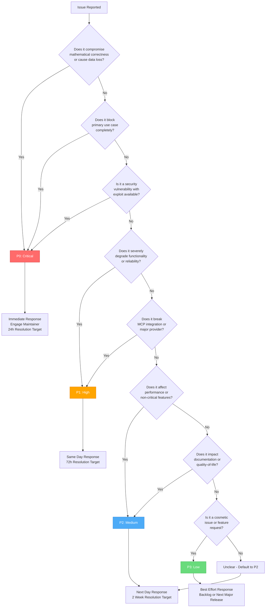
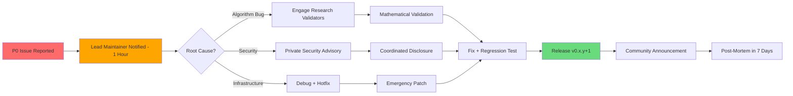
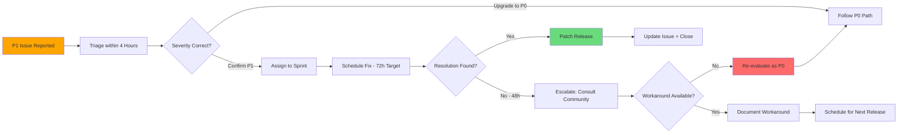

# Severity Classification: MAKER Framework

**Project:** Rust Implementation of MAKER Framework with MCP Integration
**Purpose:** Issue triage, incident response, SLA management
**Date:** 2026-01-30
**Last Updated:** 2026-01-30

---

## Classification Levels

### P0: Critical - Production Blocking

**Definition:** Issues that compromise MAKER's core mathematical guarantees, cause data corruption, or completely block primary use cases.

**Response Time SLA:** Immediate (within 1 hour of detection)
**Resolution Target:** 24 hours maximum
**Notification Channel:** GitHub Issue + Email + Community Announcement
**Escalation:** Automatic to Lead Maintainer; engage Research Validators if algorithm-related

**Examples:**

1. **Algorithm Correctness Violation**
   - k_min calculation returns incorrect values
   - Voting fails to converge when p > 0.5
   - Zero-error Hanoi demo produces errors
   - Property-based tests reveal mathematical bugs

2. **Security Breach**
   - Prompt injection bypasses schema validation
   - Agent outputs cause state corruption
   - MCP tool allows unauthorized actions
   - Dependency vulnerability with active exploit

3. **Complete Service Failure**
   - MCP server crashes on startup
   - All LLM providers fail (no fallback working)
   - CI/CD completely broken (blocks all PRs)
   - Test coverage drops below 90% due to systemic issue

---

### P1: High - Major Degradation

**Definition:** Issues that severely impact functionality, reliability, or user experience but don't compromise core guarantees. Workarounds may exist.

**Response Time SLA:** Same business day (within 4 hours)
**Resolution Target:** 72 hours (3 days)
**Notification Channel:** GitHub Issue + Community Discussion
**Escalation:** Lead Maintainer notified; community consultation if design-related

**Examples:**

1. **MCP Integration Broken**
   - Claude Code integration fails after update
   - MCP tool schema validation too strict (rejects valid inputs)
   - rmcp dependency breaks after version update
   - stdio transport fails on specific platforms

2. **LLM Provider Failure**
   - Single LLM provider (e.g., OpenAI) completely broken
   - Retry logic fails to handle 429 errors
   - Token usage tracking incorrect (overcharging users)
   - Parallel sampling breaks (falls back to sequential)

3. **Reliability Degradation**
   - Red-flag rate >30% on calibrated models
   - Cost scaling deviates >50% from Θ(s ln s)
   - k_min calculation too conservative (2x expected k)
   - Voting convergence 50% slower than theoretical

4. **Documentation Critical Gaps**
   - README quickstart completely broken
   - Security vulnerabilities undocumented
   - API docs missing for primary public interfaces
   - Migration guide missing for breaking changes

---

### P2: Medium - Partial Impact

**Definition:** Issues that affect non-critical features, performance, or quality-of-life. Core functionality remains operational.

**Response Time SLA:** Next business day (within 24 hours)
**Resolution Target:** 2 weeks (next minor release)
**Notification Channel:** GitHub Issue
**Escalation:** Normal triage process; maintainer schedules fix

**Examples:**

1. **Performance Issues**
   - Parallel sampling 2x slower than expected (but still working)
   - Red-flag parsing CPU-intensive
   - Memory usage higher than optimal
   - Event emission overhead noticeable

2. **Limited Provider Support**
   - LM Studio integration missing
   - Batch API support not implemented
   - Alternative voting strategies not configurable
   - Multi-model ensemble not supported (post-MVP feature)

3. **Documentation Improvements**
   - rustdoc missing examples for some functions
   - Security section lacks threat model diagram
   - Example code outdated after API change
   - Tuning guide incomplete

4. **Quality-of-Life Issues**
   - Error messages unclear
   - Logging too verbose at default level
   - Configuration file format cumbersome
   - CLI ergonomics poor

5. **Test Infrastructure**
   - Coverage drops to 92-95% (still passing CI)
   - Property-based tests slow (>60s)
   - Integration tests flaky (pass on retry)
   - Benchmark suite missing some scenarios

---

### P3: Low - Minor Issues

**Definition:** Cosmetic issues, feature requests, or optimizations that don't impact core functionality. Nice-to-have improvements.

**Response Time SLA:** Best effort (within 1 week)
**Resolution Target:** Next major release or backlog
**Notification Channel:** GitHub Issue or Discussion
**Escalation:** Community-driven; maintainer accepts PRs

**Examples:**

1. **Cosmetic Issues**
   - Typos in documentation
   - Inconsistent code formatting (missed by rustfmt)
   - Log message wording awkward
   - README badge formatting

2. **Feature Requests (Post-MVP)**
   - Semantic matching for non-deterministic tasks
   - Adaptive k-margin based on observed convergence
   - Web UI for configuration
   - Integration with alternative coding assistants

3. **Developer Experience**
   - Additional examples for edge cases
   - More detailed tracing spans
   - Better error message suggestions
   - Improved debug tooling

4. **Platform Support**
   - Windows binary distribution
   - ARM architecture support
   - Docker image for deployment
   - Homebrew formula

---

## Decision Tree



---

## Routing Rules

| Severity | Primary Channel | Secondary Channel | Escalation Trigger | Response SLA | On-Call Required |
|----------|-----------------|-------------------|-------------------|--------------|------------------|
| **P0** | GitHub Issue + Email | Community Announcement | Immediate | 1 hour | Yes (Lead Maintainer) |
| **P1** | GitHub Issue | Community Discussion | 4 hours without response | 4 hours | No (normal hours) |
| **P2** | GitHub Issue | - | 48 hours without triage | 24 hours | No |
| **P3** | GitHub Issue/Discussion | - | None | 1 week | No |

### Communication Templates

#### P0 Acknowledgment
```
⚠️ **P0 Critical Issue Acknowledged**

This issue has been classified as P0 (Critical) and is being actively investigated.

**Impact:** [Brief description]
**Estimated Resolution:** [Timeline]
**Updates:** Will be posted here every 4 hours

Thank you for the report. This is our highest priority.
```

#### P1 Acknowledgment
```
⚠️ **P1 High Priority Issue Acknowledged**

This issue has been classified as P1 (High) and is scheduled for resolution within 72 hours.

**Impact:** [Brief description]
**Workaround:** [If available]
**Target Resolution:** [Date]

Updates will be posted as progress is made.
```

#### P2/P3 Acknowledgment
```
✅ **Issue Acknowledged**

Classification: [P2/P3]
Target Resolution: [Next release / Backlog]

[Additional context if needed]

Thank you for the report!
```

---

## Classification Examples

| Scenario | Severity | Rationale |
|----------|----------|-----------|
| **Voting returns wrong winner despite k-margin** | P0 | Violates mathematical correctness guarantee |
| **MCP server panics on malformed JSON input** | P0 | Complete service failure; no graceful degradation |
| **CI coverage check fails due to tarpaulin bug** | P0 | Blocks all PRs; systemic quality gate failure |
| **Red-flagging allows prompt injection** | P0 | Security vulnerability; bypasses guardrails |
| **OpenAI client broken after API update** | P1 | Major provider unavailable; others still work |
| **Parallel sampling falls back to sequential** | P1 | Severe performance degradation; functionality degraded |
| **README quickstart has wrong import path** | P1 | Blocks new users; critical documentation gap |
| **Anthropic client returns incorrect token counts** | P1 | Cost tracking broken; financial impact to users |
| **Red-flag rate 40% on GPT-4.1-mini** | P2 | Performance issue; cost inflation but voting works |
| **Logging too verbose at INFO level** | P2 | Quality-of-life issue; workaround exists (change log level) |
| **Missing example for custom task integration** | P2 | Documentation gap; but basic examples exist |
| **Property-based tests take 90 seconds** | P2 | Test infrastructure slow; but still passes CI |
| **rustdoc missing example for LlmClient trait** | P3 | Minor documentation gap; API is self-documenting |
| **Typo in CHANGELOG** | P3 | Cosmetic; no functional impact |
| **Feature request: semantic matching** | P3 | Enhancement; planned for future release |
| **No Windows binary in GitHub release** | P3 | Platform support gap; users can build from source |

---

## Escalation Procedures

### P0 Escalation Path



**P0 Escalation Triggers:**
- No acknowledgment within 1 hour
- No progress update within 4 hours
- Resolution timeline exceeds 24 hours
- Community impact widespread (>10 users affected)

**Escalation Actions:**
- Hour 0-1: Lead Maintainer investigates
- Hour 1-4: Root cause analysis, engage specialists
- Hour 4-8: Fix development, testing
- Hour 8-24: Release preparation, communication
- Day 1-7: Monitoring, post-mortem, prevention

---

### P1 Escalation Path



**P1 Escalation Triggers:**
- No triage within 4 hours
- No progress update within 24 hours
- Resolution timeline exceeds 72 hours
- Workaround not viable for users

**Escalation Actions:**
- Hour 0-4: Triage and severity confirmation
- Hour 4-24: Root cause analysis, fix strategy
- Hour 24-48: Implementation and testing
- Hour 48-72: Release or escalation decision

---

### P2/P3 De-escalation

Issues initially classified as P1 may be **de-escalated** to P2/P3 if:
- Workaround identified that fully mitigates impact
- Root cause reveals lower impact than initially assessed
- Community consensus that severity overstated

**Process:**
1. Post comment explaining de-escalation rationale
2. Update issue label (priority::p1 → priority::p2)
3. Adjust resolution timeline
4. Communicate to affected users if any

---

## GitHub Issue Labels

### Priority Labels

| Label | Color | Description |
|-------|-------|-------------|
| `priority::p0` | Red (#ff6b6b) | Critical - immediate action required |
| `priority::p1` | Orange (#ffa500) | High - resolution within 72 hours |
| `priority::p2` | Blue (#4dabf7) | Medium - next release |
| `priority::p3` | Green (#69db7c) | Low - backlog or major release |

### Type Labels

| Label | Color | Used With |
|-------|-------|-----------|
| `type::bug` | Red (#d73a4a) | P0, P1, P2 |
| `type::security` | Dark Red (#b60205) | P0 (always) |
| `type::enhancement` | Green (#a2eeef) | P2, P3 |
| `type::documentation` | Blue (#0075ca) | P1, P2, P3 |
| `type::performance` | Yellow (#fbca04) | P1, P2 |
| `type::question` | Purple (#d876e3) | P3 |

### Status Labels

| Label | Color | Description |
|-------|-------|-------------|
| `status::investigating` | Gray (#d4c5f9) | Root cause analysis in progress |
| `status::in-progress` | Yellow (#fbca04) | Fix actively being developed |
| `status::needs-review` | Blue (#0e8a16) | PR submitted, awaiting review |
| `status::blocked` | Red (#b60205) | Blocked on external dependency |
| `status::wont-fix` | Black (#000000) | Closed without fix (with rationale) |

---

## Governance

### Quarterly Review Process

**Cadence:** Every 3 months (post-MVP)
**Participants:** Lead Maintainer, Contributors, Community Representatives
**Agenda:**
1. Review severity classification effectiveness
2. Analyze response time SLA adherence
3. Adjust thresholds based on empirical data
4. Update examples with real incidents

**Metrics Reviewed:**
- P0 incident count and MTTR (Mean Time To Resolution)
- P1 SLA adherence (% resolved within 72 hours)
- P2/P3 backlog growth rate
- Classification accuracy (% requiring reclassification)

### Reclassification Guidelines

**Upgrade Severity** when:
- Impact broader than initially assessed (affects >50% of users)
- Root cause reveals systemic issue
- Workaround proves inadequate or unavailable
- Security implications discovered

**Downgrade Severity** when:
- Effective workaround identified
- Impact limited to edge case (<10% of users)
- Community consensus that severity overstated
- External dependency resolution makes issue moot

**Process:**
1. Post comment explaining reclassification rationale
2. Update issue labels
3. Adjust SLA and resolution timeline
4. Communicate to stakeholders if severity upgraded

---

## SLA Compliance Tracking

| Metric | Target | Measurement | Reporting |
|--------|--------|-------------|-----------|
| **P0 Response Time** | < 1 hour | Time from issue creation to first maintainer response | Weekly during MVP, Monthly post-release |
| **P0 Resolution Time** | < 24 hours | Time from issue creation to fix deployed | Per incident |
| **P1 Response Time** | < 4 hours | Time from issue creation to triage | Weekly |
| **P1 Resolution Time** | < 72 hours | Time from issue creation to fix deployed | Per incident |
| **P2 Response Time** | < 24 hours | Time from issue creation to triage | Monthly |
| **P2 Resolution Time** | < 2 weeks | Time from issue creation to fix in release | Monthly |
| **Classification Accuracy** | > 90% | % of issues correctly classified on first triage | Quarterly |

### SLA Violation Response

**If SLA violated:**
1. Document reason for violation in issue comment
2. Update timeline estimate with revised target
3. Escalate if blocking factors persist >24 hours
4. Post-mortem: why did SLA slip? Preventable?

**Common Violation Reasons:**
- Root cause more complex than initially assessed
- Waiting on external dependency (provider, rmcp, etc.)
- Maintainer availability (single-person team limitation)
- Testing uncovered additional issues requiring resolution

---

## Integration with Risk Register

### Risk-Severity Mapping

Issues related to risks in [RISK-REGISTER.md](./RISK-REGISTER.md):

| Risk ID | Related Severity | Trigger Condition |
|---------|------------------|-------------------|
| **R-001** Mathematical Correctness | P0 | Algorithm bug detected, voting fails, property test failure |
| **R-002** API Reliability | P1 | Provider complete failure, retry exhaustion rate >10% |
| **R-003** MCP Security | P0 | Active exploit, prompt injection bypass |
| **R-004** Timeline Slippage | P2 | Milestone delay <1 week, P1 if >1 week |
| **R-005** Test Coverage | P0 | Coverage <90%, P1 if 90-95% |
| **R-006** Cost Scaling | P2 | Deviation >50% from Θ(s ln s) |
| **R-007** Low Adoption | P3 | Community engagement below target |
| **R-008** Dependency Vulnerabilities | P0 | Active exploit, P1 if patch available |
| **R-009** LLM Provider API Changes | P1 | Breaking change, P2 if deprecation period |
| **R-010** Parallel Sampling Inefficiency | P2 | Latency >2x expected |
| **R-011** rmcp SDK Breaking Changes | P1 | MCP server broken, P2 if migration guide available |
| **R-012** Red-Flag Tuning | P2 | Red-flag rate >30% |

---

## Appendix: Historical Incidents

*This section will be populated as incidents occur during MVP development and post-release.*

### Incident Template

**Incident ID:** INC-YYYY-MM-DD-NNN
**Severity:** [P0/P1/P2/P3]
**Issue:** [GitHub Issue #]
**Reported:** [Timestamp]
**Resolved:** [Timestamp]
**MTTR:** [Hours]
**Root Cause:** [Brief description]
**Fix:** [PR link and description]
**Prevention:** [Changes to prevent recurrence]
**Lessons Learned:** [Key takeaways]

---

## Revision History

| Version | Date | Author | Changes |
|---------|------|--------|---------|
| 1.0 | 2026-01-30 | Governance Architect | Initial severity classification for MAKER Framework MVP |

---

**Severity Classification Status:** ✅ Complete
**Framework:** GitHub Issues + Labels
**SLA Targets:** P0: 1h/24h, P1: 4h/72h, P2: 24h/2wk, P3: 1wk/backlog
**Next Review:** Quarterly (post-MVP) or after first P0 incident
